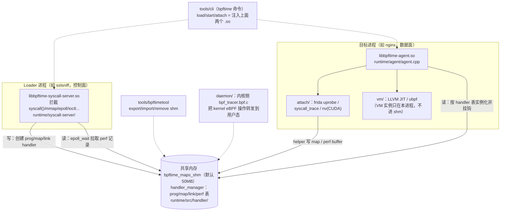
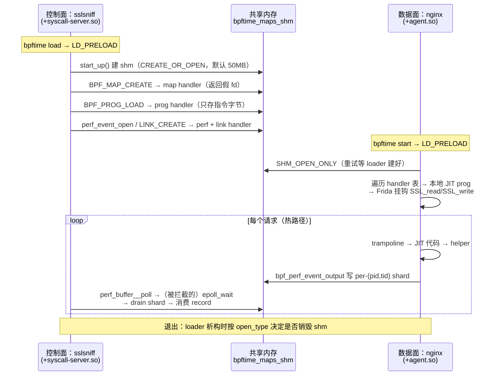

# 0. 全景架构：bpftime 是什么、由哪些部件组成

> 本章是整本指南的"地图页"：不深入任何一行热路径，只回答三个问题——bpftime 是什么、
> 由哪几块拼成、一次 trace 会话里谁在干什么。后续各章都在这张地图上放大某一块。

## 0.1 bpftime 是什么

bpftime 是一个**用户态 eBPF runtime**：它把"内核 eBPF 的那套对象模型和 API"整体搬进
用户态共享内存里重新实现一遍，让现成的 eBPF 工具（sslsniff、bcc/libbpf 程序）**不改
一行代码**就能在纯用户态跑起来。

对比部署形态，差异一目了然：

| | kernel eBPF | bpftime |
|---|---|---|
| 对象（prog/map/link）存放在 | 内核内存，凭 fd 引用 | `boost::interprocess` 共享内存段 `bpftime_maps_shm`（`runtime/src/handler/handler_manager.hpp:51`），凭**假 fd**（数组下标）引用 |
| 加载入口 | `bpf(2)` 真 syscall | LD_PRELOAD 的 `libbpftime-syscall-server.so` 用同名符号覆盖 glibc 的 `syscall()` 等函数（`runtime/syscall-server/syscall_server_main.cpp:214`），**没有** seccomp/ptrace |
| uprobe 触发 | 断点指令 → 内核 trap → 内核 VM 执行 | Frida GumInterceptor 改写目标函数序言 → 同进程内跳转 trampoline → 本进程 JIT 出的本机码（`attach/frida_uprobe_attach_impl/`） |
| 执行引擎 | 内核 verifier + JIT | 可选 PREVAIL verifier（`bpftime-verifier/`）+ LLVM OrcJIT / ubpf / AOT（`vm/`） |
| 每次事件的代价 | ≥2 次内核 trap（"trap 计价"） | 纯函数调用（"代码计价"），成本随业务代码同比缩放 |

一句话：**kernel eBPF 的每个事件按 trap 计价，bpftime 按代码计价**——这是它性能优势的
全部来源，也是后面三个修复故事的主题（冗余 syscall 会把"代码计价"偷偷退化回
"trap 计价"，见 0.5 的 📌 案例）。

代价是安全模型不同：bpftime 的 BPF 程序跑在目标进程地址空间里，隔离靠 verifier +
（可选）MPK，而不是内核态/用户态边界。这也解释了为什么 `bpf_probe_read` 需要自己装
SIGSEGV 处理器来模拟内核的 fault-safe copy（`runtime/src/bpf_helper.cpp:131`）。

## 0.2 组件图：两个 .so、一段 shm、若干工具

bpftime 运行时的主体是**两个动态库 + 一段共享内存**；其余都是工具和可选组件。



读图要点（均可在代码中核实）：

- **syscall-server 是"假内核"**：`BPF_MAP_CREATE`/`BPF_PROG_LOAD`/`BPF_LINK_CREATE` 全部
  落到 `syscall_context::handle_sysbpf`（`runtime/syscall-server/syscall_context.cpp:373`），
  最终只是往 shm 的 handler 表里写条目——prog 在 shm 里**只存指令字节**
  （`prog_handler.hpp:59` 的 `inst_vector insns`），不存任何 VM 状态。
- **agent 是"假内核的执行侧"**：启动时以 `SHM_OPEN_ONLY` 打开同一段 shm（带重试，
  `runtime/agent/agent.cpp:806-813`），遍历 handler 表，在**本进程**构造
  `bpftime_prog`、JIT、再通过 attach impl 挂钩。
- **VM 不在 shm 里**是关键设计：shm 只放"可序列化的对象描述"，每个 agent 进程各自
  JIT。这就是为什么 `bpftimetool export` 能把整个会话导出成 JSON。
- **daemon 是可选旁路**：不用 LD_PRELOAD 时，由内核 eBPF 程序
  （`daemon/kernel/bpf_tracer.bpf.c`）监听 `bpf(2)`/`perf_event_open(2)` 再转发进
  用户态 runtime。ssl-nginx benchmark 不走这条路。

## 0.3 仓库顶层目录

以 worktree（HEAD=`ead56c9`）实际内容为准：

| 目录 | 一句话 |
|---|---|
| `runtime/` | 核心：shm + handler 注册表、map 实现、helper、syscall-server 与 agent 两个 .so 的源码 |
| `attach/` | 事件挂载层：`base_attach_impl/`（抽象接口）、`frida_uprobe_attach_impl/`、`syscall_trace_attach_impl/`、`nv_attach_impl/`（CUDA）、`text_segment_transformer/`（syscall 指令改写）、`simple_attach_impl/` |
| `vm/` | 执行引擎：`vm-core/`（C 接口 `ebpf-vm.h`）、`compat/`（多后端抽象 `bpftime_vm_compat.hpp`）、`llvm-jit/`（LLVM OrcJIT/AOT，独立子项目） |
| `daemon/` | 内核协同模式：内核侧 tracer eBPF + 用户态 driver，把 kernel eBPF 操作重定向到 bpftime |
| `bpftime-verifier/` | PREVAIL（ebpf-verifier）的封装，loader 侧可选校验 |
| `tools/` | `cli/`（`bpftime load/start/attach/detach/trace` 命令）、`bpftimetool/`（shm export/import/remove）、`aot/`（AOT 编译器 CLI） |
| `example/` | 示例：`malloc/`、`sslsniff/`、`minimal/`、`gpu/` 等 |
| `benchmark/` | 性能测试：`ssl-nginx/`（你跑的那个）、`fuse/`、`deepflow/` 等 |
| `third_party/` | git submodule：frida-gum、libbpf、boost、spdlog、Catch2 等 |
| `cmake/` | CMake 辅助模块 |
| `docs/` | 文档 |
| `build/` | 本地构建产物（非源码） |
| `v1-v4-ablation/`、`v4-ablation/`、`build-alignment-test/` | 本地消融实验产物，**不属于上游仓库** |

入口文件：`Makefile`（`make build/release/unit-test` 的封装）、根 `CMakeLists.txt`、
`CLAUDE.md`（组件速览）。

## 0.4 一次 trace 会话：三方角色分工

以 ssl-nginx 为例（`bpftime load ./sslsniff` + `bpftime start nginx`，或对已运行进程
`bpftime attach <pid>`）。cli 做的事只是设置 `LD_PRELOAD` 环境变量后 exec
（`tools/cli/main.cpp:979-1013`），或用 Frida injector 把 agent 注入已运行进程
（`inject_by_frida`，`tools/cli/main.cpp:275`）。



三方职责一句话：**控制面写对象表、拉取结果；数据面读对象表、跑代码、产生结果；shm
是唯一的交汇点，也是唯一需要跨进程同步的地方**。热路径上（第 11–13 步，见
[第一部分](01-lifecycle.md)）控制面与数据面零直接通信——所有耦合都通过 shm 中的
perf buffer 解开。

## 0.5 三段定音的代码

### 选段一：拦截就是符号覆盖（syscall-server 的全部魔法）

`runtime/syscall-server/syscall_server_main.cpp:214`：

```c
extern "C" long syscall(long sysno, ...)
{
	initialize_ctx();
	// glibc directly reads the arguments without considering
	// the underlying argument number. So did us
	va_list args;
	va_start(args, sysno);
	long arg1 = va_arg(args, long);
	/* ... arg2..arg6 同理 ... */
	va_end(args);
	if (sysno == __NR_bpf) {
		int cmd = (int)arg1;
		auto attr = (union bpf_attr *)(uintptr_t)arg2;
		auto size = (size_t)arg3;
		return handle_exceptions([&]() {
			return context->handle_sysbpf(cmd, attr, size);
		});
	} else if (sysno == __NR_perf_event_open) {
		return handle_exceptions([&]() {
			return context->handle_perfevent(/* ... */);
		});
	} /* ... ioctl/dup3/... 其余分支，未识别的转发给真 syscall */
}
```

- **它在做什么**：定义一个和 glibc `syscall()` 同名的导出符号。LD_PRELOAD 让它排在
  链接查找序列最前面，libbpf 调 `syscall(__NR_bpf, ...)` 时进的就是这里。同文件
  91–207 行还覆盖了 `epoll_wait`/`ioctl`/`mmap64`/`close`/`openat`/`fopen` 等一整族。
- **为什么这样写**：零内核依赖、零权限要求（对比 seccomp/ptrace），且对 libbpf 完全
  透明——这是"兼容现成 eBPF 工具"目标的技术底座。
- **坑在哪**：只拦得住**走 PLT 的调用**。静态链接、`syscall` 指令内联（Go 程序）的
  调用会漏网——这正是 `attach/text_segment_transformer/` 存在的理由（改写 .text 段里
  的 syscall 指令）。另外无条件读 6 个 vararg 依赖"glibc 也这么干"的事实约定，注释
  写得很诚实。

### 选段二：agent 靠劫持 `__libc_start_main` 抢在 main 之前初始化

`runtime/agent/agent.cpp:457`：

```c
extern "C" int __libc_start_main(int (*main)(int, char **, char **), int argc,
				 char **argv,
				 int (*init)(int, char **, char **),
				 void (*fini)(void), void (*rtld_fini)(void),
				 void *stack_end)
{
	orig_main_func = main;
	using this_func_t = decltype(&__libc_start_main);
	this_func_t orig = (this_func_t)dlsym(RTLD_NEXT, "__libc_start_main");

	return orig(bpftime_hooked_main, argc, argv, init, fini, rtld_fini,
		    stack_end);
}
```

- **它在做什么**：把真正的 `main` 存起来，让 glibc 启动的是 `bpftime_hooked_main`——
  后者先跑 `bpftime_agent_main`（`agent.cpp:738`：打开 shm、注册三个 attach impl、
  实例化所有 prog 并挂钩），再调用原 `main`。
- **为什么这样写**：uprobe 必须在业务代码执行前就位（nginx 一启动就会调
  `SSL_read`）。而 `bpftime attach <pid>` 场景没有启动时机可抢，走的是另一入口——
  Frida 注入后直接调用导出的 `bpftime_agent_main`（`agent.cpp:446` 的 extern 声明，
  cli 侧 `tools/cli/main.cpp:1031-1032`）。同一初始化函数、两个触发路径。
- **坑在哪**：shm 可能还没被 loader 建好，所以 open 带重试循环
  （`agent.cpp:806-813`，`SHM_OPEN_ONLY`）；初始化在 main 之前意味着此时不能假设
  业务运行时（如 JVM/CUDA）已就绪，agent 里大量防御性代码源于此。

### 选段三：整个"内核对象模型"就是 shm 里的一个 variant 数组

`runtime/src/handler/handler_manager.hpp:84`：

```cpp
using handler_variant =
	std::variant<unused_handler, bpf_map_handler, bpf_link_handler,
		     bpf_prog_handler, bpf_perf_event_handler, epoll_handler,
		     memfd_handler>;

using handler_variant_vector =
	boost::interprocess::vector<handler_variant, handler_variant_allocator>;

// handler manager for keep bpf maps and progs fds
// This struct will be put on shared memory
class handler_manager {
	/* set_handler_at_empty_slot / get_handler / clear_id_at ... */
    private:
	handler_variant_vector handlers;
};
```

- **它在做什么**：内核里的"fd → bpf 对象"映射，在这里退化成"下标 → variant"的
  shm vector。`set_handler_at_empty_slot` 返回的下标就是应用看到的"fd"。
- **为什么这样写**：`std::variant` + boost.interprocess allocator 让七种对象共用一张
  表、整表可跨进程寻址（shm 内偏移指针）、可 JSON 序列化（`bpftime_shm_json.cpp`）。
  agent 侧遍历时用 `std::visit`/`holds_alternative` 分派类型。
- **坑在哪**：假 fd 与真 fd 共用一个整数空间，syscall-server 必须精确判断"这个 fd
  是我的还是内核的"（`close`/`mmap`/`ioctl` 拦截里都有这类判断）；另外 vector 槽位
  会被复用（`find_minimal_unused_idx`，`handler_manager.hpp:115`），跨会话残留的 shm
  会让新会话读到旧对象——这就是消融实验里"共享内存残留加剧双峰"的机制，实验前
  必须 `bpftimetool remove`。

### 📌 案例：三个修复在地图上的位置

三个你亲手参与的修复，恰好落在三个不同组件，可当作全书的"坐标锚点"：

1. **perf record 8 字节对齐**（`0fcdb0e`）→ **runtime/handler 层**。shm 里的 perf ring
   是自实现的（`software_perf_event_buffer`，`perf_event_handler.hpp:70` 附近），不是
   内核 mmap 页，perf ABI 的对齐规则得自己守：`align_perf_event_record_size`
   （`perf_event_handler.cpp:131`）。教训：**兼容层的 bug 表现为对端（libbpf）行为
   异常**——消费者读到跨界 `size=0` 空转，看起来像"性能问题"，实为正确性问题。
2. **删除每事件 affinity 绑核**（`076e3e4`）→ **helper 层**（`bpf_helper.cpp:500`
   `bpf_perf_event_output`）。数据面 helper 的每条指令都由**业务线程**买单；4 个冗余
   syscall 就把"代码计价"退化回"trap 计价"。写入本就走 per-(pid,tid) shard
   （`software_perf_event_shard`，`perf_event_handler.hpp:102`），绑核毫无保护作用。
3. **probe_read 的 sigaction 重装**（`ead56c9`）→ 同在 helper 层，但根因是**用户态
   模拟内核机制的副作用**：`bpf_probe_read` 靠 SIGSEGV 处理器模拟 fault-safe copy，
   "已安装"标志曾是未初始化局部变量（UB），修复后是 thread_local 标志
   （`bpf_helper.cpp:115`、`bpf_helper.cpp:127`）。

## 0.6 术语表

按"从外到内"排序。行号处即定义/核心使用点。

| 术语 | 含义 |
|---|---|
| **syscall-server** | `libbpftime-syscall-server.so`，LD_PRELOAD 进 loader 进程，用同名符号覆盖 `syscall()`/`mmap`/`epoll_*` 等，把 eBPF 相关调用改写为 shm 操作（`runtime/syscall-server/syscall_server_main.cpp:214`） |
| **agent** | `libbpftime-agent.so`，进入目标进程（LD_PRELOAD 或 Frida 注入），读 shm handler 表、JIT、挂钩（`runtime/agent/agent.cpp:738` `bpftime_agent_main`） |
| **全局 shm** | boost::interprocess managed_shared_memory 段，默认名 `bpftime_maps_shm`（可用 `BPFTIME_GLOBAL_SHM_NAME` 覆盖），默认 50MB（`bpftime_config.hpp:76`），所有跨进程状态的唯一载体 |
| **handler** | shm 中代表一个 eBPF 对象的条目：`bpf_map_handler`/`bpf_prog_handler`/`bpf_link_handler`/`bpf_perf_event_handler`/`epoll_handler`/`memfd_handler`（`handler_manager.hpp:84`） |
| **handler_manager** | shm 中的 handler variant vector + 槽位分配逻辑，即"fd 表替身"（`handler_manager.hpp:97`） |
| **假 fd** | 应用侧拿到的"fd"实为 handler vector 下标，不是内核 fd；`close`/`mmap` 等拦截函数负责区分真假 |
| **link handler** | `bpf_link_handler{prog_id, attach_target_id}`（`link_handler.hpp:16`），把"哪个 prog 挂到哪个事件"记成两个假 fd 的连线 |
| **shard** | `software_perf_event_shard`（`perf_event_handler.hpp:102`）：software perf buffer 的 per-(pid,tid) 生产者分片，写入免跨线程锁竞争；📌 绑核修复的论证核心 |
| **drain** | 消费者侧把各 producer shard 的记录搬进 `consumer_buffer` 的动作（`drain_producer_shards`，`perf_event_handler.hpp:150`），发生在被拦截的 `epoll_wait` 路径 |
| **attach impl** | `base_attach_impl` 的实现（`attach/base_attach_impl/base_attach_impl.hpp:29`）：一种事件源=一个 impl，核心接口 `create_attach_with_ebpf_callback` / `detach_by_id` |
| **attach_private_data** | 每种 attach 类型的参数载体，由字符串解析（`initialize_from_string`），agent 注册 impl 时同时注册解析器（`agent.cpp:852-894`） |
| **frida uprobe / trampoline** | 用 frida-gum 的 GumInterceptor 改写目标函数序言，跳转到保存 CPU 上下文的 trampoline，再回调 eBPF（`attach/frida_uprobe_attach_impl/`） |
| **text segment transformer** | `libbpftime-agent-transformer.so`（`attach/text_segment_transformer/`）：改写 .text 里的 syscall 指令以拦截不走 PLT 的系统调用；`bpftime start -s` 时作为 LD_PRELOAD 外壳、通过 `AGENT_SO` 环境变量再加载真 agent（`tools/cli/main.cpp:998-1008`） |
| **helper group** | 一组 helper 的注册单元：`kernel_utils`（probe_read/ktime 等）、`shm_maps`（map_lookup 等）、`ufunc` 三组，按 `agent_config` 开关注册进 prog（`bpf_attach_ctx.cpp:43-54`，定义在 `bpf_helper.cpp:1162`/`:1333`） |
| **ufunc** | bpftime 的 FFI 机制：BPF 程序直接调用宿主进程原生函数（`runtime/src/ufunc.cpp`） |
| **bpftime_prog** | 一个 prog 的**进程本地**执行体（指令 + VM 实例 + helper 绑定），从 shm 指令字节构造，**不在 shm 中**（`runtime/src/bpftime_prog.cpp`） |
| **VM backend / compat 层** | `bpftime_vm_impl` 抽象（`vm/compat/include/bpftime_vm_compat.hpp:27`：`load_code`/`exec`/`register_external_function`/`do_aot_compile`），按名字工厂创建（`:229`），后端有 llvm-vm 与 ubpf-vm |
| **LLVM JIT** | 默认高性能后端（`vm/llvm-jit/`，OrcJIT）。helper 调用在编译期绑定为符号 `_bpf_helper_ext_00NN` 的绝对地址，运行期零查表 |
| **AOT** | 提前编译：`do_aot_compile` 产出 native ELF，`tools/aot/` 提供 build/compile/run 子命令，产物存回 prog handler 的 `aot_insns`（`prog_handler.hpp:60`） |
| **verifier** | `bpftime-verifier/` 封装 PREVAIL（ebpf-verifier）；仅 loader 侧 `BPF_PROG_LOAD` 时可选启用（编译开关 `ENABLE_BPFTIME_VERIFIER`） |
| **daemon** | `daemon/`：内核 eBPF tracer 监听 `bpf(2)`/`perf_event_open(2)` 等，把 kernel eBPF 应用透明重定向到 bpftime，无需 LD_PRELOAD |
| **transporter** | daemon/共享 map 模式下的内核中继 eBPF 程序：把用户态 ringbuf 数据转投递到内核 perf event array，使 bpftime 事件能被内核侧消费者收到（`runtime/src/bpf_map/shared/perf_event_array_kernel_user.cpp:32`） |
| **agent_config** | shm 中的全局配置块（helper group 开关、shm 大小、VM 选择等，`runtime/include/bpftime_config.hpp`），loader 写、agent 读 |
| **bpftimetool** | shm 检查工具：`export`（导 JSON）/`import`/`remove`（`tools/bpftimetool/main.cpp:185-237`）；验证式阅读的主力，也是清理 shm 残留的标准动作 |
| **bpftime cli** | `bpftime load/start/attach/detach/trace` 命令（`tools/cli/main.cpp:869`）；本质只是"选择注入哪个 .so、怎么注入" |

## 0.7 自测题

1. **`bpftime load` 之后、`bpftime start` 之前，杀掉 loader 进程，shm 里的 prog/map
   还在吗？为什么这个行为对 `bpftimetool export` 是必要的？**

   <details><summary>答案</summary>

   在（取决于 open_type 的析构逻辑，POSIX shm 对象本身独立于进程存活；这也是
   `bpftimetool export` 能在事后检查会话的前提）。同一机制的反面是**残留**：上一次
   会话没清理的 shm 会污染下一次测量——消融实验里它是吞吐双峰的帮凶之一，所以
   runbook 要求每轮前 `bpftimetool remove`。定义处：`shm_remove`
   （`handler_manager.hpp:67`）只在特定 open_type 下注册删除。
   </details>

2. **为什么 VM/JIT 状态不放进共享内存，而是每个 agent 进程各自从指令字节重建？**

   <details><summary>答案</summary>

   JIT 产物含本进程绝对地址（helper 函数指针经 absoluteSymbols 绑定、代码页地址随
   ASLR 变化），跨进程无意义；而指令字节是纯数据，可序列化、可校验。于是 shm 只存
   "对象描述"（`prog_handler.hpp:59` 的 `insns`），执行体 `bpftime_prog` 在
   `init_attach_ctx_from_handlers`（`bpf_attach_ctx.cpp:59`）里本地构造。附带收益：
   JSON export/import、多 agent 挂同一 prog、AOT 产物按 handler 缓存都变得自然。
   </details>

3. **`bpftime attach <pid>` 没有 LD_PRELOAD 的机会，agent 是怎么进去并初始化的？**

   <details><summary>答案</summary>

   cli 用 frida-core 的 injector（`inject_by_frida`，`tools/cli/main.cpp:275`）把
   `libbpftime-agent.so` 注入目标进程，并直接调用其导出入口 `bpftime_agent_main`
   ——与 LD_PRELOAD 路径（`__libc_start_main` 劫持 → `bpftime_hooked_main`，
   `agent.cpp:457`）殊途同归。区别：attach 场景初始化发生在 main 之后任意时刻，
   错过的事件不补。
   </details>

4. **数据面热路径上（每个 SSL 事件），bpftime 理论上应该产生几次真正的内核
   syscall？三个修复前实际是几次？**

   <details><summary>答案</summary>

   理论 0 次——uprobe 分发、JIT 执行、shard 写入全在用户态（"代码计价"）。修复前
   实际每事件 6 次：`bpf_perf_event_output` 的 getcpu+getaffinity+2×setaffinity
   （4 次，绑核序列，已删）+ `bpf_probe_read` 的 2 次 `rt_sigaction`（未初始化标志
   UB，已改 thread_local，`bpf_helper.cpp:115`）。这 6 次把 bpftime 部分退化回
   trap 计价，在每请求预算 ~60µs 的 Jetson 上足以反转与 kernel eBPF 的胜负。
   </details>

5. **syscall-server 的拦截会漏掉哪类程序的 `bpf(2)` 调用？bpftime 对此的补救组件
   是什么？**

   <details><summary>答案</summary>

   静态链接或直接内联 `syscall` 指令（不经 glibc PLT）的程序，典型如 Go。补救是
   `attach/text_segment_transformer/`：扫描并改写 .text 段中的 syscall 指令；cli 的
   `-s/--enable-syscall-trace` 路径会把它作为外层 LD_PRELOAD、真 agent 经 `AGENT_SO`
   环境变量二段加载（`tools/cli/main.cpp:996-1013`）。
   </details>

---
[← 返回目录](README.md)
