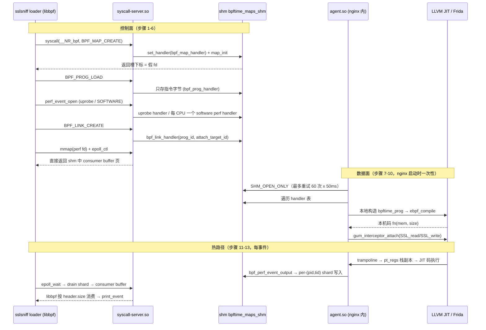
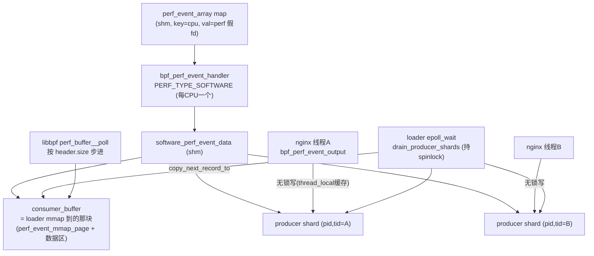

# 1. 一个事件的完整生命周期（主线，必读）

以 benchmark 的真实场景串起全部核心代码：`sslsniff`（loader，LD_PRELOAD 了
syscall-server.so）负责创建对象；`nginx`（LD_PRELOAD 了 agent.so）负责在
`SSL_read`/`SSL_write` 命中时执行 eBPF 程序并产出事件；两者之间**唯一的桥梁是
一块名为 `bpftime_maps_shm` 的共享内存**。你已经从第 11 步开始很熟了——这次从头走。

整条线的全景时序（五条泳道：loader / syscall-server / shm / agent+nginx / JIT+Frida）：



---

## 控制面（sslsniff loader 进程，LD_PRELOAD syscall-server）

### 第 1 步：符号拦截

`runtime/syscall-server/syscall_server_main.cpp:214` 定义了一个和 glibc 同名的
`syscall()`。拦截**只是 LD_PRELOAD 符号覆盖**：动态链接器让 libbpf 调到的
`syscall`/`mmap64`/`ioctl`/`epoll_*`/`close` 全部先落进 syscall-server 的同名导出
函数（`syscall_server_main.cpp:91-265`），不是 seccomp 也不是 ptrace——所以**只有
走 libc 封装的调用会被拦到**，直接 `svc`/`syscall` 指令进内核的调用管不着。真正的
libc 函数在 `syscall_context::init_original_functions()`
（`syscall_context.hpp:95-137`）里用 `dlsym(RTLD_NEXT, ...)` 逐个解析出来兜底，
并顺手 `unsetenv("LD_PRELOAD")` 防止污染子进程（`syscall_context.hpp:133`）。

```c
// syscall_server_main.cpp:214（节选）
extern "C" long syscall(long sysno, ...)
{
	initialize_ctx();          // CAS 保证全局 ctx 只构造一次（:58-74）
	va_list args;              // glibc 语义：不管实际参数个数，读满 6 个
	...
	if (sysno == __NR_bpf) {                    // :228 分流 bpf(2)
		return handle_exceptions([&]() {
			return context->handle_sysbpf(cmd, attr, size);
		});
	} else if (sysno == __NR_perf_event_open) { // :237 分流 perf_event_open(2)
		...
	}
	return context->orig_syscall_fn(sysno, ...); // 其余放行给真内核
}
```

坑：`initialize_ctx()`（`syscall_server_main.cpp:58-74`）用
`__atomic_compare_exchange` + `tls_initializing` 标志处理"构造 ctx 期间自己又调
了被拦截函数"的重入——spdlog 初始化会调 `fopen`，而 `fopen` 也被拦了。

### 第 2 步：shm 创建

第一次真正处理请求前，`try_startup()` 调 `start_up()`
（`syscall_server_utils.cpp:42`，`std::call_once` 保证一次），以
`SHM_CREATE_OR_OPEN` 初始化全局共享内存（`syscall_server_utils.cpp:51-52`）。
shm 名字是 `bpftime_maps_shm`（`handler_manager.hpp:51`），默认 50MB
（`bpftime_config.hpp:76`，`BPFTIME_SHM_MEMORY_MB` 可调），底层是
`boost::interprocess::managed_shared_memory`：`open_or_create` 模式在
`bpftime_shm_internal.cpp:676-683` 里创建 segment 并 `find_or_construct` 出
`handler_manager`（全局对象注册表）、`agent_config`、epoch 状态等命名对象。
`begin_new_session()`（`syscall_server_utils.cpp:56`）推进 epoch 序号——agent 靠
它检测"shm 是不是换了一茬"（见第 8 步）。

📌 **案例（对齐修复的背景）**：shm 是 `open_or_create` 的——上一轮 benchmark
异常退出时残留的 shm 会被下一轮直接复用，脏的 ring 状态曾是吞吐双峰的放大器
之一。跑实验前清理 `/dev/shm/bpftime_maps_shm` 从此成了 runbook 的固定步骤。

### 第 3 步：对象诞生（map 与 prog）

`syscall_context::handle_sysbpf()`（`syscall_context.cpp:373`）是 bpf(2) 的
userspace 版本。`BPF_MAP_CREATE`（`:384`）→ `bpftime_maps_create`
（`:424`，实现在 `bpftime_shm.cpp:81-84` → `add_bpf_map`
`bpftime_shm_internal.cpp:864`）→ `handler_manager::set_handler`
（`handler_manager.cpp:59-80`）把一个 `bpf_map_handler` 放进 shm 中 handler
vector 的空槽，并立刻 `map_init`（`handler_manager.cpp:73-77`）在 shm 里分配真正
的 map 存储。**返回给 libbpf 的"fd"就是这个槽下标，是假 fd**——这也是为什么
`close`/`dup3`/`mmap` 都必须被拦：假 fd 一旦漏进真内核 syscall 就会操作到无关
文件。判定函数是 `bpftime_is_map_fd` / `bpftime_is_perf_event_fd` 等（本质是查
槽里 variant 的类型，`bpftime_shm_internal.cpp:631-638`）。

`BPF_PROG_LOAD`（`:519`）先（可选）过 PREVAIL verifier
（`verify_ebpf_program`，`syscall_context.cpp:549`；`BPFTIME_VERIFIER_LEVEL`
控制 STRICT/WARNING/NO_VERIFY），然后 `bpftime_progs_create`（`:586`）——注意
**shm 里只存指令字节和名字**（`bpf_prog_handler`），不存任何 VM/JIT 状态。
谁执行谁编译，见第 9 步。

### 第 4 步：perf 对象

`handle_perfevent()`（`syscall_context.cpp:697`）按 `attr->type` 分流：

- **uprobe/uretprobe**（`:708-733`）：从 `attr->config1/config2` 取出目标
  `模块路径 + 偏移`，`attr->config` 的 retprobe 位区分 uprobe/uretprobe，
  `bpftime_uprobe_create`（`:728`）在 shm 写一个 uprobe 类型的
  `bpf_perf_event_handler`。**loader 进程此刻并没有任何东西被 hook**——挂钩发生
  在 nginx 侧的第 10 步。
- **PERF_TYPE_SOFTWARE**（`:796-801`）：`bpftime_add_software_perf_event`
  （`bpftime_shm_internal.cpp:259-266`）创建 software perf event handler。
  sslsniff 用 `perf_event_array` 时 libbpf 会**每个 CPU 开一个**，所以 shm 里
  有 N 个这样的 handler，每个持有一份 `software_perf_event_data`（你修过对齐的
  那个 buffer 家族就在这里诞生，结构详解见第 12 步）。

### 第 5 步：连线

`BPF_LINK_CREATE`（`syscall_context.cpp:595`）→ `bpftime_link_create`
（`:609`）在 shm 写入 `bpf_link_handler`，字段就两个核心：`prog_id` 和
`attach_target_id`——**两个假 fd 的连线记录**。`ioctl(PERF_EVENT_IOC_ENABLE)`
（`:910-917`）→ `bpftime_perf_event_enable` 置使能位。到此 shm 里已经形成完整的
对象图：`map ← prog → link → perf_event(uprobe)`，但整个系统还没有一行代码被
hook、没有一条指令被编译。

### 第 6 步：消费者就位

sslsniff 里 libbpf 建 perf buffer 的三件套全被拦：

```c
// syscall_context.cpp:877-886（handle_mmap64 节选）
} else if (fd != -1 && bpftime_is_software_perf_event(fd)) {
	// libbpf 以为自己在 mmap 内核 perf fd 的环形缓冲，
	// 实际拿到的是 shm 中 consumer_buffer 的原始内存
	if (auto ptr = bpftime_get_software_perf_event_raw_buffer(
		    fd, length);          // → ensure_mmap_buffer，按 libbpf
	    ptr != nullptr) {             //   请求的 length 扩容（页数须 2^n）
		mocked_mmap_values.insert((uintptr_t)ptr); // 记账，munmap 用
		return ptr;
	}
}
```

`handle_mmap64`（`syscall_context.cpp:840`）返回的指针来自
`try_get_software_perf_data_raw_buffer`（`perf_event_handler.cpp:643-654`），
即 **consumer buffer 在 shm 中的地址**：第一页是标准 `perf_event_mmap_page`
（`data_head`/`data_tail` 就在这页上），后面是数据区——完全复刻 kernel perf ABI，
libbpf 无需任何改动就能消费。`epoll_create1/epoll_ctl/epoll_wait` 同理被拦
（`syscall_context.cpp:955-1007`），`epoll_ctl(EPOLL_CTL_ADD)` 把 software perf
event 的 weak_ptr 挂进 shm 里的 `epoll_handler`（`:979-983`），支撑
`perf_buffer__poll`。

---

## 数据面（nginx 进程，LD_PRELOAD agent）

### 第 7 步：agent 启动

agent 劫持的是 `__libc_start_main`（`runtime/agent/agent.cpp:457-469`）：把真正
的 `main` 换成 `bpftime_hooked_main`（`:448-455`），后者**先跑
`bpftime_agent_main`（`:738`）再跑原 main**——所以 nginx 第一行业务代码执行前，
attach 已全部就位。`bpftime_agent_main` 里：

1. 以 `SHM_OPEN_ONLY` 打开 shm，**最多重试 60 次、每次间隔 50ms**
   （`agent.cpp:810-822`）——容忍"先起 nginx 后起 loader"的竞态窗口；
2. `register_attach_impl` 注册三类 attach 后端：syscall_trace（`:852`）、
   frida uprobe 家族（`:872`，覆盖 ATTACH_UPROBE/URETPROBE/UPROBE_OVERRIDE/
   UREPLACE 四种类型）、CUDA（`:894`，条件编译）。注册的同时传入一个
   `private_data_creator` 闭包，负责把字符串形式的 attach 参数（如
   `"模块路径:偏移"`）解析成各后端的私有数据；
3. 置 `*stay_resident = TRUE`（`:915`）防止 so 被卸载，然后进入第 8 步
   （`init_attach_ctx_from_handlers`，`:920-922`）。

### 第 8 步：实例化（遍历 handler 表）

`bpf_attach_ctx::init_attach_ctx_from_handlers`
（`runtime/src/attach/bpf_attach_ctx.cpp:59`，真身在 `:70`）先读 shm epoch 序号
判断会话是否更替（`:74-101`，不稳定则等 50ms 重试），然后**线性扫一遍 handler
vector**（`:103-117`），对每个已分配槽调 `instantiate_handler_at`（`:187`）。
关键设计：link handler 会**递归先实例化它引用的 prog 和 perf event**
（`:224-241`，用 `std::set<int> stk` 防环），保证依赖序；单个 handler 实例化失败
只记 debug 不中断（`:109-115`）——LD_PRELOAD 到无关进程（模块路径不存在）是常态
而非错误。

分类型看：

- **prog**：`instantiate_prog_handler_at`（`:284-305`）从 shm 指令字节**在本进程
  本地**构造 `bpftime_prog`（`:291-292`）——**VM 和 JIT 产物都不在 shm 里**，每个
  agent 进程各编译一份。随后 `load_prog_and_helpers`（`:40-57`）按 config 注册三
  组 helper（kernel utils / ufunc / shm maps，实现在
  `bpf_helper.cpp:1135-1141` 的 `add_helper_group_to_prog`，逐个
  `ebpf_register` 进 VM）。
- **software perf event**：`instantiate_perf_event_handler_at`（`:401-411`）
  直接返回——数据结构已在 shm，agent 侧无事可做。
- **uprobe perf event**：拼出 `"模块路径:偏移"` 字符串（`:427-440`），交给第 7 步
  注册的 `private_data_creator` 解析成 `frida_attach_private_data`（内部把模块名
  +偏移解析成本进程的**绝对地址**）。
- **link**：`instantiate_bpf_link_handler_at`（`:306`）把上面两者接起来，
  见第 10 步的回调闭包。

### 第 9 步：JIT

`bpftime_prog_load`（`runtime/src/bpftime_prog.cpp:169`）→ `ebpf_load` 校验并
拷入指令 → `ebpf_compile`（`:206`）走 LLVM OrcJIT（`vm/llvm-jit/`）产出
`uint64_t fn(void *mem, size_t len)` 本机码函数指针存进 `fn`（`:211`）。

**helper 分发没有运行期查表**：翻译 `EBPF_OP_CALL` 时
（`vm/llvm-jit/src/compiler.cpp:1043-1106`），`emitExtFuncCall`
（`compiler_utils.cpp:308-345`）按 `inst.imm` 直接生成对符号
`_bpf_helper_ext_%04u` 的调用（命名见 `compiler_utils.hpp:40-44`），实参就是
r1–r5、返回值写回 r0（`compiler_utils.cpp:318-333`）。链接期
`llvm_jit_context.cpp:515-553` 把每个已注册 helper 的**函数指针**用
`absoluteSymbols` 绑到对应符号。于是 `call 25`（perf_event_output）在编译期就
定死为一条对 C++ 函数 `bpf_perf_event_output` 的直接调用——从 JIT 代码到 helper
是**零间接层**，这正是"代码计价"优势的来源。

### 第 10 步：挂钩

`frida_attach_impl::create_attach_with_ebpf_callback`
（`attach/frida_uprobe_attach_impl/src/frida_uprobe_attach_impl.cpp:173`）先扫
`/proc/self/maps` 确认目标模块确实映射在本进程（`:188-228`，用
`std::filesystem::equivalent` 比对路径，防同名不同文件），然后 `attach_at`
（`:47-95`）。同一函数地址只建一个 `frida_internal_attach_entry`（`:64-74`），
多个 user attach（如 uprobe + uretprobe 同挂 `SSL_read`）共享它。真正改写指令的
是其构造函数里的 `gum_interceptor_attach`
（`frida_internal_attach_entry.cpp:134`）——Frida 把 `SSL_read`/`SSL_write` 的函
数序言改写为跳向 trampoline，并注册 `on_enter`/`on_leave` 两个回调
（`:338-339`）。

link 层则在 `bpf_attach_ctx.cpp:380-388` 里把 JIT 产物包成统一回调：

```cpp
// bpf_attach_ctx.cpp:380-388：prog 与 attach 后端之间唯一的胶水
auto cookie = handler.attach_cookie;
attach_id = attach_impl->create_attach_with_ebpf_callback(
	[=](void *mem, size_t mem_size, uint64_t *ret) -> int {
		current_thread_bpf_cookie = cookie;   // thread_local，供
		                                      // bpf_get_attach_cookie 读
		int err = prog->bpftime_prog_exec(
			(void *)mem, mem_size, ret);  // mem = pt_regs 副本
		return err;
	},
	*priv_data, attach_type);
```

至此静态图完成：`SSL_read 序言 → Frida trampoline → 这个 lambda → JIT 码`。

---

## 热路径（每个请求 2 次，读者最熟的部分）

### 第 11 步：触发

`SSL_read` 返回 → trampoline 收拢现场为 `GumCpuContext` → Frida 分发到
`uprobe_listener_on_leave`（uretprobe 路径，
`frida_internal_attach_entry.cpp:315-326`；入口侧是 `on_enter`，`:294-313`）。
每次命中都在**栈上**声明一个 `bpftime::pt_regs`，由
`convert_gum_cpu_context_to_pt_regs`（`frida_register_conversion.cpp:51`，
ARM64 版本）逐寄存器拷贝——**单向拷贝**：BPF 程序改 ctx 不会写回真实寄存器
（uprobe/uretprobe 语义本来就是只读观测；想改返回值要用 override attach，
走 `bpftime_set_retval` 另一条路）。随后
`iterate_uretprobe_callbacks`（`:231-239`）遍历该地址上所有 user attach，
`run_callback`（`frida_attach_entry.hpp:24-47`）以
`ebpf_cb((void*)&regs, sizeof(regs), &ret)`（`:40-41`）进入上面第 10 步的
lambda → `bpftime_prog_exec`（`bpftime_prog.cpp:231`）。

`bpftime_prog_exec` 先 `bpftime_protect_disable()`（`:240`，MPK 开启时解锁 shm
写权限，未启用时是空操作），jitted 分支直接 `val = fn(memory, memory_size)`
（`:245-248`）跑本机码，返回前 `bpftime_protect_enable()`（`:258`）。对比 kernel
uprobe 此处已省掉 2 次以上内核陷入——这是 bpftime 的结构性优势所在。

📌 **案例（sigaction 修复，`ead56c9`）**：sslsniff 的 prog 里会调
`bpf_probe_read_user` 抄 SSL buffer。`bpftime_probe_read`
（`bpf_helper.cpp:157-214`）用"装一个 SIGSEGV handler + 出错时把 PC 改到
`jump_point_read`"模拟内核 probe_read 的容错。修复前，"handler 是否已装"的判断
读了一个**未初始化的局部变量**（UB，首次调用后恒真），导致每次 probe_read 都白付
2 个 `rt_sigaction` syscall。修复后改为 `thread_local static bool
segv_read_handler_installed`（`bpf_helper.cpp:115`，安装点 `:185-200`）——
每线程只装一次。教训：热路径上的"一次性初始化"必须有明确的、可证明初始化过的
标志位。

### 第 12 步：输出

JIT 码里的 `call 25` 直落 `bpf_perf_event_output`（`bpf_helper.cpp:500`）：

```cpp
// bpf_helper.cpp:500-539（节选，已含绑核删除修复）
uint64_t bpf_perf_event_output(uint64_t ctx, uint64_t map, uint64_t flags,
			       uint64_t data, uint64_t size)
{
	int32_t current_cpu = my_sched_getcpu();  // :503 cpu 只是一次快照
	// :509-514 注释明确记录了修复结论：cpu 值仅用作 per-CPU map 的
	// lookup key，ring 写入走 per-thread shard，下文不依赖"仍在此核上"，
	// 因此不做任何绑核（sched_setaffinity 在 ARM 上每事件耗数微秒）
	int fd = (int)map;
	bpftime::bpf_map_type map_ty;             // :519 查 map 类型
	...
	if (map_ty == BPF_MAP_TYPE_PERF_EVENT_ARRAY) {
		const int32_t *val_ptr = ...bpf_map_lookup_elem(
				fd, &current_cpu, false);  // :526 cpu → 槽
		int32_t perf_handler_fd = *val_ptr;        // 槽里存 perf 假 fd
		ret = bpftime_perf_event_output(perf_handler_fd,
				(const void *)data, (size_t)size); // :537
	}
	...
}
```

`my_sched_getcpu` 在 Linux 上就是 glibc `sched_getcpu()`
（`platform_utils.cpp:7-9`；现代 glibc 底层走 rseq/vDSO，纳秒级，无陷入）。

📌 **案例（绑核删除，`076e3e4`）**：修复前这里在 `my_sched_getcpu` 之后跟着
getcpu + getaffinity + setaffinity(单核) + …末尾 setaffinity(恢复) 的完整序列，
Jetson 上每事件 3.1–6.7µs、独占 event-output 段成本的 72%。代码走读证明它无任何
保护作用（cpu 值在绑核**前**已快照；写入走 per-thread shard 不需要独占 CPU；
绑核也不是锁）；还附带两个子 bug：错误路径漏恢复 mask 会把 nginx worker 永久钉死
单核、恢复用的陈旧 mask 与应用自身 setaffinity 竞态。修复就是整段删除——
`:509-514` 的注释是留给后人的"为什么不要加回来"。

`bpftime_perf_event_output`（`bpftime_shm.cpp:579-600`）由假 fd 找到
`bpf_perf_event_handler`，转给 `software_perf_event_data::output_data`
（`perf_event_handler.cpp:601-604`）→ `get_current_thread_shard().buffer
.output_data(buf, size)`。核心数据结构（全部住在 shm）：

| `software_perf_event_data` 字段 | 谁写 | 谁读 | 说明 |
|---|---|---|---|
| `consumer_buffer` | loader 侧 drain 时 append（`:554`） | libbpf 经 mmap 直接读、推进 `data_tail` | 就是第 6 步 mmap 返回的那块；kernel perf ABI 布局 |
| `producer_shards`（boost 容器） | nginx 各线程首次 output 时 emplace（`:535`） | loader drain 遍历（`:553`） | **每 (pid,tid) 一个 shard**，各含独立 ring |
| `shard_lock`（进程共享 spinlock） | 建 shard / drain / 回收时持有（`:513`,`:552`） | — | **热路径写入不持锁**，靠 thread_local 缓存绕过 |
| `event_generation` / `producer_buffer_generation` | 创建时 / consumer buffer 扩容时（`:620-623`） | shard 缓存校验（`:500-506`） | 换代即缓存失效，防用到旧 shard |

`get_current_thread_shard`（`perf_event_handler.cpp:491-548`）先查
**thread_local 缓存**（`:142-144` 定义，`:497-510` 校验三层 generation +
pid/tid），命中则零锁零查找直达自己的 shard；未命中才拿 spinlock 线性找/建。
这就是"两个 nginx 线程同时命中 uprobe 也互不争用"的机制根据。

真正落盘在 `append_record_parts`（`perf_event_handler.cpp:302-355`）：

```cpp
// perf_event_handler.cpp:310-347（节选，对齐修复的核心）
const size_t raw_record_size = first_size + second_size;
size_t record_size;
if (!align_perf_event_record_size(raw_record_size, record_size))
	return false;              // :131-140 向上取整到 8B 倍数
...
// :330 恒留一字节空隙，使 head==tail 只可能表示"空"
if (available_size <= record_size)
	return false;              // 满了：静默丢弃（已知未修：无 LOST 记录）
write_wrapped(data_head, first, first_size);           // header
if (second_size > 0)
	write_wrapped(data_head + first_size, second, second_size); // payload
if (record_size > raw_record_size) {
	const uint8_t padding[perf_event_record_alignment - 1] = {};
	write_wrapped(..., padding, record_size - raw_record_size); // :341-345
}                                                      // padding 清零
smp_store_release_u64(&header.data_head, new_head);    // :347 发布
```

📌 **案例（对齐修复，`0fcdb0e`）**：修复前 record 按原始长度紧密排布，header
（8 字节）可以恰好横跨环回绕点——libbpf 假设 header 永不跨界（kernel 保证 8B
对齐），读到撕裂的 `size=0` 后死循环空转，consumer 停摆 → shard 填满 → 静默丢
事件 → 吞吐双峰。修复三件套都在这段附近：`record_size` 8B 对齐并写入
`header.size`（`output_data` 的 `:373-383`，同时以 `uint16_t` 上限拒绝超大
记录）、padding 清零、消费侧 `copy_next_record_to` 拒绝非对齐记录（`:441-448`
校验 `size % 8 == 0`）。

### 第 13 步：消费

sslsniff 的 `perf_buffer__poll` → 被拦截的 `epoll_wait`
（`syscall_server_main.cpp:91` → `handle_epoll_wait` `syscall_context.cpp:995`
→ `bpftime_epoll_wait` `bpftime_shm.cpp:418`）。这是个 **1ms 粒度的轮询模拟**：
循环里对 epoll 实例挂的每个 software perf event 调 `has_data()`
（`bpftime_shm.cpp:475`）；无事件时用 `sigtimedwait` 睡 1ms 并保持
SIGINT/SIGTERM 可中断（`:511-533`——先 sigprocmask 阻塞、再定时等待、捕到信号则
手动转发给原 handler）。

关键副作用：`has_data()`（`perf_event_handler.cpp:589-593`）**先
`drain_producer_shards()` 再判断**——搬运发生在 loader 进程里：

- `drain_producer_shards`（`:550-558`）持 `shard_lock` 遍历所有 shard，逐条
  `copy_next_record_to(consumer_buffer)`（`:420-462`）：读出 record header
  → 校验 size（下限/上限/8B 对齐，`:441-448`，脏数据则丢弃整个 shard 存量）
  → 经 `copy_buffer` 中转搬进 consumer ring → `smp_store_release` 推进 shard
  的 `data_tail`（`:459-460`）。consumer ring 满时返回 false，记录留在 shard
  里下轮再搬。
- 顺带按节流阈值回收已死线程的空 shard（`:560-587`，`tgkill(sig 0)` 探活）。

之后 libbpf 在 mmap 的 consumer buffer 上按标准 perf 协议消费：读
`data_head`、按每条 `header.size` 步进、回调 `print_event`、写回
`data_tail`——**跨进程各自推进同一页上的 head/tail，全程无锁无 syscall**（除了
那次被拦的 epoll_wait 本身）。

一个事件从 nginx 线程到 sslsniff 屏幕，数据共经历 3 次 memcpy：BPF 栈 → shard
ring（第 12 步）；shard ring → `copy_buffer` → consumer ring（第 13 步 drain，
算两次）。

热路径上 perf 数据结构的全景：



走完这 13 步，架构骨架即完整。下面横向展开。

---

## 自测题

**1. loader 拿到的 map "fd" 是什么？为什么 `close`、`dup3`、`mmap` 都必须被拦截？**

<details><summary>答案</summary>

是 shm 中 handler vector 的槽下标（`handler_manager::set_handler`，
`handler_manager.cpp:59-80` 返回槽号），不是内核 fd。libbpf 拿到后会像真 fd 一样
`mmap` 它（perf buffer）、`close` 它（清理）、偶尔 `dup3` 它（fd 固定技巧）——
若不拦截，这些小整数会撞上进程真实打开的文件（比如 fd 3 可能是个日志文件），
造成误关/误映射。所以 `syscall_server_main.cpp` 把这些 libc 入口全部覆盖，先用
`bpftime_is_*_fd` 判定是假 fd 才走 mock，否则用 `dlsym(RTLD_NEXT)` 解析出的
原函数放行。
</details>

**2. eBPF 指令字节放在 shm 里，为什么 VM 和 JIT 产物不放？**

<details><summary>答案</summary>

JIT 产物是带绝对地址的本机码：helper 函数指针（`absoluteSymbols`，
`llvm_jit_context.cpp:515-553`）、LLVM 运行时结构都是**本进程地址空间**的指针，
跨进程无意义（ASLR 下各进程加载地址不同）。所以 shm 只存与地址无关的指令字节
（`bpf_prog_handler`），每个 agent 在 `instantiate_prog_handler_at`
（`bpf_attach_ctx.cpp:284-305`）里本地构造 `bpftime_prog` 并各自编译一份。
代价是每个被注入进程都付一次编译时间，换来的是零共享状态、零重定位。
</details>

**3. 两个 nginx worker 线程同时命中 uprobe 并各自 `bpf_perf_event_output`，会争用同一个 ring 吗？会拿锁吗？**

<details><summary>答案</summary>

不会争 ring：写入目标由 `get_current_thread_shard`
（`perf_event_handler.cpp:491`）按 (pid, tid) 选择，每线程独占一个 shard ring。
稳态下也不拿锁：thread_local 缓存（`:142-144`）校验 generation 与 pid/tid 后
直接返回 shard 指针；只有**首次写入**（建 shard）或缓存失效（consumer buffer
扩容导致 `producer_buffer_generation` 换代）才走 `shard_lock` 慢路径。
唯一的常态竞争在 loader 的 drain 与"建 shard"之间，同样由该 spinlock 序列化。
这正是绑核序列"无保护作用"论证的核心一环。
</details>

**4. 修复对齐 bug 时为什么生产侧对齐之外，还要在 `copy_next_record_to` 加消费侧校验？**

<details><summary>答案</summary>

因为 shard ring 住在共享内存里，其内容不受本进程控制：旧版本进程残留的
非对齐记录、异常退出留下的半写记录、甚至被追踪进程的越界写都可能出现。
消费侧（`perf_event_handler.cpp:441-448`）校验 `size >= sizeof(header) &&
size <= mmap_size && size % 8 == 0`，不满足则丢弃该 shard 全部存量并把 tail
推到 head——把"不可信输入"挡在 consumer buffer（libbpf 直接消费、无再校验能力）
之外。这是跨进程共享数据结构的通用原则：写方保证不变量，读方仍需验证不变量。
</details>

**5. 绑核序列删除后，`current_cpu` 快照可能在写入前就"过时"（线程被迁核）。这会造成错误吗？**

<details><summary>答案</summary>

不会。`current_cpu` 唯一的用途是作 `perf_event_array` 的 lookup key
（`bpf_helper.cpp:526-529`）选出一个 software perf event 假 fd；实际写入走
per-(pid,tid) shard，与 CPU 无关；消费侧也是把所有 CPU 的 handler 统统 drain。
迁核只会让这条记录"归属"到旧 CPU 的 handler 下，影响的是按 CPU 维度统计的
准确性（kernel perf 同样存在采样瞬间与处理瞬间的错位），不影响记录完整性与
顺序。既然"钉住 CPU"不保护任何不变量，它就只是纯开销——这就是删除的正当性。
</details>

**6. agent 为什么劫持 `__libc_start_main` 而不是用构造函数（`__attribute__((constructor))`）？**

<details><summary>答案</summary>

`bpftime_hooked_main`（`agent.cpp:448-455`）在 `orig_main_func` 之前同步执行
`bpftime_agent_main`，保证 attach（含 Frida 改写函数序言）完成后 nginx 才开始
接请求——不丢启动早期的事件，也避免"业务线程正在执行 `SSL_read` 时序言被改写"
的竞态。此外该文件也保留了 Frida 注入路径（`bpftime_agent_main` 可被
`bpftime attach` 直接调用，`:446`），`__libc_start_main` 劫持只是 LD_PRELOAD
场景下的触发点。（注：构造函数时机在 glibc 里同样早于 main，但相对其他 so 的
构造顺序不可控，且拿不到 main 指针无法实现"先于业务、晚于全部初始化"的精确
排序。）
</details>

---
[← 返回目录](README.md)
