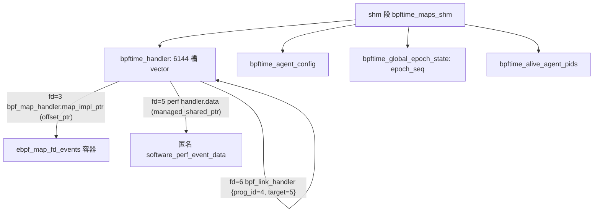
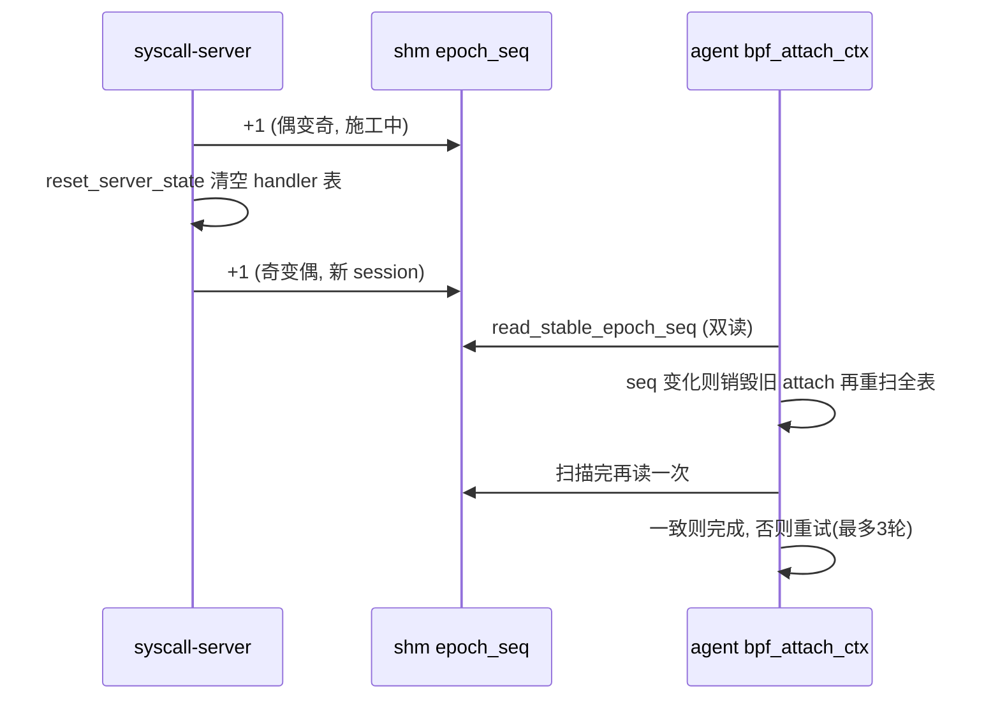

# 2. runtime 核心：共享内存与 handler 注册表

内核 eBPF 里，`bpf()` 返回的 fd 由内核对象表背书；bpftime 没有内核可依赖，
于是用一块跨进程共享内存（boost `managed_shared_memory`）来"冒充内核"。
一切的中心是 shm 里一个**定长（默认 6144 槽，`bpftime_config.hpp:24,81`）的
`boost::interprocess::vector<handler_variant>`**——**下标即假 fd，variant
的当前类型即 fd 的种类**（`handler_manager.hpp:84-93,128`）。loader（被
syscall-server 劫持的 sslsniff）往表里写，agent（注入 nginx 的 so）从表里读，
双方只共享这块内存，不做任何 RPC。

## 1.1 阅读地图

| 文件 | 行数 | 看什么 |
|---|---:|---|
| `runtime/src/handler/handler_manager.hpp` | 133 | handler_variant 的 7 个成员、shm 命名对象常量（先读，全读） |
| `runtime/src/handler/handler_manager.cpp` | 154 | `set_handler` / `clear_id_at`（级联删除）/ `clear_all` |
| `runtime/src/bpftime_shm_internal.cpp` | 1159 | **L640 构造函数是全子系统最密的 100 行**：三种 shm_open_type 分支 = server 建 / agent 开的协作；L813 起是 epoch seqlock |
| `runtime/src/bpftime_shm_internal.hpp` | 306 | `class bpftime_shm` 当 API 目录读；`is_*_fd` 系列是 fd 判型层；L33-42 epoch 定义 |
| `runtime/src/bpftime_shm.cpp` | 714 | 纯 C ABI 转发层，扫一遍即可；但 L639 `map_ptr_by_fd` 值得细看 |
| `handler/{prog,link,map,perf_event,epoll,memfd}_handler.hpp` | ~720 | "shm 只放数据、VM 在各进程本地"的分界 |
| `runtime/src/bpftime_config.cpp` | 172 | BPFTIME_* 环境变量 → agent_config |

## 1.2 shm 内存布局：一段 segment、五个命名对象

boost `managed_shared_memory` 允许在一段 shm 里按**名字**construct/find 对象
（内部自带分配器与名字索引）。bpftime 的 segment 名默认 `bpftime_maps_shm`
（`handler_manager.hpp:51`，可用 `BPFTIME_GLOBAL_SHM_NAME` 覆盖，:57-64；
Linux 下就是 `/dev/shm/bpftime_maps_shm` 这个文件），默认大小 50MB
（`bpftime_config.hpp:76`；构造函数里 `memory_size << 20` 把 MB 换算成字节，
`bpftime_shm_internal.cpp:679`——旁边那句 "Allocate 20M bytes" 注释是过时的）。

```
/dev/shm/bpftime_maps_shm  (managed_shared_memory, 默认 50MB)
├── "bpftime_handler"            handler_manager        ← 全书主角：6144 槽注册表
├── "bpftime_syscall_pid_set"    set<int>               哪些 pid 已装 syscall tracer
├── "bpftime_agent_config"       agent_config           helper 开关/JIT 开关等
├── "bpftime_alive_agent_pids"   set<int>               活着的 agent pid（注入时登记）
├── "bpftime_global_epoch_state" { uint64_t epoch_seq } 会话 seqlock（§1.5）
├── "ebpf_map_fd_<map名>" × N    各 map 的数据容器（map_init 按名构造）
└── (匿名对象) × N               software_perf_event_data、map refcount 等
```

前四个的名字常量在 `handler_manager.hpp:52-56`；epoch 对象名是硬编码字面量
（`bpftime_shm_internal.cpp:669,705,745`）。map 容器名的构造规则是
`"ebpf_map_fd_" + name`（`map_handler.cpp:64-67`）。



**指针纪律**：`bpftime_shm` 的成员 `manager` / `agent_config` / `epoch_state`
等是**裸指针**（`bpftime_shm_internal.hpp:65-76`），每个进程 attach 时各自
`find<>` 出来（shm 在不同进程映射基址不同）；而 **shm 内部**的一切指涉都必须
用 `offset_ptr` 或 shm 分配器容器——例如 `bpf_map_handler::map_impl_ptr` 是
`offset_ptr<void>`（`map_handler.hpp:70,281`）。这就是"什么能放进 shm"的
判据：能位置无关的数据能放；JIT 代码、`bpftime_prog` 对象、真实文件 fd 都不能。

## 1.3 handler_variant：七种 handler 字段级表

`handler_variant = std::variant<...>`（`handler_manager.hpp:84-87`），
variant 下标固定（`set_handler` 的日志就打印 `handler.index()`，
`handler_manager.cpp:71`）：

| idx | 类型 | 关键字段 | 谁写 | 谁读 | 生命周期备注 |
|---|---|---|---|---|---|
| 0 | `unused_handler` | 无（`handler_manager.hpp:46`） | — | `is_allocated` | 空槽标记；表初始化时全表填它 |
| 1 | `bpf_map_handler` | `attr`、`type`、`name`、`map_lock`(spinlock)、`map_impl_ptr`(offset_ptr)、`map_refcnt_ptr`、`key_size/value_size/max_entries`（`map_handler.hpp:69-286`） | loader 建；agent/loader 都可 update elem | 双方（helper 与 syscall 两条路径，`from_syscall` 参数区分） | 析构**不**释放 impl，靠 `clear_id_at`→`map_free`；析构时 impl 未释放会打 CRITICAL（`map_handler.hpp:132-142`） |
| 2 | `bpf_link_handler` | `args`、`prog_id`、`attach_target_id`、`attach_cookie`（`link_handler.hpp:16-43`） | loader | agent（attach 时把 prog 挂到 perf event 上） | 纯 POD；cookie 只在 perf-event 型 link 里取自 `perf_event.bpf_cookie`（:30-31） |
| 3 | `bpf_prog_handler` | `type`、`insns`(shm vector\<ebpf_inst\>)、`aot_insns`、`name`（`prog_handler.hpp:36,59-62`） | loader 写入指令字节 | agent 读出并**本地**建 VM/JIT | shm 里只有字节码；改它不影响已实例化的 agent |
| 4 | `bpf_perf_event_handler` | `type`(int)、`enabled`(mutable bool)、`data`(内嵌 variant，见下)（`perf_event_handler.hpp:191-241`） | loader 建、`enable()` 只置位 `enabled=true`（:196-203，真正 attach 是 agent 的事） | agent 判型后做 uprobe attach；software 型双方都碰 | `data` 按事件类型五选一 |
| 5 | `epoll_handler` | `files`: vector\<epoll_file{weak_ptr, epoll_data_t}\>（`epoll_handler.hpp:20-35`） | loader（epoll_ctl 劫持） | loader 消费者轮询 | 存 weak_ptr，perf 数据没了也不悬垂 |
| 6 | `memfd_handler` | `flags`、`name`（`memfd_handler.hpp:16-21`） | loader | loader | 给 memfd_create 劫持占位用 |

perf handler 的内嵌 `data` variant（`perf_event_handler.hpp:185-188`）：
`uprobe_perf_event_data{offset,pid,ref_ctr_off,_module_name}`(:162-167) /
`tracepoint_perf_event_data`(:174-179) / `kprobe_perf_event_data`(:169-173) /
`custom_perf_event_data`(:181-183) /
`software_perf_event_shared_ptr`——最后这个是跨进程 shared_ptr，指向匿名的
`software_perf_event_data`（:123-153）：里面有消费者 ring
（`consumer_buffer`）、**per-(pid,tid) 生产者 shard 链表 `producer_shards`**
（:135；shard 结构 :102-114）和 `shard_lock` 自旋锁。

> 📌 **案例（对齐修复）**：你修的 8 字节对齐 bug 就长在这里——perf record
> 直接以字节形式写进 shm 里的 `software_perf_event_buffer::mmap_buffer`
> （`perf_event_handler.hpp:71-100`），生产者（nginx 里的 agent）和消费者
> （sslsniff 进程）读写的是**同一块物理内存**。record 头跨环尾时消费者读到
> `size=0`，就是"shm 是唯一媒介、没有任何序列化层"这个设计的直接后果。
> 修复后的对齐常量与断言在 `perf_event_handler.cpp:129-138`。

> 📌 **案例（绑核修复）**：per-(pid,tid) shard 链表正是"绑核无保护作用"论证的
> 核心证据：每个线程写自己的 shard，根本没有跨 CPU 竞争可言，绑核既不是锁
> 也不改变写入目标。现在 `bpf_helper.cpp:509-514` 留有一段注释，明确记载
> "cpu 只是 per-CPU map 查找 key 的快照，禁止在这里 pin 线程"。

还有个微妙细节：`map_lock` 是 `pthread_spinlock_t`，但初始化传的 pshared=0
（PTHREAD_PROCESS_PRIVATE，`map_handler.hpp:95,108,121`）。glibc 的 spinlock
本质是原子整数、不依赖该标志，跨进程实际能用——但严格说这是依赖实现的行为。

## 1.4 注释版选段一：构造函数三分支（`bpftime_shm_internal.cpp:640`）

构造函数按 `shm_open_type`（枚举定义 `bpftime_shm.hpp:137-142`）分流。
先看谁用哪种：

| open_type | 语义 | 使用者 |
|---|---|---|
| `SHM_CREATE_OR_OPEN` | 有则开、无则建 | syscall-server（`syscall_server_utils.cpp:51-52`）、bpftimetool load/import（`tools/bpftimetool/main.cpp:179-180,231-232`） |
| `SHM_OPEN_ONLY` | 只开，不存在就抛异常 | agent（`agent.cpp:812-813`，外面套了 60 次×50ms 的重试环 :810-822 对付注入竞态）、bpftimetool export/dump |
| `SHM_REMOVE_AND_CREATE` | 删了重建 | daemon（`daemon/user/bpftime_driver.cpp:383`）、各单测/基准 |
| `SHM_NO_CREATE` | 什么都不建 | 纯测试（构造函数直接 return，:747-752） |

核心分支（节选自 `bpftime_shm_internal.cpp:647-706`）：

```cpp
if (type == shm_open_type::SHM_OPEN_ONLY) {              // :647 agent 路径
    segment = managed_shared_memory(open_only, shm_name); // :650 不存在 → 抛异常
    manager = segment.find<handler_manager>(              // :652 只 find，不 construct
              DEFAULT_GLOBAL_HANDLER_NAME).first;         //      找不到得 nullptr
    /* syscall_installed_pids / agent_config / injected_pids
       / epoch_state 同理逐个 find<>()  :655-670 */
} else if (type == shm_open_type::SHM_CREATE_OR_OPEN) {   // :672 server 路径
    segment = managed_shared_memory(open_or_create,
              shm_name, memory_size << 20);               // :676-679 MB→字节
    manager = segment.find_or_construct<handler_manager>( // :681 关键：若 shm 残留，
              DEFAULT_GLOBAL_HANDLER_NAME)(               //   拿到的是**旧表**，
              segment, max_fd_count);                     //   不会重建！
    /* 其余对象同样 find_or_construct  :686-706 */
}
```

要点：

- **agent 全是 `find<>`**：agent 永远不改 shm 的"骨架"，找不到就拿 nullptr
  （所以 `is_*_fd` 系列都先判 `manager == nullptr`）。
- **server 用 `find_or_construct`**：shm 残留时会拿到上一轮的旧 handler 表。
  这不是 bug 而是设计——已注入的 agent 还映射着这段内存，删了重建等于把别人
  脚下的地毯抽走。旧数据的清理交给 §1.5 的会话协议。
- agent_config 虽然可能 find 到旧值，但 server 启动流程随后会
  `bpftime_set_agent_config(std::move(agent_config))` 用当前环境变量整体覆盖
  （`syscall_server_utils.cpp:97`；覆盖实现是显式析构 + `construct_at`，
  `bpftime_shm_internal.cpp:968-979`）。

环境变量 → config 的映射（`bpftime_config.cpp`）：`BPFTIME_SHM_MEMORY_MB`
(:115，1MB–10GB 夹取)、`BPFTIME_MAX_FD_COUNT`(:120)、`BPFTIME_HELPER_GROUPS`
(:92，逗号分隔 ufunc/kernel/shm_map)、`BPFTIME_DISABLE_JIT`(:106)、
`BPFTIME_VM_NAME`(:126)、`BPFTIME_VERIFIER_LEVEL`(:133)、
`BPFTIME_LOG_OUTPUT`(:154)。

## 1.5 epoch/session seqlock：清态协议的底层

既然 server 复用旧 shm，就必须回答两个问题：旧 handler 怎么清？agent 怎么
知道"世界换代了"？答案是一个 8 字节的 seqlock：

```cpp
// bpftime_shm_internal.hpp:36-42
// - odd  : server is updating/resetting handlers
// - even : stable; session_id = epoch_seq / 2
struct bpftime_global_epoch_state { std::uint64_t epoch_seq = 0; };
```

**写侧**（server 启动时，`syscall_server_utils.cpp:56` 调用）：

```cpp
std::uint64_t bpftime_shm::begin_new_session()           // :833
{
    ...
    __atomic_add_fetch(&epoch_state->epoch_seq, 1,       // :841 偶→奇：挂"施工中"牌
                       __ATOMIC_ACQ_REL);
    reset_server_state();                                // :842 clear_all 逐槽级联清空
                                                         //  + 清 syscall_installed_pids
                                                         //  （:1118-1127；注意 injected_pids
                                                         //   不清——agent 还活着）
    std::uint64_t seq = __atomic_add_fetch(              // :844 奇→偶：新 session 号
        &epoch_state->epoch_seq, 1, __ATOMIC_ACQ_REL);   //      = seq/2
    return seq;
}
```

**读侧**（agent，经典 seqlock 双读）：

```cpp
std::uint64_t bpftime_shm::read_stable_epoch_seq(int max_tries) const // :813
{
    if (!epoch_state)
        return BPFTIME_EPOCH_SEQ_MISSING;                // :815 旧版 shm 没有该对象
    for (int i = 0; i < max_tries; i++) {
        std::uint64_t a = __atomic_load_n(&epoch_state->epoch_seq,
                                          __ATOMIC_ACQUIRE);
        if (a & 1U) { usleep(1000); continue; }          // :820-823 奇数=施工中，等
        std::uint64_t b = __atomic_load_n(&epoch_state->epoch_seq,
                                          __ATOMIC_ACQUIRE);
        if (a == b) return a;                            // :827 两次读一致才算稳定
    }
    return BPFTIME_EPOCH_SEQ_UNSTABLE;                   // :830 200 次仍不稳
}
```

特殊值（`bpftime_shm_internal.hpp:33-34`）：`MISSING = UINT64_MAX-1`（shm 里
根本没有 epoch 对象，视为"会话跟踪不可用"降级），`UNSTABLE = UINT64_MAX`。
注意 hpp:134 的注释说 "Returns 0 if the epoch object isn't available"——
**注释是错的**，实现返回的是 MISSING；读大型代码时"以实现为准"的典型例子。

agent 侧的消费者是 `bpf_attach_ctx::init_attach_ctx_from_handlers`
（`bpf_attach_ctx.cpp:74-158`）：扫表前读一次 epoch，发现与
`last_epoch_seq_seen` 不同就先 `destroy_all_attach_links_unlocked()` +
重置实例化状态（:88-101）；**扫完表再读一次**，若期间 epoch 变了或不稳，
推倒重扫（最多 3 轮，否则 -EAGAIN，:134-158）。这保证 agent 绝不会把"半新
半旧"的 handler 表实例化出来。



> 📌 **案例（shm 残留双峰）**：你在 benchmark 里踩过的"上一轮 map/prog 残留
> 导致双峰"正是这套机制要解决的问题域：server 故意不删 shm（保 agent 映射），
> 代价就是残留窗口。清理协议里的 `bpftimetool remove` 走的是另一条路——
> `bpftime_remove_global_shm()`（`bpftime_shm_internal.cpp:66-73`）直接
> `shared_memory_object::remove`，整段 shm 从文件系统里消失，下一个 server
> 必然全新构建。**能删段就删段，是比 epoch 更彻底的清态**。

## 1.6 假 fd 的完整生命周期

**① 分配**（`bpftime_shm_internal.cpp:530-538`）：

```cpp
int bpftime_shm::open_fake_fd()
{
    int fd = open("/dev/null", O_RDONLY);   // 真实 fd！内核保证取最小空闲号，
                                            // 所以编号天然紧凑、能当表下标用
    int cnt = 5;
    while (fd <= 2 && fd >= 0 && --cnt > 0) // 避开 0/1/2：万一进程关了 stdio，
        fd = dup(fd);                       // open 会返回这些号，后患无穷
    return fd;
}
```

"假 fd"其实是**真 fd 配假语义**：它在 loader 进程里真实存在（指向
/dev/null），close/dup 语义部分成立、编号不会被本进程复用；但它的**含义**
（是 map 还是 prog）完全由 shm 表的同号槽位决定。

**② 占位**：`manager->set_handler(fd, std::move(handler), segment)`
（`handler_manager.cpp:59-80`）——已占用返回 -EEXIST（:62-65）；若放入的是
map handler 且还没有底层容器，就地 `map_init` 按名构造数据容器（:73-78，
容器构造见 `map_handler.cpp:767-836`）。

**③ 跨进程**：跨进程传播的只有**整数编号**。agent 进程里并没有这个 /dev/null
fd——它遍历表下标（`bpf_attach_ctx.cpp:103-117` 的 `for i in manager->size()`）
或从 link handler 的 `prog_id`/`attach_target_id` 字段拿编号。helper 层更直白：
JIT 重定位 map 地址时调用的 `map_ptr_by_fd` **原样返回 fd 当"指针"**
（`bpftime_shm.cpp:639-652`），后续 helper 拿到这个"指针"再查表。这回答了
"map fd 如何变成 shm 缓冲区指针"：**它不变成，每次访问都查表**。

**④ 级联删除**（`handler_manager.cpp:90-133`，节选）：

```cpp
void handler_manager::clear_id_at(int fd, managed_shared_memory &memory)
{
    ...
    if (holds_alternative<bpf_map_handler>(handlers[fd])) {
        std::get<bpf_map_handler>(handlers[fd]).map_free(memory); // :95-96
        // 必须在这里 free：handler 析构函数不敢碰 shm 分配器（§1.3 表）
    } else if (holds_alternative<bpf_perf_event_handler>(handlers[fd])) {
        for (size_t i = 0; i < handlers.size(); i++)      // :101 O(n) 全表扫
            if (是 link 且 link.attach_target_id == fd)
                clear_id_at(i, memory);                   // :110 递归删引用者
    } else if (holds_alternative<bpf_prog_handler>(handlers[fd])) {
        for (...)                                          // :116 同样扫一遍
            if (是 link 且 link.prog_id == fd)
                clear_id_at(i, memory);                   // :127
    }
    handlers[fd] = unused_handler();                      // :132 槽位归零
}
```

即：删 perf/prog 会连带删掉所有引用它的 link（防悬垂编号），每删一个是
O(n) 线性扫——6144 槽无所谓，但说明这条路不是热路径。`close_fd` 只清槽位，
**真实的 /dev/null fd 由调用方自己 close**（约定写在
`bpftime_shm_internal.hpp:249-251` 注释里）。`clear_all`（server 换代）就是
对全表逐槽调 `clear_id_at`（`handler_manager.cpp:145-152`）。

另外 `add_bpf_map` 有一个宽容行为：目标槽已被占用时先 `clear_id_at` 再放新
map（`bpftime_shm_internal.cpp:886-890`）；而 `dup_bpf_map` 会共享底层容器并
递增 shm 里的匿名引用计数（:925-931，`map_handler.hpp:246-262`）。

## 1.7 进程内生命周期：shm_holder 与两种"销毁"

- `shm_holder` 是 **union 包裹的全局对象**（`bpftime_shm_internal.hpp:292-302`）：
  union 的空析构函数骗过编译器，静态析构阶段不会自动跑 `~bpftime_shm`，
  改由显式控制——初始化用 placement new（`bpftime_shm_internal.cpp:37-45`），
  销毁用 `bpftime_destroy_global_shm`（:47-64，带 `global_shm_initialized`
  标志保证幂等）。
- 两种"销毁"务必分清：`bpftime_destroy_global_shm` 只析构**本进程**的映射
  对象，segment 仍在 /dev/shm 里；`bpftime_remove_global_shm`（:66-73，即
  `bpftimetool remove`，`tools/bpftimetool/main.cpp:237-244`）才删系统对象。
- 退出兜底是 `__destruct_shm`（:75-97，`destructor(65535)` 保证最后跑）：
  先判 `global_shm_initialized`（:83-84，防止从未初始化就乱摸内存），再判
  `get_open_type() == SHM_OPEN_ONLY`——**只有 agent** 需要把自己的 pid 从
  `bpftime_alive_agent_pids` 里摘掉（:87-94；登记发生在注入时，
  `agent.cpp:837-838`）。

## 1.8 两条升级版调用链

**控制面（loader 建 map）**：

```
libbpf bpf(BPF_MAP_CREATE, attr)                 ← 被 syscall-server 劫持
 └→ bpftime_maps_create(fd=-1, name, attr)         bpftime_shm.cpp:81
     └→ bpftime_shm::add_bpf_map                   bpftime_shm_internal.cpp:864
         ├→ fd<0 → open_fake_fd()                  :867-870  真实 /dev/null fd
         ├→ 槽位被占 → clear_id_at 先清            :886-890
         └→ manager->set_handler(fd, bpf_map_handler{fd,name,attr})  :891-892
             └→ map_init(memory)                   handler_manager.cpp:73-78
                 └→ segment.construct<hash_map_impl 等>("ebpf_map_fd_"+name)
                                                   map_handler.cpp:789 起
 返回 fd 给 libbpf —— 它以为这是内核发的 map fd
```

**数据面（你最熟的热路径，参数语义版）**：

```
uprobe 命中 → JIT 代码调 helper #25
 bpf_perf_event_output(ctx, map=假fd(map_ptr_by_fd 原样透传), flags, data, size)
                                                   bpf_helper.cpp:500
 ├→ my_sched_getcpu()          → cpu 仅作 per-CPU 查表 key 的快照   :503
 │    （📌 绑核序列原先就插在这里，删除理由固化成注释 :509-514）
 ├→ bpftime_map_get_info(fd,…,&map_ty)  → shm 判型                :519
 ├→ shm.bpf_map_lookup_elem(fd, &cpu)   → perf_event_array[cpu]
 │                                       = perf handler 的假 fd    :526-529
 └→ bpftime_perf_event_output(perf_fd, data, size) bpftime_shm.cpp:579
     ├→ is_perf_event_handler_fd 判型（含边界检查）                 :582
     └→ get<software_perf_event_shared_ptr>(handler.data)
          ->output_data(buf, sz)         → 本线程 shard ring 写入   :587-592
              （📌 8 字节对齐修复生效点：perf_event_handler.cpp:129-138）
```

## 1.9 坑清单（扩充版）

- shm 里只有可跨进程的数据（boost 容器 + offset_ptr）；JIT 代码、`bpftime_prog`
  都是各进程从 `insns` 字节私有重建的——**改 shm 里的 prog 不影响已实例化的
  agent**（agent 只在 epoch 变化时重扫）。
- handler 注册表**没有全局锁**（`handler_manager` 只有一个 vector 成员，
  `handler_manager.hpp:128`）：假定写方基本只有 server；agent 无锁读，靠
  epoch 双读检测撕裂。表定长也是为此——扩容会让 vector 搬家，无锁读者会踩空。
- `get_handler` 不做边界检查（`handler_manager.cpp:35-38`），安全性靠调用方
  先走 `is_*_fd`（那里有 `manager==nullptr && fd 范围` 检查，如
  `bpftime_shm_internal.cpp:450-454`）。
- server 用 `SHM_CREATE_OR_OPEN` 而非删了重建，是为了让已注入的 agent 保持
  映射；配套 epoch seqlock（奇数=正在 reset）。**这正是"shm 残留"双峰假象的
  结构性根源**；根治手段是删段（`bpftimetool remove`）。
- `clear_id_at` 级联删 link 是 O(n) 全表扫；`enable()` 只置一个 bool，真正的
  attach 动作全在 agent 侧。
- `find_or_construct` 意味着 config/表都可能是旧的；agent_config 靠 server
  启动后整体覆盖（`syscall_server_utils.cpp:97`），handler 表靠
  `begin_new_session` 清空——两者缺一都会出现"改了环境变量没生效"。

## 1.10 自测题

1. **sslsniff 传给 helper 的 map fd 如何从整数变成 shm 缓冲区指针？**
   <details><summary>答案</summary>
   它从不"变成"指针。JIT 重定位时 <code>map_ptr_by_fd</code> 校验后原样返回
   fd 当作"map 指针"（bpftime_shm.cpp:639-652）；此后每次 helper 调用（lookup/
   update/perf_output）都拿这个整数按下标查 handler 表，经
   <code>bpf_map_handler.map_impl_ptr</code>（offset_ptr）解引用到本进程映射
   地址。间接层保留在每次访问里，换取跨进程编号稳定。
   </details>
2. **server 重启会话后 agent 为何不用重新 mmap？**
   <details><summary>答案</summary>
   server 用 SHM_CREATE_OR_OPEN，segment 与命名对象都不销毁重建
   （bpftime_shm_internal.cpp:672-706），只是 <code>begin_new_session</code>
   就地清空表内容（:833-847）；agent 手里的 segment 映射和 find 出来的裸指针
   （manager/epoch_state）全部仍然有效，检测到 epoch_seq 变化后重扫表即可
   （bpf_attach_ctx.cpp:88-101）。
   </details>
3. **agent 退出时 `__destruct_shm` 为何要检查 `SHM_OPEN_ONLY`？**
   <details><summary>答案</summary>
   open_type 是"我是谁"的标记：只有 agent（OPEN_ONLY 打开 shm 的进程）在注入
   时把 pid 登记进 <code>bpftime_alive_agent_pids</code>（agent.cpp:837-838），
   所以也只有它需要在退出时摘除自己（bpftime_shm_internal.cpp:87-94）。server
   或工具进程跑这段既无意义也可能误删。前置的
   <code>global_shm_initialized</code> 检查（:83-84）则防止 shm 从未初始化的
   进程在退出时摸到未构造的 union 内存。
   </details>
4. **`read_stable_epoch_seq` 为什么要读两次？只读一次判断"是偶数"不行吗？**
   <details><summary>答案</summary>
   偶数只说明"此刻没在施工"，不能排除两次访问 handler 表之间发生过一整轮
   奇→偶翻转（清空又填入了新内容）。双读取稳定值（:817-828）+ 扫描后再读比对
   （bpf_attach_ctx.cpp:134-156）才能证明"我扫描期间世界没变过"。这正是
   seqlock 与单标志位的本质区别。
   </details>
5. **删除一个 prog fd 会引发什么连锁反应？map fd 呢？**
   <details><summary>答案</summary>
   prog：<code>clear_id_at</code> 全表扫描，递归删除所有
   <code>link.prog_id == fd</code> 的 link handler（handler_manager.cpp:114-131）。
   map：调用 <code>map_free</code> 销毁 shm 里的命名数据容器（:95-96），无级联
   ——因为引用 map 的是 prog 指令里的 fd 常量，表层无从追踪。悬垂的 map fd
   访问由每次查表判型兜底（返回 ENOENT）。
   </details>
6. **既然假 fd 是真实的 /dev/null fd，为什么还要 dup 到大于 2？**
   <details><summary>答案</summary>
   若目标进程曾关闭 stdio，open 可能返回 0/1/2；这些编号一旦被当作 handler
   槽位，任何后续对"标准输入/输出"的常规操作都会与 bpftime 的 fd 语义打架
   （比如库代码往 fd 1 写日志）。所以 open_fake_fd 循环 dup 直到编号大于 2
   （bpftime_shm_internal.cpp:534-536），最多尝试 5 次。
   </details>

---
[← 返回目录](README.md)
