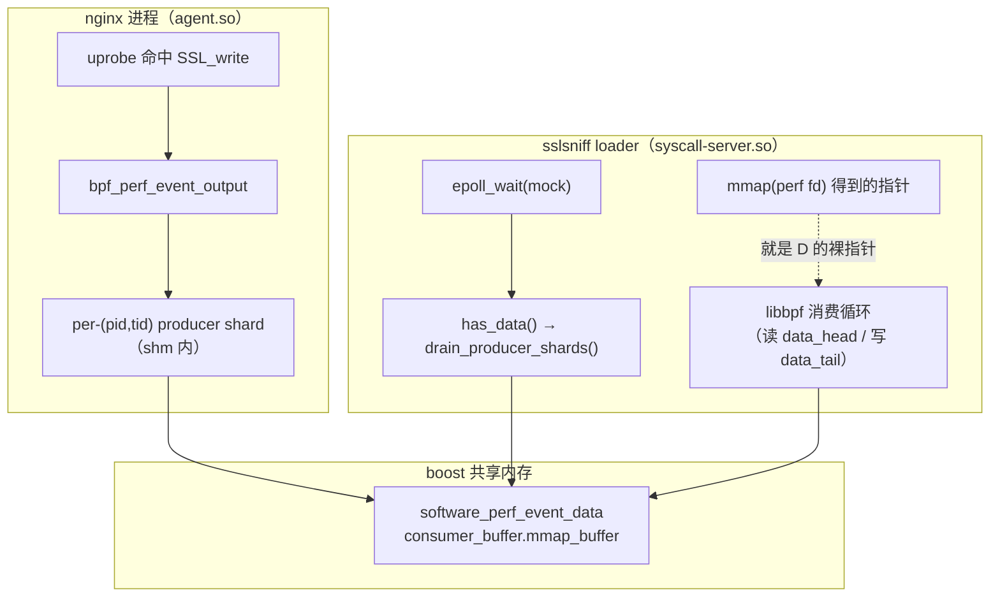
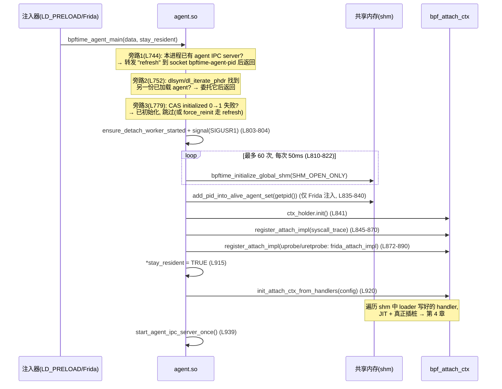

# 3. agent 与 syscall-server：两个 LD_PRELOAD 入口层

> 一句话定位：**syscall-server.so 注入 loader（如 sslsniff CLI），把 libbpf 发出的
> bpf()/perf_event_open()/mmap()/epoll 骗进共享内存；agent.so 注入被追踪进程
> （如 nginx），从同一块共享内存读出 handler 并真正挂钩。** 两个 .so 都只是
> "拦截 + 转发"的薄壳，干活的代码全在它们各自静态链接的 runtime 库里。

## 2.0 阅读地图

| 文件 | 行数 | 看什么 |
|---|---:|---|
| `runtime/syscall-server/syscall_server_main.cpp` | 276 | 全读：拦截入口 + `syscall()` 分流表 + 防重入初始化 |
| `runtime/syscall-server/syscall_context.hpp` | 202 | `init_original_functions`(L95)、三个 mock 开关字段（L158–162） |
| `runtime/syscall-server/syscall_context.cpp` | 1097 | `handle_sysbpf`(L373)、`handle_perfevent`(L697)、`handle_mmap64`(L840) |
| `runtime/syscall-server/syscall_server_utils.cpp` | 228 | `start_up`(L42)；uprobe perf type 的 /sys 文件 mock（L136–198） |
| `runtime/agent/agent.cpp` | 1030 | 主线 `bpftime_agent_main`(L738)；IPC/auto-refresh 可略 |
| 两个 `CMakeLists.txt` | — | 确认 ".so = 薄入口 + 整个 runtime 静态库" |

CMake 事实核对：`runtime/syscall-server/CMakeLists.txt` 的
`target_link_libraries(bpftime-syscall-server PUBLIC runtime ...)` 与
`runtime/agent/CMakeLists.txt` 的 `target_link_libraries(bpftime-agent PUBLIC ... runtime ...)`
——**两个 .so 各自静态链入一份完整 runtime**。同一段 helper/map 代码在两个进程各有
一份拷贝，真正共享的只有 boost shm 里的数据。（这就是为什么你的消融实验只需要换
agent 侧的 .so。）

## 2.1 syscall-server：全局上下文如何"安全地晚起床"

libbpf 的第一次调用可能来自任何线程、任何时机，而拦截层自己初始化时（spdlog 开日志
文件、dlsym）又会触发被拦截的 `fopen`/`open`——这是典型的"拦截器自噬"问题。看
`syscall_server_main.cpp:41-74` 怎么解的：

```cpp
// syscall_server_main.cpp:41-74（节选）
union syscall_server_ctx_union {          // union + 空构造/析构：
	syscall_context ctx;              //  1) 不在 .so 加载时跑构造函数
	syscall_context *operator->() { return &ctx; }
	syscall_server_ctx_union() {}     //  2) 进程退出时也不跑析构——
	~syscall_server_ctx_union() {}    //     其他线程可能还在调 hook
};
static syscall_server_ctx_union context;
static int ctx_initialized = 0;           // 0=未初始化 1=进行中 2=完成
static __thread int tls_initializing = 0; // 每线程重入标志
static void initialize_ctx()
{
	if (tls_initializing)             // 构造期间自己再进来：直接放行，
		return;                   // 防止下面的自旋等待变成自死锁
	int expected = 0;
	if (__atomic_compare_exchange_n(&ctx_initialized, &expected, 1, ...)) {
		tls_initializing = 1;
		new (&context.ctx) syscall_context;  // placement new，抢到的线程构造
		tls_initializing = 0;
		__atomic_store_n(&ctx_initialized, 2, __ATOMIC_RELEASE);
	} else {
		while (__atomic_load_n(&ctx_initialized, __ATOMIC_ACQUIRE) != 2)
			sched_yield();    // 没抢到的线程等构造完成
	}
}
```

三个设计点：

1. **union 技巧**：普通全局 `syscall_context` 会在 .so 加载时构造（此时 libc 环境
   未必就绪）、在 `exit()` 时析构（此时别的线程可能还在 hook 里跑）。union 的空
   构造/析构把这两个时机都掐掉，改为首次拦截时 placement-new，永不析构。
2. **CAS + 自旋**：多线程同时首次进入时，只有一个线程构造，其余 `sched_yield()`
   等 `ctx_initialized == 2`。
3. **`tls_initializing`**：构造 `syscall_context` 时，其构造函数（L107–118）里的
   spdlog/dlsym 会再调 `fopen` → 重新进入 `initialize_ctx`。此时 `ctx_initialized==1`，
   若无此标志，本线程会在自旋分支里**等自己**——死锁。TLS 标志让重入调用直接
   返回，落到 `orig_*` 或半初始化的 handler 上（这也是 `safe_spdlog_debug`
   L33–38 要先判 `default_logger_raw()` 的原因）。

外面还包了一层 `handle_exceptions`（L75–89）：捕获 boost shm 的 `bad_alloc`，
提示调大 `BPFTIME_SHM_MEMORY_MB` 后 `exit(1)`——共享内存耗尽没有优雅恢复路径。

### mock 分流三件套

几乎每个 `handle_*` 开头都是同一句咒语（如 `syscall_context.cpp:375-379`）：

```cpp
if (!enable_mock || initializing_cuda || !enable_mock_after_initialized)
	return orig_xxx_fn(...);
```

| 开关（`syscall_context.hpp`） | 谁翻转它 | 何时为 false |
|---|---|---|
| `enable_mock`(L158) | `try_startup()`(L143–148) | `start_up` 自身执行期间——启动代码自己的 open/mmap 必须走真 libc |
| `initializing_cuda`(L160) | `initialize_cuda()`(L121–141) | CUDA 驱动初始化期间（驱动狂发 ioctl/mmap，不能被 mock） |
| `enable_mock_after_initialized`(L162) | shm 的 `mock_setter` 回调（utils L57–63；被 `map_handler.cpp:954` 等 CUDA map 构造代码翻转） | runtime 内部需要临时"素颜"调用真 syscall 时 |

读主线时可把三者一律当 `true`；同理每个 case 里的 `run_with_kernel`
（`BPFTIME_RUN_WITH_KERNEL`，L90–96 读环境变量）分支先全部跳过。

## 2.2 `syscall()` 分流表（注释版）

libbpf 发 bpf 命令不走 glibc 包装函数，而是直接 `syscall(__NR_bpf, ...)`，所以
拦截层必须重写 `syscall()` 本身（`syscall_server_main.cpp:214-266`）：

```cpp
// syscall_server_main.cpp:214-265（节选，略去日志行）
extern "C" long syscall(long sysno, ...)
{
	initialize_ctx();
	va_list args;                     // glibc 的 syscall() 也是不管实际参数
	va_start(args, sysno);            // 个数、一律读 6 个——这里照抄。
	long arg1 = va_arg(args, long);   // 坑：在某些 ABI 上多读寄存器无害，
	/* ... arg2..arg6 同理 ... */     // 但绝不能少读。
	va_end(args);
	if (sysno == __NR_bpf) {          // ① bpf(cmd, attr, size)
		return handle_exceptions([&]() {
			return context->handle_sysbpf((int)arg1,
				(union bpf_attr *)arg2, (size_t)arg3);
		});
	} else if (sysno == __NR_perf_event_open) {   // ② 五参全转发
		return handle_exceptions([&]() {
			return context->handle_perfevent(
				(perf_event_attr *)arg1, (pid_t)arg2,
				(int)arg3, (int)arg4, (unsigned long)arg5);
		});
	} else if (sysno == __NR_ioctl) {
		/* 只打日志，不拦！ioctl 靠上面的 ioctl() 函数包装拦截 */
	} else if (sysno == __NR_dup3)        { /* → handle_dup3: map fd 复制 */ }
	  else if (sysno == __NR_memfd_create){ /* → handle_memfd_create */ }
	return context->orig_syscall_fn(sysno, arg1, ..., arg6);  // 其余放行
}
```

注意分流表只是**第二道网**。第一道网是同文件里对 `epoll_wait`/`epoll_ctl`/
`ioctl`/`mmap(64)`/`munmap`/`close`/`open(at)`/`read`/`fopen(64)` 的直接函数拦截
（L91–212）——libbpf 大多数时候调的是这些 glibc 包装。`__NR_ioctl` 分支
（L245–247）只记日志不处理，正说明作者假设 ioctl 总是从包装函数进来。
aarch64 上头文件也不同：L7–11 用 `asm-generic/unistd.h` 取 `__NR_*`。

`orig_*` 函数指针在 `syscall_context.hpp:95-137` 的 `init_original_functions`
里用 `dlsym(RTLD_NEXT, ...)` 解析——`RTLD_NEXT` 即"链路里排在我后面的那个
libc 实现"。两个细节：L115–116 把 `orig_mmap64_fn` 和 `orig_mmap_fn` 都指向
`"mmap"`（glibc 内部二者同址）；L133 `unsetenv("LD_PRELOAD")`——**子进程不继承
注入**，调 fork/exec 场景时必记（你的 nginx master/worker 若靠 LD_PRELOAD 注入，
worker 是 master fork 出来的、发生在 unsetenv 之后，所以能继承到已加载的 .so，
但再 exec 别的程序就不会带上）。

## 2.3 `handle_sysbpf`：三个必读 case

`syscall_context.cpp:373-696` 是一张 `switch(cmd)` 大表。default 分支（L691–693）
放行到内核——**没实现的命令不会报错，会静默走真内核**，调试时要警惕。挑三个
带读（均忽略 `run_with_kernel`）：

### BPF_MAP_CREATE（L384–444）

主线只有一件事（L424–438）：把 `bpf_attr` 里的 map 参数抄进 bpftime 自己的
`bpf_map_attr`，然后

```
bpftime_maps_create(-1 /* let the shm alloc fd for us */, attr->map_name, {...})
  → bpftime_shm::add_bpf_map                    [bpftime_shm.cpp:81 → shm_internal.cpp:864]
      fd < 0 时 fd = open_fake_fd()             [shm_internal.cpp:530-538]
      manager->set_handler(fd, bpf_map_handler{...})   // handler 落入共享内存
  返回值 = 这个 fd，libbpf 拿它当真 map fd 用
```

`open_fake_fd()`（`bpftime_shm_internal.cpp:530-538`）值得看一眼：它
`open("/dev/null", O_RDONLY)` 拿一个**真实 fd** 当号码占位——号码在进程 fd 表里
被真实占住，后续 libbpf 对它做 dup/close 都不会撞号；若拿到 ≤2 的号码还会 `dup`
着跳过，避免占用 stdin/stdout/stderr。fd 号即 handler_manager 的下标，这是
第 1 章 shm 布局的接口约定。

### BPF_PROG_LOAD（L519–594）

```
attr->prog_type == BPF_PROG_TYPE_TRACEPOINT     → section = "tracepoint"   (L535)
attr->prog_type == BPF_PROG_TYPE_SOCKET_FILTER  → section = "uprobe"       (L537-540)
  （libbpf 对 uprobe 实际报的类型是 KPROBE；这里映射到 SOCKET_FILTER 是
   bpftime loader 侧的约定，能对上就行，读到别纠结语义）
[可选] ENABLE_BPFTIME_VERIFIER：verify_ebpf_program(insns, insn_cnt, section)
  失败时 STRICT 模式返回 -EINVAL，WARNING 模式只告警照样加载       (L541-585)
bpftime_progs_create(-1, (ebpf_inst *)attr->insns, attr->insn_cnt,
                     attr->prog_name, attr->prog_type)              (L586-590)
  → add_bpf_prog [shm_internal.cpp:541-556]：指令字节码整段拷入 shm 的
    bpf_prog_handler。注意：loader 侧不做 JIT，只存字节码；编译发生在
    agent 侧 attach 时（第 5 章）。
```

### BPF_LINK_CREATE（L595–623，注释版）

```cpp
// syscall_context.cpp:595-622（节选）
case BPF_LINK_CREATE: {
	auto prog_fd = attr->link_create.prog_fd;      // 前面 PROG_LOAD 返回的假 fd
	auto target_fd = attr->link_create.target_fd;  // 前面 perf_event_open 返回的假 fd
	auto attach_type = attr->link_create.attach_type;
	...
	int id = bpftime_link_create(                  // 在 shm 里放一个
		-1 /* let the shm alloc fd for us */,  // bpf_link_handler{prog_fd, target_fd}
		(bpf_link_create_args *)&attr->link_create);
	if (id < 0 && bpftime_is_prog_fd(prog_fd) &&   // 兜底：新式 link 建失败但
	    bpftime_is_perf_event_fd(target_fd) &&     // 两个 fd 都合法且是
	    attach_type == BPF_PERF_EVENT) {           // perf-event 挂载
		auto cookie = attr->link_create.perf_event.bpf_cookie;
		id = bpftime_attach_perf_to_bpf_with_cookie(target_fd,
							    prog_fd, cookie);
	}
	return id;
}
```

link 只是 shm 里的一条"prog_fd ↔ perf_event_fd"关系记录，**此刻什么都没挂上**。
真正插桩要等 agent 侧 `init_attach_ctx_from_handlers` 扫到这条 link（第 4 章）。
旧式 attach 路径也有对应 mock：`ioctl(PERF_EVENT_IOC_SET_BPF)`（L936–949）和
`BPF_PROG_ATTACH`（L678–690）最终都落到 `bpftime_attach_perf_to_bpf`。
`ioctl(PERF_EVENT_IOC_ENABLE)`（L910–922）也只是翻 shm 里 handler 的使能位。

## 2.4 `handle_perfevent` 与 /sys 文件 mock

libbpf 创建 uprobe 前会读 `/sys/bus/event_source/devices/uprobe/type` 确定
perf type。容器里可能没有这个文件，于是 syscall-server 连文件都 mock 了：
`create_mocked_file_based_on_full_path`（utils L175–198）对四个固定路径返回内存
文件（uprobe type 恒为 `MOCKED_UPROBE_TYPE_VALUE = 9`，hpp L33），`handle_open`/
`handle_fopen`（ctx L200–222 / L1027–1058）用 `mkstemp("/tmp/bpftime-mock.XXXXXX")`
造一个真实 fd 挂上 `mocked_file_provider`，`handle_read`（L224–256）从内存 buf
喂数据。

随后 `handle_perfevent`（L697–826）按 `attr->type` 分发；uprobe 分支（L708–733）：

```
attr->type == determine_uprobe_perf_type()        // 与上面 mock 的值闭环
retprobe    = attr->config  & (1 << retprobe_bit) // libbpf 的编码约定
name        = (const char *)attr->config1         // 目标 ELF 路径
offset      = attr->config2                       // 函数在文件内偏移
→ bpftime_uprobe_create(-1, pid, name, offset, retprobe, ref_ctr_off)
  → add_uprobe [shm_internal.cpp:205-219]：open_fake_fd() + 写入
    bpf_perf_event_handler{type=uprobe, offset, pid, name}
```

即：**loader 侧的 "perf event" 只是 shm 里的一张说明书**——"请在 pid 的 name+offset
处挂一个 uprobe"。执行者是 agent。

## 2.5 `handle_mmap64`：把 shm perf buffer 页递给 libbpf 消费者

这里与你最熟的路径对接。libbpf `perf_buffer__new` 的动作序列是：每 CPU
`perf_event_open`（→ 2.4 的 SOFTWARE 分支，L796–801，`bpftime_add_software_perf_event`
[shm_internal.cpp:259] 造假 fd）→ `mmap(fd, 页数)` 拿环形缓冲 → `epoll_ctl` 注册
→ 循环 `epoll_wait` + 读环。三步全被拦截：

```cpp
// syscall_context.cpp:877-892（节选）
} else if (fd != -1 && bpftime_is_software_perf_event(fd)) {
	if (auto ptr = bpftime_get_software_perf_event_raw_buffer(
		    fd, length);                  // ↓ 见下方调用链
	    ptr != nullptr) {
		mocked_mmap_values.insert((uintptr_t)ptr); // 记账，munmap 时识别
		return ptr;   // 直接返回 shm 内指针！没有发生任何真 mmap
	}
}
/* 未识别的 fd 走原始 mmap64（L887-892）。注意 L890 先做了一次
   匿名映射却丢弃结果、L892 又映射一次——疑似历史遗留的死代码，
   每次 fallthrough 会泄漏一段匿名映射。读到这里不要试图理解它的
   "深意"，它没有。 */
```

调用链（带语义）：

```
handle_mmap64(fd, length)
 → bpftime_get_software_perf_event_raw_buffer(fd, length)   [bpftime_shm.cpp:572]
 → bpftime_shm::get_software_perf_event_raw_buffer          [shm_internal.cpp:1000-1010]
     校验 fd 是 software perf event handler
 → bpf_perf_event_handler::try_get_software_perf_data_raw_buffer  [perf_event_handler.cpp:642-651]
 → software_perf_event_data::ensure_mmap_buffer(length)     [perf_event_handler.cpp:611-623]
     consumer_buffer.mmap_buffer 是 boost shm 里的 vector；
     resize 到 length 后返回 .data()。若发生了扩容，还会把
     producer_buffer_generation +1（L619-621），让 agent 侧
     缓存的 shard 指针失效重取。
```

所以：**libbpf 以为自己 mmap 了内核 perf ring，实际拿到的是 boost 共享内存段内
一块普通 vector 的裸指针**；开头一页照内核布局放 `perf_event_mmap_page`
（data_head/data_tail 就在里面，L260–266），后面跟数据区。libbpf 的消费代码
（读 head、搬记录、写 tail）原封不动地工作。

消费触发链：`epoll_wait`（mock，ctx L995–1007）→ `bpftime_epoll_wait`
[bpftime_shm.cpp:418] 1ms 一轮询问每个注册的 event → `software_perf_event_data::has_data()`
[perf_event_handler.cpp:589-592] → **先 `drain_producer_shards()`（L550）把各
per-(pid,tid) producer shard 的记录搬进 consumer_buffer**，再看 consumer 环里
是否有数据。你熟悉的完整链条在两个进程间就此闭合：



> **📌 案例（对齐修复）**：`perf_event_record_alignment = 8`
> （`perf_event_handler.cpp:129`，含 `static_assert` L133–134）、写入端补齐
> padding（L342）、drain 端校验 `size % 8 == 0`（L440–448）——这一整套就是你
> 修的 8 字节对齐 bug 的落点。修复前 record header 可以横跨环尾，libbpf 在
> "mmap"到的这块 shm 里读出跨界的 `size=0`，消费者空转、事件静默丢失、吞吐双峰。
> 注意受害者是 loader 侧 libbpf 原生消费代码——它完全信任这块"内核格式"的内存。

> **📌 案例（绑核修复）**：注意 drain 路径对 CPU 毫无要求：shard 按 (pid,tid)
> 组织、搬运在 `shard_lock` 下进行。这正是"producer 侧每事件 getcpu +
> 2×setaffinity 序列无任何保护作用"论证的消费端一半——消费者从不按 CPU 索引
> shard，绑核自然保护不了任何东西。

## 2.6 agent：启动主线与三条防重入旁路

agent 有三种进入方式，殊途同归到 `bpftime_agent_main`（agent.cpp:738）：

1. **LD_PRELOAD**：拦截 `__libc_start_main`（L457–469）→ `bpftime_hooked_main`
   （L448–455）先置 `injected_with_frida = false` 再调 `bpftime_agent_main`，
   然后才跑真 main；
2. **Frida 注入**（`bpftime attach <pid>`）：Frida 直接调用导出的
   `bpftime_agent_main`，`injected_with_frida` 保持默认 true（L62）；
3. **text-transformer / syscall trace**：`_bpftime__setup_syscall_trace_callback`
   （L1021–1029）先把 syscall 转发钩子装好再进主函数。



三条**旁路都是防重入**，读主流程时全部跳过即可；只需记住存在一个 abstract unix
socket `bpftime-agent-<pid>`（L167–174，`sun_path[0]='\0'` 即 abstract namespace，
不落文件系统）作为进程内 agent 的控制面，`bpftime trace` 的二次 attach/refresh
都从这里走。

几个主线细节：

- **为什么重试 60 次开 shm**（L806–822）：agent 用 `SHM_OPEN_ONLY`（不存在即抛
  异常），而"先 spawn loader 再注入 agent"的工作流里 loader 可能还没来得及
  `SHM_CREATE_OR_OPEN`（utils L51）。60 × 50ms = 最多等 3 秒，源码注释原话：
  "SHM can race with the loader process; retry a bit"。
- **`bpf_attach_ctx_holder` union**（L81–98）：与 2.1 的 union 同一招——不让全局
  attach 上下文在加载期构造/退出期析构。
- **失败回滚 lambda `init_fail`**（L762–777）：把 ctx、alive-pid 记录、
  `initialized` 标志按申请的逆序撤销，是一个手写 scope-guard 的教科书样例。
- `injected_with_frida` 决定是否把 pid 记入 shm 的 alive agent 集合（L835–840）：
  只有 Frida 注入的 agent 支持被 detach。

### SIGUSR1 → pipe → 工作线程的 detach 链

```cpp
// agent.cpp:470-481
static void sig_handler_sigusr1_detach(int sig)
{
	// Async-signal-safe: do not call spdlog / malloc / locks here.
	auto_refresh_epoch.fetch_add(1, std::memory_order_acq_rel);
	int fd = detach_pipe_fds[1];
	if (fd >= 0) {
		uint8_t one = 1;
		ssize_t ignored = write(fd, &one, 1);  // 唯一的"重活"
	}
}
```

信号处理函数里只做原子加和 `write(pipe)`（两者都是 async-signal-safe），真正的
`perform_detach()`（L365–395：拿 `detach_mutex`、join 线程、销毁 attach link、
spdlog 打日志——全都**不是** async-signal-safe）由 `ensure_detach_worker_started`
（L405–442）预先起好的工作线程在 pipe 读端阻塞等待、收到字节后执行。若在信号
上下文直接做这些，撞上"信号打断了正持有 malloc 内部锁的线程"就会死锁。

> **📌 案例（sigaction 修复）**：这段是"信号上下文纪律"的正面教材，而你修的
> `bpf_probe_read` bug 是反面教材的邻居——那边的问题是"要不要（重新）安装
> SIGSEGV handler"的判断读了未初始化变量，导致每次调用都白付 2 个
> `rt_sigaction`。两处放在一起记：**信号处理器应当装一次、处理函数里只做
> safe 操作、重活丢给普通线程**。agent 这里三条全对；probe_read 那边错在
> 第一条的判定逻辑。

## 2.7 坑清单（修订版）

- 两个 .so 各链一份 runtime 静态库；进程间只共享 shm 数据，**代码与全局变量
  互不相通**——在 agent 里打印 loader 侧的全局状态是新手常犯错。
- `default:` 分支静默放行到真内核（ctx L691–693）：mock 没覆盖的 bpf 命令不会
  报"未实现"，现象是权限错误或行为诡异。
- `unsetenv("LD_PRELOAD")`（hpp L133）：exec 出的子进程无注入。
- 假 fd 是 `open("/dev/null")` 的真实 fd（`open_fake_fd`，shm_internal.cpp:530-538），
  号码被真实占位；mock 的 /sys 文件则另用 `mkstemp` 临时文件占号（ctx L211）。
  两套机制别混淆。
- `handle_mmap64` 的 fallthrough 尾巴（ctx L890–892）有一次结果被丢弃的匿名
  mmap——死代码 + 映射泄漏，读代码时别被它带偏。
- `handle_mmap64` 不检查 `enable_mock_after_initialized`（对比 `handle_mmap`
  L831–834 与 L843–845）——两个包装的 gate 条件不完全一致。
- loader 侧只登记不执行：`PERF_EVENT_IOC_ENABLE`、`BPF_LINK_CREATE` 都只改 shm；
  若 agent 没起来或 `init_attach_ctx_from_handlers` 失败，loader 一侧看起来
  一切成功，但探针根本没挂——排障时先查 agent 日志。

## 2.8 自测题

**Q1. loader `mmap(perf fd)` 拿到的内存来自哪里？**

<details><summary>答案</summary>

来自 boost managed shared memory：`handle_mmap64`（ctx L877–886）识别出 software
perf event 假 fd 后，经 `bpftime_get_software_perf_event_raw_buffer`
[bpftime_shm.cpp:572] → `software_perf_event_data::ensure_mmap_buffer`
[perf_event_handler.cpp:611] 返回 shm 内 `consumer_buffer.mmap_buffer`（shm vector）
的裸指针。全程没有发生真 mmap syscall；fd 本身只是 `/dev/null` 占位。libbpf 能
照常消费是因为这块内存开头按内核布局放了 `perf_event_mmap_page`。
</details>

**Q2. agent 为何要重试 60 次开 shm？**

<details><summary>答案</summary>

agent 用 `SHM_OPEN_ONLY` 打开（不存在即抛异常，agent.cpp:812–813），而 shm 由
loader 以 `SHM_CREATE_OR_OPEN` 创建（utils L51）。"先 spawn 目标进程/注入 agent、
loader 稍后才跑"的工作流存在竞态，故重试 60 次、每次 sleep 50ms（agent.cpp:810–822），
给 loader 最多 3 秒创建时间，避免注入流程偶发失败。
</details>

**Q3. SIGUSR1 的 detach 为什么要经过 pipe，而不在信号处理函数里直接做？**

<details><summary>答案</summary>

`perform_detach`（agent.cpp:365–395）要拿 mutex、join 线程、调 spdlog（内含
malloc）——都不是 async-signal-safe；在信号上下文执行可能与被打断线程持有的
锁互死。处理函数（L470–481）因此只做原子操作和 `write(pipe)`（POSIX 规定
signal-safe），由预先启动的工作线程（L429–441）从 pipe 读到字节后在普通线程
上下文完成 detach。
</details>

**Q4.（新）`initialize_ctx` 里 `tls_initializing` 防的是哪种死锁？为什么普通
互斥锁解决不了？**

<details><summary>答案</summary>

构造 `syscall_context` 期间（`ctx_initialized == 1`），构造代码自己触发被拦截的
libc 调用（如 spdlog 的 fopen）→ 同一线程重入 `initialize_ctx` → 落入 else 分支
自旋等待 `ctx_initialized == 2`——但置 2 的正是被卡住的自己，永久自旋
（syscall_server_main.cpp:58–74）。普通互斥锁同样会自己等自己（除非用递归锁，
但递归锁解决不了"半构造对象被使用"的问题，也更慢）；TLS 标志让重入直接短路
返回，是最小代价的解法。
</details>

**Q5.（新）libbpf 调 `bpf(BPF_LINK_CREATE)` 成功返回后，nginx 里的
`SSL_write` 被插桩了吗？如果没有，插桩发生在何时？**

<details><summary>答案</summary>

没有。loader 侧 `BPF_LINK_CREATE`（ctx L595–623）只在 shm 写入一条
link handler（prog_fd ↔ perf_event_fd 关系）。真正插桩发生在 agent 侧
`init_attach_ctx_from_handlers`（agent.cpp:920）扫描 shm handler 时：读出
uprobe 说明书 → frida_attach_impl 改写目标函数指令（第 4 章）→ JIT 编译
prog（第 5 章）。所以时序上 agent 必须在 loader 写完 handler 之后初始化
（或经 IPC refresh / auto-refresh 重扫）。
</details>

**Q6.（新）为什么 `enable_mock` 在 `try_startup` 里要先关后开
（ctx L143–148）？不关会发生什么？**

<details><summary>答案</summary>

`start_up`（utils L42–104）自己要做真 IO：创建/映射 boost shm、打开日志文件等。
若 mock 仍开着，这些调用会被拦截层再次接管——轻则走进依赖"shm 已就绪"的 mock
逻辑造成递归初始化，重则死锁或用到半初始化状态。所以 `try_startup` 先
`enable_mock=false` 放行真 libc，`start_up` 完成后再恢复 true。这与
`initializing_cuda`、CUDA map 构造时经 `mock_setter` 翻转
`enable_mock_after_initialized`（map_handler.cpp:954 等）是同一个模式：
**runtime 自己的 syscall 必须绕过自己的拦截**。
</details>

---
[← 返回目录](README.md)
