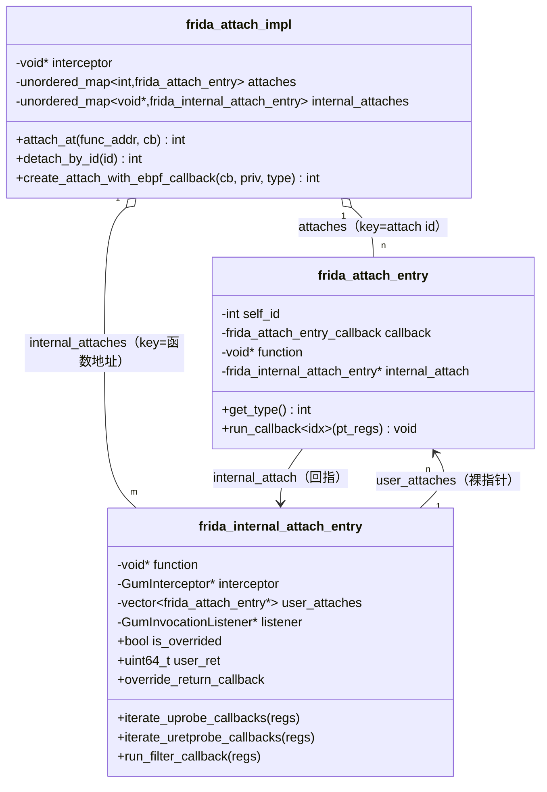
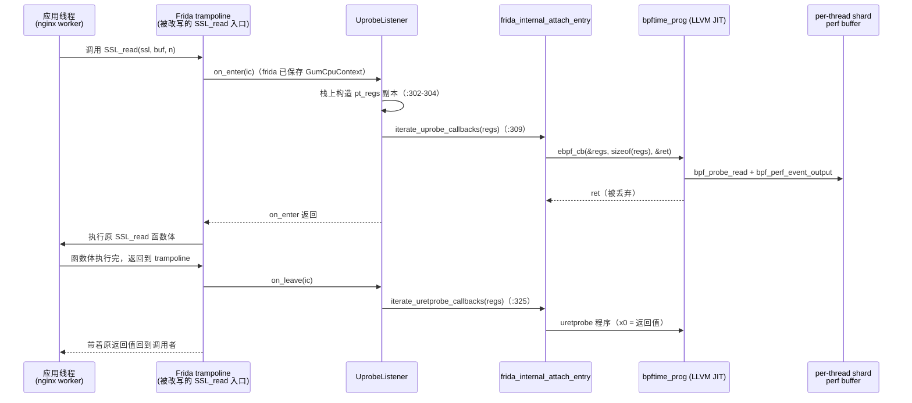

# 4. attach：事件挂载层（Frida uprobe）

> 本章回答一个问题：**应用线程调用 `SSL_read` 的那一瞬间，控制权是怎么一步步走到你的
> BPF 程序，又怎么走回来的。** 这条链你在 ssl-nginx benchmark 里测过无数次——现在
> 把每一跳落到代码行上。

## 3.0 全景：runtime 与 attach 层的唯一契约

runtime 与所有 attach 实现之间只有一个契约：`ebpf_run_callback` 三参签名
（`base_attach_impl.hpp:22-23`）：

```cpp
using ebpf_run_callback = std::function<int(void *memory, size_t memory_size,
                                            uint64_t *return_value)>;
```

这个 callback 由 runtime 侧构造——`bpf_attach_ctx.cpp:380-388` 在实例化 link handler
时把 `bpftime_prog` 包成 lambda：

```cpp
auto cookie = handler.attach_cookie;
attach_id = attach_impl->create_attach_with_ebpf_callback(
        [=](void *mem, size_t mem_size, uint64_t *ret) -> int {
                current_thread_bpf_cookie = cookie;   // bpf_get_attach_cookie 的数据源
                int err = prog->bpftime_prog_exec((void *)mem, mem_size, ret);
                return err;
        },
        *priv_data, attach_type);
```

也就是说：**attach 层只负责"在正确的时机、用正确的 `memory` 调这个黑盒"**；
`memory` 是什么由 attach 实现自己定义——Frida uprobe 给的是 `pt_regs*`。
先把 `base_attach_impl.hpp` 全部 110 行读完（含 `bpftime_set_retval` /
`bpftime_override_return` 两个 C 导出函数，:77-106，后面 override 机制会用到）。

frida 实现在 agent 启动时注册，一个实例包揽四种 attach type
（`runtime/agent/agent.cpp:872-875`）：

```cpp
ctx_holder.ctx.register_attach_impl(
        { ATTACH_UPROBE, ATTACH_URETPROBE,
          ATTACH_UPROBE_OVERRIDE, ATTACH_UREPLACE },
        std::make_unique<attach::frida_attach_impl>(), ...);
```

## 3.1 文件地图

目录 `attach/frida_uprobe_attach_impl/`：

| 文件 | 行数 | 看什么 |
|---|---:|---|
| `include/frida_uprobe_attach_impl.hpp` | 111 | 四个 attach type 常量（:22-31）、callback variant 类型系统（:39-61）、`frida_attach_impl` 类（:65-107） |
| `src/frida_internal_attach_entry.cpp` | 344 | **热路径核心**：`uprobe_listener_on_enter`(:294)/`on_leave`(:315)、override handler(:243)、内部 entry 构造(:111) |
| `src/frida_uprobe_attach_impl.cpp` | 331 | attach 建立：`attach_at` 去重复用(:47-95)、module 校验(:188-228)、UREPLACE 降级 wrapper(:236-263)、`generate_stack`(:292-331) |
| `src/frida_register_conversion.cpp` | 110 | GumCpuContext↔pt_regs，aarch64 分支 :51-71（你的平台） |
| `include/frida_register_def.hpp` | 78 | bpftime 自带的 `pt_regs` 定义 + `PT_REGS_PARM*` 宏（aarch64 :43-59） |
| `src/frida_attach_utils.cpp` | 135 | 地址解析（module base + offset，:37-58）、`bpf_get_func_arg` 等三个自定义 helper（:99-135） |
| `src/frida_attach_private_data.cpp` | 35 | 解析 `"module:offset"` 字符串 → 函数地址 |
| `../syscall_trace_attach_impl/src/syscall_trace_attach_impl.cpp` | 201 | 对比读：同一契约、不同 ctx（依赖 text_segment_transformer 而非 Frida） |

`nv_attach_impl/`（CUDA）占了 attach 目录近半代码量，与 uprobe 无关，先跳过。

## 3.2 两层实体：attach id 视角 vs 函数地址视角

Frida 的 `gum_interceptor_attach` 对**同一个函数地址只能 hook 一次**，但用户可以往
同一地址挂任意多个 uprobe/uretprobe。所以这里拆成两层实体：



### 字段级说明

**`frida_attach_entry`**（`frida_attach_entry.hpp:14-21`）——面向用户，一个 attach id 一条：

| 字段 | 谁写 | 谁读 | 说明 |
|---|---|---|---|
| `self_id` | `attach_at` 用 `allocate_id()` 分配（`frida_uprobe_attach_impl.cpp:82`） | `detach_by_id` 按它查 map | 就是返回给 runtime 的 attach id |
| `callback` | 构造时 move 进来 | `run_callback<idx>`（`frida_attach_entry.hpp:24-47`） | `std::variant<callback_variant, ebpf_callback_args>`：要么是接受 `pt_regs&` 的裸函数（单测用），要么是 ebpf callback + attach_type（生产路径） |
| `internal_attach` | `attach_at` 插入后回填（`frida_uprobe_attach_impl.cpp:93`） | `detach_by_id` 用它找回内部 entry | 裸指针，生命周期由 `internal_attaches` map 保证 |

`run_callback` 的 ebpf 分支（`frida_attach_entry.hpp:39-45`）值得注意：

```cpp
uint64_t ret = 0;
int err = ebpf_call_args.ebpf_cb((void *)&regs, sizeof(regs), &ret);
```

`ret` 声明了但**从不使用**——普通 uprobe 的 BPF 返回值直接丢弃（override 路径除外，见 3.6）。

**`frida_internal_attach_entry`**（`frida_internal_attach_entry.hpp:15-30`）——面向
Frida，一个函数地址一条：

| 字段 | 谁写 | 谁读 | 说明 |
|---|---|---|---|
| `function` | 构造 | `detach_by_id` 判断是否清理 | 被 hook 的函数地址，同时是外层 map 的 key |
| `frida_gum_invocation_listener` | 构造（仅 uprobe/uretprobe 路径，`.cpp:130-132`） | 析构时 detach（:172-175） | GObject，uprobe 与 override 二选一：此指针为 null 说明走的是 replace |
| `user_attaches` | `attach_at` push（`frida_uprobe_attach_impl.cpp:91`）、`detach_by_id` remove | 三个 iterate/run 函数遍历过滤 | 触发时按 `get_type()` 现场过滤，没有按类型分桶 |
| `is_overrided` / `user_ret` | override handler 每次进入清 false（:252），BPF 调 `bpf_override_return` 时经 lambda 置 true（:156-164） | handler 尾部判断（:269） | ⚠️ 是普通成员而非 thread_local——多线程并发命中同一 override 函数理论上有数据竞争（未在代码中看到防护，不确定是否有意） |
| `override_return_callback` | 构造（仅 override 路径，:156-164） | override handler 存入 thread_local（:253-254） | 桥接全局 C 函数 `bpftime_set_retval` 与这个具体 entry |

生命周期：两层 entry 都由 `frida_attach_impl` 的两个 `unordered_map` 持有
`unique_ptr`（`frida_uprobe_attach_impl.hpp:99-103`）。`detach_by_id`
（`frida_uprobe_attach_impl.cpp:124-149`）先从内部 entry 的 `user_attaches` 里摘掉
自己，**最后一个用户 attach 消失时才析构内部 entry**，析构函数（
`frida_internal_attach_entry.cpp:169-183`）负责 `gum_interceptor_detach`（listener
路径）或 `gum_interceptor_revert`（replace 路径），把原函数的机器码恢复原样。

## 3.3 attach 建立：从 `"module:offset"` 到改写函数入口

完整链（自顶向下）：

```
bpf_attach_ctx::instantiate_perf_event_handler_at        bpf_attach_ctx.cpp:401
  拼出 arg_str = "module_name:offset"                                  :427-432
  → private_data_gen(arg_str)  （agent.cpp:876 注册的 lambda）
    → frida_attach_private_data::initialize_from_string   frida_attach_private_data.cpp:9
      → resolve_function_addr_by_module_offset            frida_attach_utils.cpp:37
        gum_module_load + gum_module_find_base_address + offset → 绝对地址 addr
bpf_attach_ctx::instantiate_bpf_link_handler_at           bpf_attach_ctx.cpp:306
  → frida_attach_impl::create_attach_with_ebpf_callback   frida_uprobe_attach_impl.cpp:173
      校验 module 确实在 /proc/self/maps 里                            :188-228
      → attach_at(addr, ebpf_callback_args{cb, type})                  :47
        → new frida_internal_attach_entry(...)            frida_internal_attach_entry.cpp:111
          → gum_interceptor_attach / gum_interceptor_replace（真正改写指令）
```

**注意地址解析发生在 private data 解析时**（还没碰 Frida interceptor），而
`/proc/self/maps` 校验的意义在 `.cpp:185-187` 注释里写了：LD_PRELOAD 的 agent 可能
被注入到无关进程（比如 nginx 的 master 拉起的 shell），module 不存在时静默返回
`-EINVAL` 而不报错。

### 注释版选段 1：`attach_at` 的去重复用（`frida_uprobe_attach_impl.cpp:54-95` 节选）

```cpp
auto itr = internal_attaches.find(func_addr);     // 按函数地址查内部 entry
...
if (itr == internal_attaches.end()) {
        // 第一次 hook 这个地址：创建内部 entry。
        // ★ 传入的 current_attach_type 决定走 listener 还是 replace，
        //   而且只有这第一次有机会决定！
        itr = internal_attaches.emplace(func_addr,
                std::make_unique<frida_internal_attach_entry>(
                        func_addr, current_attach_type,
                        (GumInterceptor *)interceptor)).first;
} else if (itr->second->has_override()) {
        // 已有 override/replace：任何新 attach 都拒绝
        return -EEXIST;
}
auto &inner_attach = itr->second;
int used_id = this->allocate_id();                // base_attach_impl.hpp:44，从 1 递增
frida_attach_entry ent(used_id, std::move(cb), func_addr);
...
inner_attach->user_attaches.push_back(...);       // 内部 entry 记住用户 entry
inserted_attach_entry->second->internal_attach = inner_attach.get();  // 反向回指
return result;                                    // 返回 attach id
```

坑在 `★` 处：互斥检查是**不对称**的。先 override 后 uprobe → `-EEXIST`（:75-79）；
但**先 uprobe 后 override 不报错**——新 entry 被塞进 `user_attaches`，可内部 entry
构造时只装了 listener、从未调 `gum_interceptor_replace`，`run_filter_callback` 永远
不会被触发，这个 override **静默失效**。（从代码看是缺陷；`has_uprobe_or_uretprobe()`
（:195-204）定义了却没人调用，疑似本想做反向检查。）

内部 entry 构造函数里还有一个 RAII 小技巧（`frida_internal_attach_entry.cpp:115-126`）：
局部 struct `interceptor_transaction` 在构造/析构里配对调用
`gum_interceptor_begin/end_transaction`，保证中途 throw 也能关闭事务。attach 失败时
（函数太短、Frida 无法改写指令）会抛出带诊断信息的异常，错误信息里甚至建议
`-O0` / `__attribute__((noinline))`（:95-107）——单测
`test_attach_failure_diagnostics.cpp` 专门测这个。

## 3.4 uprobe 触发的完整时序（热路径）

这就是你 benchmark 里每个 HTTPS 请求走两次（SSL_read + SSL_write）的路径：



关键认知：**整条链在应用线程里同步执行**。BPF 程序跑多久，`SSL_read` 就慢多久。

> 📌 **案例：绑核修复（fix #2）**。正因为这条链是同步的，
> `bpf_perf_event_output` 里那套每事件 `sched_setaffinity` ×2 的绑核序列
> （已在 `076e3e4` 删除）才会直接放大成 Jetson 上 3.1–6.7 µs/事件的
> 请求延迟——它不是后台开销，是被 hook 函数的"税"。attach 层的同步设计
> 决定了 runtime 层任何每事件成本都会被 1:1 传导给应用。

> 📌 **案例：sigaction 重装（fix #3）**。同理，sslsniff 每个事件都在这条链上调
> `bpf_probe_read` 拷 SSL buffer——修复前每次调用多 2 个 `rt_sigaction`
> syscall（未初始化局部变量导致"handler 是否已装"判断恒真）。一次事件
> 里 helper 被调几次，这个税就交几次。

> 📌 **案例：8 字节对齐（fix #1）**。时序图最后一跳 `Ring` 就是第 2 章的
> per-(pid,tid) shard perf buffer；`0fcdb0e` 修的 record 对齐发生在那里的
> `output_data` 写入路径。attach 层不感知，但事件的"出生地"在这条链上。

### 注释版选段 2：`uprobe_listener_on_enter`（`frida_internal_attach_entry.cpp:294-313`）

```cpp
static void uprobe_listener_on_enter(GumInvocationListener *listener,
                                     GumInvocationContext *ic)
{
        // 从 listener 附加数据取回内部 entry——就是 gum_interceptor_attach
        // 时传的第 4 个参数 this（:134-136）
        auto *hook_entry = (frida_internal_attach_entry *)
                gum_invocation_context_get_listener_function_data(ic);
        GumInvocationContext *ctx;
        bpftime::pt_regs regs;                       // ★ 栈上副本，生命周期到函数尾
        ctx = gum_interceptor_get_current_invocation();  // 与 ic 是同一个 invocation
        convert_gum_cpu_context_to_pt_regs(*ctx->cpu_context, regs);

        // thread_local 指针，给 bpf_get_stackid（generate_stack）用
        current_thread_gum_cpu_context = ctx->cpu_context;

        hook_entry->iterate_uprobe_callbacks(regs);  // 遍历所有 UPROBE 类型的用户 attach

        current_thread_gum_cpu_context.reset();      // 出了 on_enter 就取不到栈了
}
```

三个要点：

1. `regs` 是**栈上副本**：`convert_gum_cpu_context_to_pt_regs` 拷出来后传 const 引用
   一路到 BPF（`(void*)&regs`），从不回写。BPF 改 ctx 寄存器不影响被 hook 函数。
2. `current_thread_gum_cpu_context`（thread_local，定义在
   `frida_uprobe_attach_impl.cpp:28-29`）只在 on_enter 和 override handler（:264）
   设置——`on_leave`（:315-326）**不设置**，所以 uretprobe 里 `bpf_get_stackid`
   必然失败（`generate_stack` 在 `frida_uprobe_attach_impl.cpp:297-300` 检查
   `has_value()` 后返回 nullptr，`bpf_helper.cpp:797` 转成 `-ENOENT`）。
3. `on_leave` 除了不设置栈上下文、调用的是 `iterate_uretprobe_callbacks`（:325），
   结构与 on_enter 相同；此时 GumCpuContext 里 `x[0]` 已是原函数返回值，所以
   uretprobe BPF 用 `PT_REGS_RC` 拿到的正是 `SSL_read` 的返回值。

listener 的 GObject 接线在 :333-340：`iface->on_enter = uprobe_listener_on_enter;
iface->on_leave = uprobe_listener_on_leave;`——这就是本章开头说"注释写反、以代码为准"
的最终裁判：**on_enter 跑 UPROBE，on_leave 跑 URETPROBE**（
`frida_uprobe_attach_impl.hpp:20-25` 的两段注释恰好互换了）。

## 3.5 GumCpuContext → pt_regs：aarch64 带读

bpftime 不用内核头文件的 `pt_regs`，自己在 `frida_register_def.hpp` 定义了一份
布局兼容的（aarch64 :43-48）：

```cpp
struct pt_regs {
        uint64_t regs[31];   // x0..x30
        uint64_t sp;
        uint64_t pc;
        uint64_t pstate;
};
#define PT_REGS_PARM1(x) ((x)->regs[0])   // x0
#define PT_REGS_RET(x)   ((x)->regs[30])  // lr
#define PT_REGS_RC(x)    ((x)->regs[0])   // 返回值也是 x0
```

Frida 侧的 `GumArm64CpuContext`（frida-gum.h）布局是
`{ pc, sp, nzcv, x[29], fp, lr, v[32] }`——注意 `x` 只有 29 个（x0–x28），fp(x29)、
lr(x30) 单独存放。转换函数（`frida_register_conversion.cpp:51-60`）：

```cpp
void convert_gum_cpu_context_to_pt_regs(const ::_GumArm64CpuContext &context,
                                        pt_regs &regs)
{
        memcpy(&regs.regs, &context.x, sizeof(context.x)); // 拷 x0..x28（29×8 字节）
        regs.regs[29] = context.fp;    // x29 = frame pointer，单独补
        regs.regs[30] = context.lr;    // x30 = link register，单独补
        regs.sp = context.sp;
        regs.pc = context.pc;
        regs.pstate = context.nzcv;    // 只有条件码，不是完整 PSTATE
}
```

为什么这样写：`memcpy` 一把梭比 29 次赋值快（这是每事件热路径）；`sizeof(context.x)`
保证 Frida 改布局时至少编译期尺寸对得上。坑：`pstate` 只填了 NZCV 条件码——BPF 程序
若依赖 PSTATE 其他位（如 DAIF）会拿到 0；反向函数 `convert_pt_regs_to_gum_cpu_context`
（:62-71）存在但**热路径没人调**（uprobe 从不回写），只有个别单测用。

对照 x86-64 分支（:6-26）：字段一一手工赋值，`orig_ax`/`cs`/`ss`/`flags` 没填
（保持未初始化——`pt_regs` 在 on_enter 栈上默认构造不清零，读这些字段是垃圾值）。

## 3.6 override / replace：让原函数"消失"

Frida 提供两种互斥机制，bpftime 各用其一：

| | uprobe / uretprobe | UPROBE_OVERRIDE (1008) | UREPLACE (1009) |
|---|---|---|---|
| Frida 原语 | `gum_interceptor_attach`（listener，:134） | `gum_interceptor_replace`（换入口，:145） | 同 override（降级实现） |
| 原函数执行？ | 一定执行 | 默认执行；BPF 调了 `bpf_override_return` 才跳过 | **从不执行**（wrapper 无条件 set_retval） |
| BPF 返回值 | 丢弃（`frida_attach_entry.hpp:39-45`） | 丢弃；生效的是 helper 设置的 `user_ret` | `*return_value` 直接成为函数返回值（:257） |
| 同地址可挂几个 | 任意多 | 1 个，且排他（:75-79） | 1 个，且排他 |
| 触发时点 | entry / exit | entry | entry |
| 参数转发 | 无需（原调用流不被截断） | 仅前 5 个整型参数（:241,:256-260） | 仅前 5 个整型参数 |
| 对应内核能力 | uprobe/uretprobe | `bpf_override_return`（kprobe error injection 的用户态版） | 无对应（bpftime 扩展） |

### 注释版选段 3：override handler（`frida_internal_attach_entry.cpp:243-277` 节选）

```cpp
extern "C" void *__bpftime_frida_attach_manager__override_handler()
{
        // 此函数被 gum_interceptor_replace 安装为"新的函数体"。
        // 应用调 SSL_read 实际进的是这里。
        ctx = gum_interceptor_get_current_invocation();
        convert_gum_cpu_context_to_pt_regs(*ctx->cpu_context, regs);
        auto hook_entry = (frida_internal_attach_entry *)
                gum_invocation_context_get_replacement_data(ctx);
        hook_entry->is_overrided = false;             // 每次进入先复位
        curr_thread_override_return_callback =        // thread_local ← entry 的 lambda
                hook_entry->override_return_callback;

        auto arg0 = gum_invocation_context_get_nth_argument(ctx, 0);
        ... // arg1..arg4，只取 5 个
        ufunc_func func = (ufunc_func)ctx->function;  // 原函数（Frida 保存的入口）

        current_thread_gum_cpu_context = ctx->cpu_context;
        hook_entry->run_filter_callback(regs);        // 跑 BPF；可能触发 override
        current_thread_gum_cpu_context.reset();

        if (hook_entry->is_overrided)
                return (void *)(uintptr_t)hook_entry->user_ret;  // 跳过原函数
        else
                return func(arg0, arg1, arg2, arg3, arg4);       // 手工重放调用
}
```

`bpf_override_return` 的完整回路（自测题 3 的答案骨架）：

```
BPF 程序调 helper 58                bpf_helper.cpp:1242-1246 注册
 → bpftime_override_return          base_attach_impl.hpp:92-106
   → curr_thread_override_return_callback（thread_local，handler :253-254 刚设置）
     → entry 构造时装的 lambda      frida_internal_attach_entry.cpp:156-164
       is_overrided = true; user_ret = v;
 → 回到 handler :269：检查 is_overrided → 直接 return user_ret，原函数没被调
```

**UREPLACE 是语法糖**：`create_attach_with_ebpf_callback` 的 UREPLACE 分支
（`frida_uprobe_attach_impl.cpp:236-263`）把用户 callback 包一层 wrapper——先跑
BPF，成功后无条件 `bpftime_set_retval(*return_value)`（:257），再以
`ATTACH_UPROBE_OVERRIDE` 类型注册。于是"replace"=「必然 override 的 override」，
BPF 程序的返回值就是被替换函数的返回值。

**override 路径的坑**（对照表里"仅 5 个参数"那行）：`ufunc_func` 签名只有 5 个
`void*`（:241）。原函数若有第 6+ 个整型参数、浮点参数或栈上参数，重放调用
`func(arg0..arg4)` 时这些参数是垃圾——uprobe listener 路径没有此问题（原调用流
未被截断）。这是选 override 还是 uprobe 时的硬约束。

## 3.7 坑与暗礁（汇总）

- **`frida_uprobe_attach_impl.hpp:20-25` 的 UPROBE/URETPROBE 注释写反了**，以
  `iface_init`（`frida_internal_attach_entry.cpp:338-339`）接线为准。
- BPF 拿到的 ctx 是栈上 `pt_regs` **副本**（:302/:321），从不回写；普通 uprobe 的
  BPF 返回值也被丢弃（`frida_attach_entry.hpp:39-45`）。
- 互斥检查不对称：先 override 后任何 attach → `-EEXIST`；**先 uprobe 后 override
  静默失效**（3.3 选段 ★ 处）。
- `current_thread_gum_cpu_context` 只在 on_enter/override handler 设置——
  **uretprobe 里 `bpf_get_stackid` 必失败**。
- override handler 只转发 **5 个整型参数**；浮点/栈参数函数不能用 override/UREPLACE。
- `is_overrided`/`user_ret` 是内部 entry 的普通成员，非 thread_local——多线程并发
  命中同一 override 点存在理论数据竞争（未见防护，不确定是否有意）。
- x86-64 的 `pt_regs` 副本里 `orig_ax`/`cs`/`ss`/`flags` 未初始化；aarch64 的
  `pstate` 只有 NZCV。
- attach 太短的函数会被 Frida 拒绝（`GUM_ATTACH_WRONG_SIGNATURE`），错误消息
  （:95-107）给了绕法：`-O0`、`noinline`、或挂更大的 wrapper 函数。
- `nv_attach_impl`（CUDA）与 uprobe 无关，先跳过。

## 3.8 自测题

**Q1（底稿原题）：sslsniff 的 `pt_regs *ctx` 在哪行构造？生命周期多长？**

<details><summary>答案</summary>

uprobe：`frida_internal_attach_entry.cpp:302` 的 `bpftime::pt_regs regs;`（栈变量），
:304 由 `convert_gum_cpu_context_to_pt_regs` 填充，经
`iterate_uprobe_callbacks(regs)` → `run_callback<0>(regs)` →
`ebpf_cb((void*)&regs, sizeof(regs), &ret)`（`frida_attach_entry.hpp:40-41`）以指针
形式进入 BPF。生命周期到 `on_enter` 返回为止；BPF 程序里保存这个指针跨事件使用是
悬垂指针。uretprobe 同理在 :321。
</details>

**Q2（底稿原题）：同一地址挂 3 个 uprobe + 1 个 uretprobe，三种实体各几个？**

<details><summary>答案</summary>

`frida_attach_entry` ×4（每个 attach id 一个，`attaches` map 4 条）；
`frida_internal_attach_entry` ×1（`internal_attaches` 按函数地址去重，
`frida_uprobe_attach_impl.cpp:54-74`）；`GumInvocationListener` ×1（内部 entry
构造时创建一次，uprobe 和 uretprobe 共享——on_enter 时现场按 `get_type()` 过滤出
3 个 UPROBE，on_leave 过滤出 1 个 URETPROBE）。`GumInterceptor` 是
`frida_attach_impl` 级别的全局单例（`frida_uprobe_attach_impl.cpp:40`）。
</details>

**Q3（底稿原题）：`bpf_override_return` 的"不执行原函数"经过哪几步？**

<details><summary>答案</summary>

① helper 58 注册指向 `bpftime_override_return`（`bpf_helper.cpp:1242-1246`）；
② 它调 thread_local 的 `curr_thread_override_return_callback`
（`base_attach_impl.hpp:92-106`），该变量在 override handler 进入时刚被设为本
entry 的 lambda（`frida_internal_attach_entry.cpp:253-254`）；
③ lambda（:156-164）置 `is_overrided=true`、存 `user_ret`；
④ handler 跑完 BPF 后检查 `is_overrided`（:269），为真则直接
`return user_ret`，跳过 `func(arg0..arg4)` 的重放调用（:274）。
</details>

**Q4（新）：为什么在 uretprobe 的 BPF 程序里调 `bpf_get_stackid` 拿不到栈？错误码是什么？**

<details><summary>答案</summary>

`generate_stack`（`frida_uprobe_attach_impl.cpp:297-300`）依赖 thread_local
`current_thread_gum_cpu_context`，它只在 `on_enter`（:307）和 override handler
（:264）设置、且在回调结束即 `reset()`；`on_leave`（:315-326）从不设置。于是
`has_value()` 为 false → 返回 nullptr → `bpf_helper.cpp:797` 返回 `-ENOENT`。
</details>

**Q5（新）：先对 `SSL_read` 挂一个普通 uprobe，再挂一个 UPROBE_OVERRIDE，会发生什么？反过来呢？**

<details><summary>答案</summary>

先 uprobe 后 override：`attach_at` 只在已有 entry `has_override()` 时才拒绝
（`frida_uprobe_attach_impl.cpp:75-79`），所以第二次 attach **成功返回 id**，但内部
entry 是构造时定死的 listener 模式，`gum_interceptor_replace` 从未执行，
`run_filter_callback` 永远不会被调——override 静默失效（疑似缺陷）。
反过来先 override 后 uprobe：命中 :75-79 的检查，返回 `-EEXIST`。
</details>

**Q6（新）：三个修复都不在 attach/ 目录里，为什么说 attach 层的设计"放大"了它们的影响？**

<details><summary>答案</summary>

因为 uprobe listener 在**应用线程里同步执行**整条
on_enter → pt_regs → BPF → helpers 链。每事件的固定成本（fix #2 的两次
`sched_setaffinity`、fix #3 的两次 `rt_sigaction`）不是后台开销，而是逐事件叠加在
被 hook 函数（SSL_read/SSL_write）的延迟上，再经 nginx 的请求路径直接变成吞吐损失；
fix #1 的 shard ring 写入同样位于这条同步链的末端（`bpf_perf_event_output`）。
这也是评估任何"每事件工作"时的第一原则：先问它在不在这条同步链上。
</details>

---
[← 返回目录](README.md)
