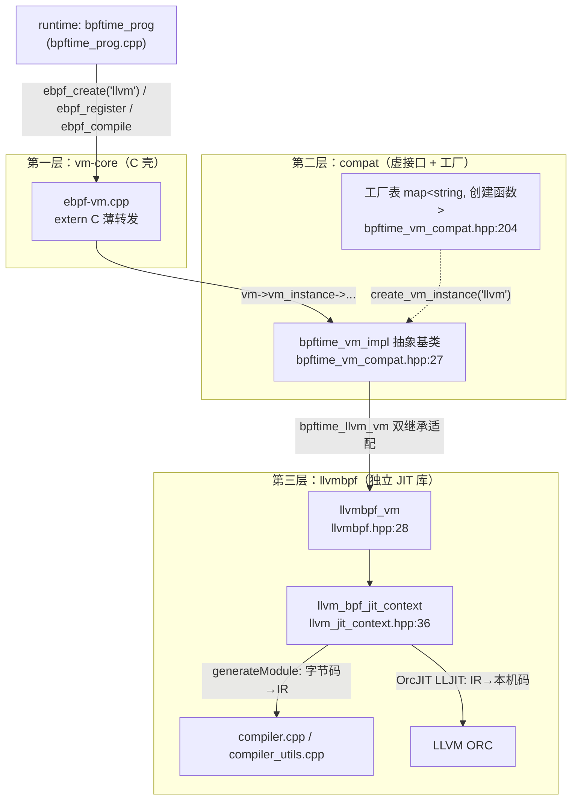
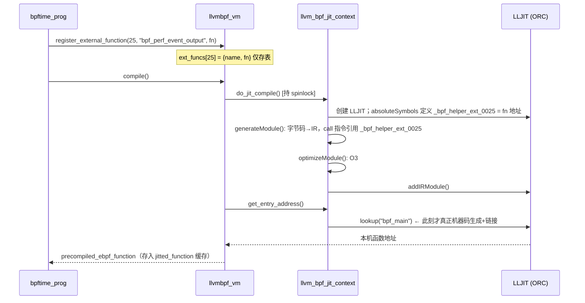
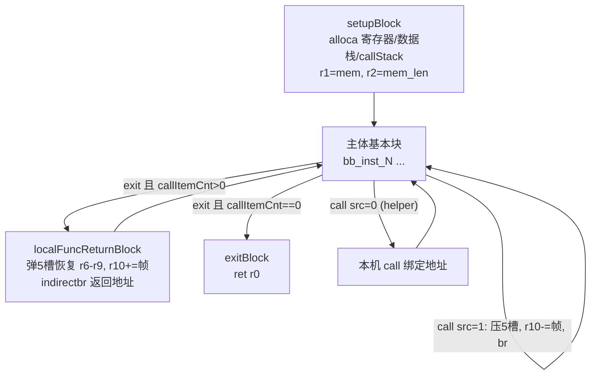

# 5. vm：执行引擎与 LLVM JIT

上一章我们看到 runtime 层拿着一段 eBPF 字节码和一堆 helper 函数指针。这一章回答：
**这段字节码怎么变成一个能直接 `call` 的本机函数指针**。你在 benchmark 里测到的
"uprobe 触发 → helper 执行"热路径，中间的 vm 层开销之所以趋近于零，答案全在这里。

## 4.0 三层结构总览

vm/ 是三层洋葱：最外层是纯 C API（给 runtime 用），中间是 C++ 虚接口 + 按名注册的工厂
（支持 `"llvm"` / `"ubpf"` 两个后端），最里层是 llvmbpf——一个可独立发布的 LLVM JIT 库
（bpftime 内嵌了它的一份拷贝）。



| 文件 | 行数 | 看什么 |
|---|---:|---|
| `vm/compat/include/bpftime_vm_compat.hpp` | 265 | **枢纽，先读**：`bpftime_vm_impl` 虚接口（:27）、工厂表（:204-257）、`struct ebpf_vm` 真实定义（:260-263） |
| `vm/compat/llvm-vm/compat_llvm.{hpp,cpp}` | 51+90 | 双继承适配器 + `__attribute__((constructor))` 自动注册工厂（compat_llvm.cpp:82-86） |
| `vm/vm-core/src/ebpf-vm.cpp` | 99 | 确认 C API 只是转发；`ebpf_jit_fn(mem, len)` 即 ctx 传递方式 |
| `vm/llvm-jit/include/llvmbpf.hpp` + `src/vm.cpp` | 112+166 | `ext_funcs` 表、`jitted_function` 缓存、"没编译先编译"语义（vm.cpp:57-84） |
| `vm/llvm-jit/src/compiler_utils.cpp` | 369 | `emitExtFuncCall`（:308-345）：helper 编号→符号 `_bpf_helper_ext_%04d` |
| `vm/llvm-jit/src/llvm_jit_context.cpp` | 815 | :515-606 符号绑定段：`absoluteSymbols` 把 helper 函数指针钉进 JIT dylib |
| `vm/llvm-jit/src/compiler.cpp` | 1377 | `generateModule`（:88）：block 划分、寄存器 alloca、512B 栈、lddw 伪指令、自建 callStack |

## 4.1 第一层与第二层：C 壳和工厂

### C 壳有多薄

`vm-core/src/ebpf-vm.cpp` 每个函数都是一行转发。例如：

```c
// ebpf-vm.cpp:35-39
extern "C" int ebpf_register(struct ebpf_vm *vm, unsigned int index,
                             const char *name, void *fn)
{
    return vm->vm_instance->register_external_function(index, name, fn);
}
```

`struct ebpf_vm` 对 C 调用方是不透明指针，真身在 `bpftime_vm_compat.hpp:260-263`：
一个 `std::string vm_name` 加一个 `unique_ptr<bpftime_vm_impl>`。所以"C API"其实
是 C++ 对象上的一层 ABI 稳定壳。

值得注意的是 `precompiled_ebpf_function` 的签名（`bpftime_vm_compat.hpp:25`）：

```cpp
using precompiled_ebpf_function = uint64_t (*)(void *mem, size_t mem_len);
```

**整个 vm 层对外只有这一个执行入口形态**：两个参数，一个返回值。eBPF 程序拿到的
"ctx"就是这里的 `mem`。是谁把 uprobe 的寄存器现场包装成 `mem` 的？是 attach 层
（前面章节的 frida uprobe impl）；vm 层不关心 `mem` 里是什么。

### 工厂注册的两个 C++ 技巧

**注释版代码选段 ①：工厂表怎么躲开静态初始化顺序问题**

```cpp
// bpftime_vm_compat.hpp:204-225（有删节）
inline std::map<std::string, create_vm_instance_func> &get_vm_factory_map()
{
    union vm_map_holder {                    // ① union 包裹：既分配了存储，
        std::map<std::string, create_vm_instance_func> map;
        vm_map_holder() {}                   //    又让编译器不自动构造/析构 map
        ~vm_map_holder() {}
    };
    static vm_map_holder factory_map;
    static int initialized = 0;
    int expected = 0;
    if (__atomic_compare_exchange_n(&initialized, &expected, 1, false,
                                    __ATOMIC_SEQ_CST, __ATOMIC_SEQ_CST)) {
        new (&factory_map.map)               // ② 第一个到达者 placement-new
            std::map<std::string, create_vm_instance_func>;
    }
    return factory_map.map;
}
```

为什么这么绕？因为注册动作发生在 `__attribute__((constructor(0)))` 里
（compat_llvm.cpp:82-86），也就是**动态库加载时、main 之前**。如果工厂表是普通的
全局 `std::map`，不同编译单元的静态构造顺序不确定，注册函数可能先于 map 构造运行
（static initialization order fiasco）。这里用 union 拿到"未构造的存储"，第一个调用者
负责构造，并且**永不析构**（析构顺序同样不可控，宁可泄漏一个 map）。这个模式
在大型 C++ 系统的插件注册里很常见，值得记住。

`create_vm_instance("llvm")`（bpftime_vm_compat.hpp:228-244）查表后调用
`create_llvm_vm_instance()`（compat_llvm.cpp:12-16），返回 `bpftime_llvm_vm`——
一个**双继承**适配器（compat_llvm.hpp:14-15）：既是 `bpftime::llvmbpf_vm`（拿实现），
又是 `compat::bpftime_vm_impl`（满足接口）。每个 override 都是一行转发到
`bpftime::llvmbpf_vm::xxx`（compat_llvm.cpp:23-75）。

## 4.2 第三层：llvmbpf_vm 数据结构详解

`llvmbpf.hpp:28-107`，字段级说明：

| 字段 | 类型 | 谁写 | 谁读 | 生命周期/备注 |
|---|---|---|---|---|
| `instructions` | `vector<ebpf_inst>` | `load_code()`（vm.cpp:41-50，长度必须是 8 的倍数） | `generateModule()`（compiler.cpp:100） | `unload_code()` 清空；编译后其实不再需要 |
| `ext_funcs` | `vector<optional<external_function>>` 定长 8192 | `register_external_function()`（vm.cpp:25-39；重复注册返回 `-EEXIST`） | 编译期两处：符号绑定循环（llvm_jit_context.cpp:519）和声明收集 | 下标即 helper 编号。**编译后修改不再生效**（见 4.3） |
| `jit_ctx` | `unique_ptr<llvm_bpf_jit_context>` | 构造函数（vm.cpp:11-12） | `compile()/exec()` | 持有 LLJIT 实例；`friend` 关系让它能直接读 `vm.ext_funcs`（llvmbpf.hpp:102） |
| `jitted_function` | `optional<precompiled_ebpf_function>` | `compile()` 成功后（vm.cpp:102） | `exec()` 快路径（vm.cpp:60） | **编译结果缓存**：再次 `compile()` 直接返回旧值并置 error "Already compiled"（vm.cpp:88-91） |
| `map_by_fd/map_val/...` | 5 个函数指针 | `set_lddw_helpers()`（vm.cpp:111-122） | lddw 伪指令翻译（compiler.cpp:824-1015） | runtime 在 `bpftime_prog` 构造时就设好（bpftime_prog.cpp:126-127） |

`llvm_bpf_jit_context`（llvm_jit_context.hpp:36-73）里还有一把
`pthread_spinlock_t compiling`（:39），`do_jit_compile` 全程持锁
（llvm_jit_context.cpp:269）——防止多线程同时触发惰性编译。

## 4.3 主线：helper 编号如何固化为符号并绑定

这是本章最重要的一条链。完整链条（带参数语义）：

```
bpf_attach_ctx::instantiate_prog_handler_at            (bpf_attach_ctx.cpp:284)
  └► load_prog_and_helpers(prog, config)               (bpf_attach_ctx.cpp:40)
       ├► helper_group.add_helper_group_to_prog(prog)  (bpf_helper.cpp:1135)
       │    └► prog->bpftime_prog_register_raw_helper({index=25,
       │           name="bpf_perf_event_output", fn=&bpf_perf_event_output})
       │                                               (bpf_helper.cpp:1311-1314)
       │         └► ebpf_register(vm, 25, name, fn)    (bpftime_prog.cpp:265)
       │              └► ext_funcs[25] = {name, fn}    (vm.cpp:37)  // 仅存表，无副作用
       └► prog->bpftime_prog_load(jit=true)            (bpftime_prog.cpp:169)
            └► ebpf_compile(vm)                        (bpftime_prog.cpp:206)
                 └► llvmbpf_vm::compile()              (vm.cpp:86)
                      └► jit_ctx->do_jit_compile()     (llvm_jit_context.cpp:267)
                           ├► create_and_initialize_lljit_instance()   // 绑定端
                           ├► generateModule(extFuncNames, ...)        // 引用端
                           ├► optimizeModule(M)  → O3   (llvm_jit_context.cpp:228)
                           └► jit->addIRModule(...)     (llvm_jit_context.cpp:288)
```

编号在**两端同时**变成同一个字符串符号，字符串由 `ext_func_sym` 生成
（compiler_utils.hpp:39-44）：`sprintf(buf, "_bpf_helper_ext_%04u", idx)`，
即 helper 25 → `"_bpf_helper_ext_0025"`。

**绑定端**——把真实函数地址钉进 JIT 的符号表：

**注释版代码选段 ②：absoluteSymbols 绑定（llvm_jit_context.cpp:518-551，有删节）**

```cpp
SymbolMap extSymbols;
for (uint32_t i = 0; i < std::size(vm.ext_funcs); i++) {   // 遍历 8192 个槽位
    if (vm.ext_funcs[i].has_value()) {
        auto sym = JITEvaluatedSymbol::fromPointer(         // ① 直接拿宿主进程内
            vm.ext_funcs[i]->fn);                           //    的函数地址
        auto symName = jit->getExecutionSession().intern(
            ext_func_sym(i));                               // ② 编号→符号名，此刻固化
        sym.setFlags(JITSymbolFlags::Callable |
                     JITSymbolFlags::Exported);
        extSymbols.try_emplace(symName, sym);               // (LLVM<17 分支)
        extFuncNames.push_back(ext_func_sym(i));            // ③ 名字同时收集起来，
    }                                                       //    稍后传给 generateModule
}
// ...
if (auto err = mainDylib.define(absoluteSymbols(extSymbols)); !err) {
    SPDLOG_DEBUG("LLVM-JIT: failed to define external symbols");
}
```

`absoluteSymbols` 的含义：这些符号**没有对应的代码生成**，链接时直接解析为给定
的绝对地址。也就是说 helper 对 JIT 来说等价于"已知地址的外部 C 函数"。

> 顺带一个找茬点：最后那个 `!err`（llvm_jit_context.cpp:551，及 :602 的 lddw 同款）
> 对 `llvm::Error` 而言 `!err` 表示**成功**——所以这行在成功时打印 "failed"，真失败
> 反而不打。同文件 `BPFTIME_ENABLE_LLVM_PRELOAD` 分支（:547）写的是 `err`，是对的。
> 影响仅限日志（DEBUG 级），但演示了 `llvm::Error` 的反直觉语义。

**引用端**——生成 IR 时对同名符号发射 call：

**注释版代码选段 ③：emitExtFuncCall（compiler_utils.cpp:308-345，有删节）**

```cpp
llvm::Expected<int>
emitExtFuncCall(llvm::IRBuilder<> &builder, const ebpf_inst &inst,
                const std::map<std::string, llvm::Function *> &extFunc,
                llvm::Value **regs, llvm::FunctionType *helperFuncTy,
                uint16_t pc, llvm::BasicBlock *exitBlk)
{
    auto funcNameToCall = ext_func_sym(inst.imm);       // ① imm 就是 helper 编号
    if (auto itr = extFunc.find(funcNameToCall); itr != extFunc.end()) {
        auto callInst = builder.CreateCall(
            helperFuncTy, itr->second,
            { builder.CreateLoad(builder.getInt64Ty(), regs[1]),
              builder.CreateLoad(builder.getInt64Ty(), regs[2]),
              builder.CreateLoad(builder.getInt64Ty(), regs[3]),
              builder.CreateLoad(builder.getInt64Ty(), regs[4]),
              builder.CreateLoad(builder.getInt64Ty(), regs[5]) });
        builder.CreateStore(callInst, regs[0]);         // ② 返回值写回 r0
        if (inst.imm == 12) {                           // ③ bpf_tail_call 硬编码特例：
            builder.CreateBr(exitBlk);                  //    调完直接跳 exit，模拟内核
        }                                               //    tail call 不返回的语义
        return 0;
    } else {
        return llvm::make_error<llvm::StringError>(
            "Ext func not found: " + funcNameToCall, ...);   // ④ 没注册→编译失败
    }
}
```

注意 ①：所有 helper 一律按 `helperFuncTy = i64(i64,i64,i64,i64,i64)` 发射
（原型定义在 compiler.cpp:133-138），不管真实 helper 用几个参数——r1..r5 全部传过去。
这依赖 C 调用约定（SysV x86-64 / AAPCS64）容忍多传整型参数：多余的参数只是占了
寄存器，被调方不看。runtime 侧配合地把所有 helper 都写成 5×`uint64_t` 形参
（如 `bpf_perf_event_output`，bpf_helper.cpp:500-501）。

注意 ④：**这就是"helper 必须在 compile 前全部注册"的机械原因**——引用端只认
`extFunc` 这张编译期快照；程序字节码 call 了一个当时没注册的编号，编译直接报错。
反过来，编译成功后再 `register_external_function` 只会写 `ext_funcs` 向量，
LLJIT dylib 里的符号表早已封板，**不会生效**。

一个现实中的边界案例：`bpf_attach_ctx::instantiate_prog_handler_at`
（bpf_attach_ctx.cpp:294-302）先 `load_prog_and_helpers`（内部已按 `config.jit_enabled`
编译），**之后**才注册 attach impl 私有 helper（:300-302）。jit 开启时这批晚到的
helper 之所以没炸，只因程序字节码恰好没引用它们（引用了会在编译期报
"Ext func not found"）；而 jit 关闭时 llvm 后端走惰性编译（见 4.5），首个事件才编译，
晚注册反而"碰巧"来得及。读代码时遇到这种"顺序敏感但没炸"的地方，值得多问一句为什么。

编译全流程时序：



`get_entry_address`（llvm_jit_context.cpp:609-627）`lookup("bpf_main")` 是 ORC 的
物化触发点：符号解析时 `_bpf_helper_ext_0025` 命中 absoluteSymbols，helper 地址被
直接写进（或经目标架构的取址序列送进）call 位点。

## 4.4 一条指令的旅程：`call 25` 从字节码到本机 call

以 ssl-nginx 热路径的核心指令为例。字节码 8 字节
（`ebpf_inst` 布局见 ebpf_inst.h:27-33——opcode/dst:4/src:4/offset/imm）：

```
85 00 00 00 19 00 00 00
│  │        └─ imm = 0x19 = 25 (BPF_FUNC_perf_event_output, bpf_helper.cpp:911)
│  └─ dst=0, src=0 (src=0 → helper 调用；src=1 → bpf-to-bpf 局部调用)
└─ opcode 0x85 = EBPF_OP_CALL (EBPF_CLS_JMP | EBPF_MODE_CALL, ebpf_inst.h:215)
```

1. **分发**：主循环 `switch (inst.opcode)` 命中 `EBPF_OP_CALL`（compiler.cpp:1043），
   `inst.src != 0x1` 走 `emitExtFuncCall`（compiler.cpp:1100-1105）。
2. **IR**：生成
   `%ret = call i64 @_bpf_helper_ext_0025(i64 %r1, i64 %r2, i64 %r3, i64 %r4, i64 %r5)`
   加一条 `store %ret, %r0`。此时 r1..r5、r0 都还是 `alloca` 出来的栈槽
   （compiler.cpp:203-207）。
3. **O3**：`optimizeModule`（llvm_jit_context.cpp:198-242）跑 mem2reg 等 pass，
   把寄存器 alloca 提升为 SSA 值——最终机器码里 r1..r5 就在真实物理寄存器里，
   按调用约定正好落在参数寄存器位置（x86-64: rdi..r8；aarch64: x0..x4），
   常常一条 mov 都不需要。
4. **机器码**：符号解析为 `bpf_perf_event_output` 的绝对地址，发射为一条对该地址的
   本机调用（具体形式依架构：可能是 `movabs+call` 或 `ldr+blr`）。

**结论：运行时零层软件间接**——没有查表、没有 dispatch、没有蹦床。JIT 后的 eBPF
程序调用 helper 与一个普通 C 函数调用另一个 C 函数没有区别。

📌 **案例（绑核修复 & sigaction 修复）**：正因为 vm 层把调用成本压到了零，
你在 perf 里几乎看不到"vm 开销"这一项——所有热点都落在 helper 函数体内部。
Jetson 上每事件 3.1–6.7 µs 的 affinity 绑核序列（修复 #2）和每次 2 个 `rt_sigaction`
（修复 #3），全都发生在 `_bpf_helper_ext_00xx` 绑定的那个函数体里。**优化 bpftime
的正确姿势是改 runtime/helper 层，而不是碰编译器**——这三个修复没有一个动过 vm/。

📌 **案例（对齐修复）**：`call 25` 的 r4/r5 分别是事件数据指针和长度
（`bpf_perf_event_output(ctx, map, flags, data, size)`），vm 层原样透传；这个
`size` 一路传到 `perf_event_handler` 才在修复 #1 中被向上对齐到 8 字节。分层看：
**vm 负责"把参数无损送到 helper"，语义修正发生在 handler 层**。

另外两类特殊指令的编译期处理值得知道：

- **lddw 伪指令**（compiler.cpp:783-1017）：16 字节双 slot 指令，`src` 字段区分 6 种
  变体。JIT 路径 `patch_map_val_at_compile_time=true`（llvm_jit_context.cpp:279），
  `src==1/2` 的 map 地址**在编译期就调用 `vm.map_by_fd`/`vm.map_val` 求值并烧成
  常量**（compiler.cpp:833-837, 872-876）——所以 map 查找的"取 map 指针"这步在
  运行时是零成本的立即数。AOT 路径则为 `map_val` 保留运行时调用
  `__lddw_helper_map_val`（llvm_jit_context.cpp:404）。
- **exit**（compiler.cpp:1110-1117）：不是无条件 ret，而是看 callStack 深度决定
  返回宿主还是返回 bpf 调用者——引出下一节。

## 4.5 bpf-to-bpf：自建 callStack，整个程序是一个 `bpf_main`

llvmbpf **不把 eBPF 子函数编译成独立的 LLVM 函数**。整段字节码（含所有子函数）
生成为单个 `bpf_main`，bpf-to-bpf 调用被降级为"手工保存现场 + 无条件跳转"。

编译期准备（setupBlock，compiler.cpp:196-258）：

- `regs[0..10]`：11 个 `alloca i64`（:203-207）；
- 数据栈：`alloca i64 × (STACK_SIZE*MAX_LOCAL_FUNC_DEPTH + 10)`，r10 初始指向
  `stackEnd`（:219-231）。`STACK_SIZE = (512+7)/8 = 64` 个 8 字节槽（:36），
  `MAX_LOCAL_FUNC_DEPTH = 32`（:39）；
- `callStack`：`alloca ptr × (CALL_STACK_SIZE*5)`（:240-244）+ 计数器
  `callItemCnt`（:245-247），初值 0。

**注释版代码选段 ④：局部调用的压栈（compiler.cpp:1048-1090，有删节）**

```cpp
if (inst.src == 0x1) {                        // src=1 → bpf-to-bpf 局部调用
    Value *nextPos = builder.CreateAdd(       // ① callItemCnt += 5：
        builder.CreateLoad(i64, callItemCnt), //    每次调用压 5 个槽
        builder.getInt64(5));
    builder.CreateStore(nextPos, callItemCnt);
    builder.CreateStore(                      // ② 槽顶存返回地址：BlockAddress
        localFuncRetBlks[pc + 1],             //    指向 call 的下一条指令所在块
        /* callStack[nextPos-1] */ ...);      //    （blockaddress 常量，:280-287 预建）
    for (int i = 6; i <= 9; i++) {            // ③ 手工保存 callee-saved r6..r9
        builder.CreateStore(load(regs[i]),
            /* callStack[nextPos-(i-4)] */ ...);
    }
    builder.CreateStore(                      // ④ r10 -= STACK_SIZE：给被调方
        builder.CreateSub(load(regs[10]),     //    腾出新栈帧
                          builder.getInt64(STACK_SIZE)),
        regs[10]);
    builder.CreateBr(loadCallDstBlock(...));  // ⑤ 无条件跳到目标块（pc+1+imm）
}
```

返回路径是共享的 `localFuncReturnBlock`（compiler.cpp:309-352）：弹出返回地址、
恢复 r6..r9、`callItemCnt -= 5`、`r10 += STACK_SIZE`，最后
`indirectbr`（:348）跳回——所有可能的返回点（`localFuncRetBlks` 收集于 :280-287，
条件是"前一条指令是 `EBPF_OP_CALL` 且 `src==0x01`"）都注册为 indirectbr 的候选目的地。
而 `EBPF_OP_EXIT` 编译成条件分支（:1110-1117）：

```
callItemCnt == 0 ? → exitBlock（ret r0，宿主拿到返回值）
                 : → localFuncReturnBlock（弹栈回到 bpf 调用者）
```

状态流转：



为什么不用本机 call/ret？因为那样每个子函数就得是独立 LLVM 函数，跨函数传递
"11 个虚拟寄存器 + 共享数据栈"会非常别扭；单函数方案让 O3 可以跨"函数边界"做
常量传播和内联级优化，代价是自己管理保存/恢复。

两个疑点（读代码时验证过的算术，结论标注不确定）：

- **帧位移量疑点**：`r10 -= STACK_SIZE` 中 `STACK_SIZE = 64` 是**以 8 字节槽为单位**
  的常量，但 r10 里存的是字节粒度的指针值，这一减只移动 64 字节而非 512 字节
  （compiler.cpp:1084-1090，返回路径 :337-347 同款 +64）。若子函数栈帧使用超过
  64 字节，将与调用者栈帧重叠。**疑似 bug，未构造用例验证**；ssl-nginx 路径无
  bpf-to-bpf 调用，不受影响。
- **无深度检查**：`callItemCnt` 只增不查上限，`CALL_STACK_SIZE*5 = 320` 槽支持深度
  64，数据栈按 `MAX_LOCAL_FUNC_DEPTH=32` 预留；越界依赖 verifier 在加载前拒绝深
  调用链，vm 层自己不设防。

## 4.6 惰性 JIT：llvm 后端没有解释器

`exec()`（vm.cpp:57-84）的语义是"没编译先编译"：

```cpp
// vm.cpp:57-79（有删节）
int llvmbpf_vm::exec(void *mem, size_t mem_len, uint64_t &bpf_return_value)
{
    if (jitted_function) {                        // 快路径：直接调缓存的函数指针
        auto ret = (*jitted_function)(mem, mem_len);
        bpf_return_value = ret;
        return 0;
    }
    auto func = compile();                        // 慢路径：首次触发完整 LLVM 编译
    if (!func) return -1;
    jitted_function = func;
    return exec(mem, mem_len, bpf_return_value);  // 尾递归重入快路径
}
```

所以配置里 `jit_enabled=false` 对 llvm 后端来说**不是解释执行**，只是把编译从
load 时（bpftime_prog.cpp:203-211，eager 路径）推迟到第一个事件（bpftime_prog.cpp:250-251
→ `ebpf_exec` → 上面这段）。首个事件会付出整个 O3 编译的延迟。真解释器只有
ubpf 后端有。做 benchmark 时务必确认走的是哪条路径、以及首事件是否被计入。

uprobe 场景下每次事件的运行时调用链（jit 模式）只有两跳：

```
attach 层回调 → bpftime_prog_exec(memory, size, &ret)   (bpftime_prog.cpp:231)
             → fn(memory, memory_size)                  (bpftime_prog.cpp:248, 直呼 JIT 码)
             → bpf_main 的 setupBlock: mem→r1, len→r2   (compiler.cpp:250-256)
```

## 4.7 坑与要点清单

- **helper 必须在 compile 前全部 register**：编号在 `create_and_initialize_lljit_instance`
  和 `generateModule` 两端固化为符号 `_bpf_helper_ext_%04d`；之后改 `ext_funcs` 不生效，
  且 `compile()` 有一次性缓存（vm.cpp:88-91）。
- llvm 后端**没有真解释器**：`exec()` 是惰性 JIT + 缓存。
- helper 统一按 5×i64 原型发射，依赖调用约定容忍多传参；`bpf_tail_call`（imm==12）
  是 `emitExtFuncCall` 里的硬编码特例，call 后直接 br 到 exit。
- bpf-to-bpf 不走本机栈：自建 callStack + indirectbr，整个程序是单个 `bpf_main`；
  帧位移量 64 字节 vs 512 字节的疑点见 4.5。
- JIT 路径 map 地址在编译期烧成常量（lddw `patch_map_val_at_compile_time=true`），
  所以**编译发生在 map 创建之后**是隐含前提。
- `bpf_attach_ctx` 里 attach impl 的私有 helper 在编译**之后**才注册
  （bpf_attach_ctx.cpp:294-302），顺序敏感。

## 4.8 自测题

**Q1. `call 25` 到 `bpf_perf_event_output` 中间有几层间接？**

<details><summary>答案</summary>

零层软件间接。编译期 `ext_func_sym(25)` 生成符号 `_bpf_helper_ext_0025`
（compiler_utils.hpp:39-44），`absoluteSymbols` 把它直接解析为
`bpf_helper.cpp:500` 那个函数的绝对地址（llvm_jit_context.cpp:519-539, 547），
机器码是对该地址的本机调用。没有 helper 表查找、没有 dispatch 函数、没有蹦床。
（架构层面的取址序列如 `movabs+call` 不算软件间接层。）
</details>

**Q2. compile 后再 register 新 helper 有效吗？**

<details><summary>答案</summary>

对已编译的程序无效。`register_external_function` 只写 `ext_funcs` 向量
（vm.cpp:37），而符号绑定发生在 `create_and_initialize_lljit_instance` 的快照循环里
（llvm_jit_context.cpp:519）；`compile()` 又有一次性缓存（vm.cpp:88-91），不会重编。
若字节码引用了未注册编号，编译期即报 "Ext func not found"（compiler_utils.cpp:341-344）。
现实注意：`bpf_attach_ctx.cpp:300-302` 恰好在编译后才注册 attach impl helper，
它没炸只是因为程序没引用这些编号（或 jit 关闭走了惰性编译）。
</details>

**Q3. JIT `bpf_main` 的两个参数在 uprobe 场景对应什么？**

<details><summary>答案</summary>

`bpf_main(void *mem, size_t mem_len)`：`mem` 是 attach 层（frida uprobe impl）
组装的上下文（模拟 `pt_regs` 的结构），`mem_len` 是其长度。setupBlock 把它们
存入 r1/r2（compiler.cpp:250-256），与内核 eBPF "r1 = ctx" 的约定一致。调用点在
`bpftime_prog_exec`（bpftime_prog.cpp:248）。
</details>

**Q4.（新）`jit_enabled=false` 时 llvm 后端的第一个 uprobe 事件会发生什么？**

<details><summary>答案</summary>

`bpftime_prog_load(false)` 不编译（bpftime_prog.cpp:212-215），首个事件走
`ebpf_exec` → `llvmbpf_vm::exec`（vm.cpp:57），发现 `jitted_function` 为空，
就地触发完整的 generateModule + O3 + ORC 链接（毫秒级延迟），缓存后重入快路径。
后续事件与 jit 模式无差别。benchmark 里首事件延迟异常大、且"解释模式和 JIT 模式
吞吐几乎一样"，都是这个机制的信号。
</details>

**Q5.（新）为什么给只有 2 个参数的 helper 也传 5 个参数是安全的？什么时候会不安全？**

<details><summary>答案</summary>

所有 helper 调用统一用 `i64(i64,i64,i64,i64,i64)` 原型（compiler.cpp:133-138），
SysV x86-64 / AAPCS64 下前 5 个整型参数都走寄存器，被调方对多余寄存器不感知；
且 runtime 把 helper 都定义成 5×`uint64_t` 形参（bpf_helper.cpp:500）。不安全的情形：
helper 用可变参数、浮点参数、或在栈传参的 ABI 上（超过寄存器数量的约定）——
以及任何"被调方会校验参数个数"的机制（如某些 CFI 方案对函数签名做哈希检查时，
调用点签名与定义签名不一致可能被拦截）。
</details>

**Q6.（新）bpf-to-bpf 调用一次，callStack 上多了哪 5 项？r10 移动了多少字节？**

<details><summary>答案</summary>

槽顶到槽底依次是：返回地址（`BlockAddress`，指向 call 下一条指令的基本块）和
r6、r7、r8、r9 四个 callee-saved 寄存器的值（compiler.cpp:1058-1081）。r10 减去
`STACK_SIZE = 64`——按代码字面意义是 64 **字节**，而 512 字节栈的意图应是减 512
（64 是"8 字节槽数"）。这正是 4.5 标注的疑点：字面行为与 eBPF 栈帧语义不符，
读者可以自己写一个使用 >64B 栈的子函数验证。
</details>

---
[← 返回目录](README.md)
