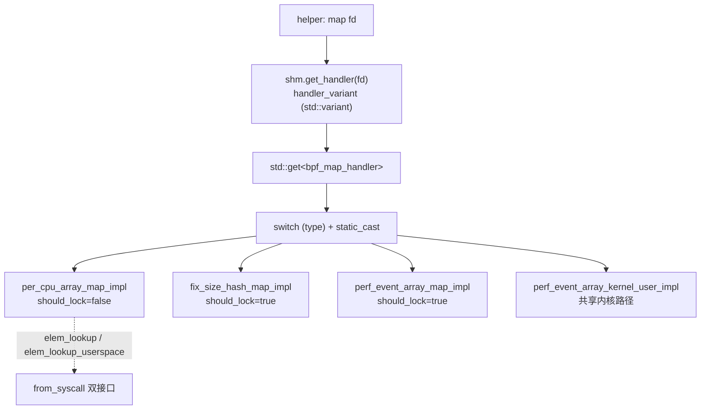
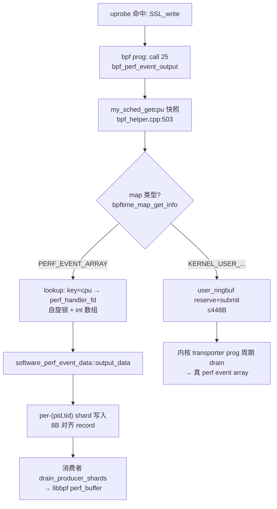
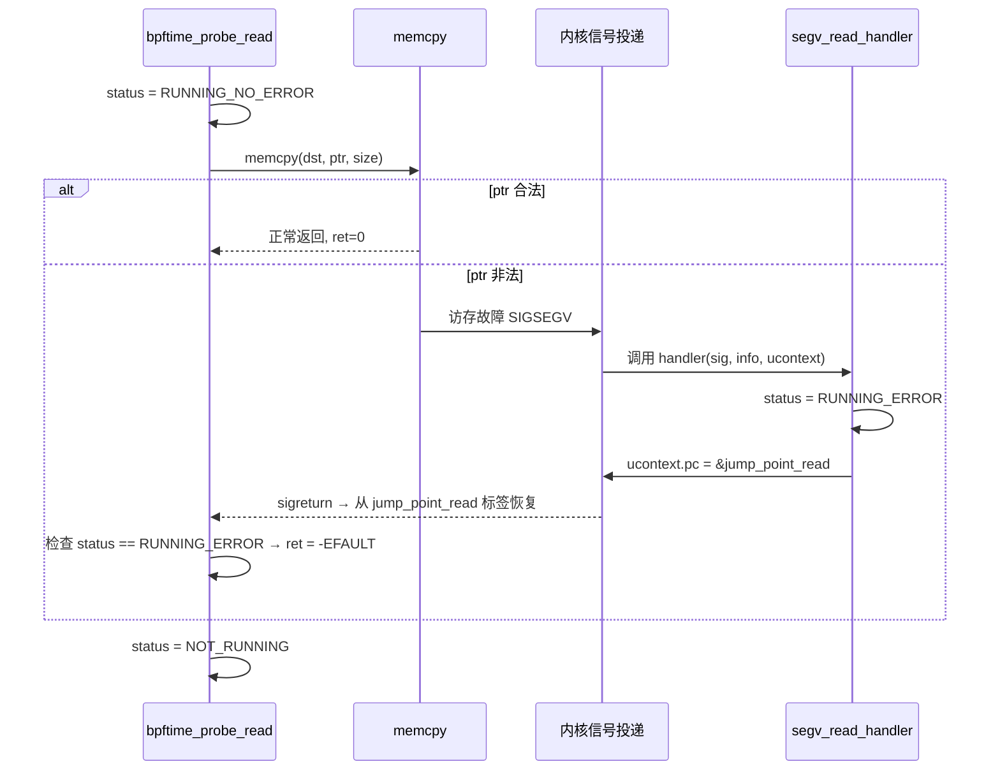

# 6. bpf_map 与 bpf_helper：map 实现与 helper 注册

> 行号基于 HEAD=`ead56c9`（已含三个修复：perf record 8 字节对齐 `0fcdb0e`、删除每事件绑核 `076e3e4`、sigaction 重装 `ead56c9`）。

这一章是你的**主场**。sslsniff 的四个 map 全部落在本章管辖范围内
（`example/tracing/sslsniff/sslsniff.bpf.c:20-58`）：

| sslsniff 里的 map | 类型 | 本章对应实现 |
|---|---|---|
| `perf_SSL_events` | `BPF_MAP_TYPE_PERF_EVENT_ARRAY` | `userspace/perf_event_array_map.cpp` |
| `ssl_data`（16KB 事件暂存） | `BPF_MAP_TYPE_PERCPU_ARRAY` | `userspace/per_cpu_array_map.cpp` |
| `bufs` / `start_ns` | `BPF_MAP_TYPE_HASH` | `userspace/fix_hash_map.cpp`（默认）|

热路径的两大 helper——`bpf_perf_event_output`（call 25）和 `bpf_probe_read_user`（call 112）——也都在 `bpf_helper.cpp` 里。三个修复中的两个直接改的就是本章文件。

## 文件地图

| 文件 | 行数 | 看什么 |
|---|---:|---|
| `bpf_map/map_common_def.hpp` | 103 | 先读：`bytes_vec`、`ensure_on_current_cpu`（快照，便宜）vs `ensure_on_certain_cpu`（真迁移，昂贵且只有单测在用） |
| `handler/map_handler.hpp/.cpp` | 304+1467 | map 统一分发层：`switch(type) + static_cast`，**不是虚函数**（想想为什么） |
| `userspace/per_cpu_array_map.cpp` + `per_cpu_hash_map.cpp` | 147+216 | per-CPU 用户态模拟的两种范式；`elem_*` vs `elem_*_userspace` 双接口 |
| `bpf_helper.cpp` | 1406 | 注册骨架 L1101-1375（helper 三大组）；锚点 `bpf_perf_event_output` L500、`bpftime_probe_read` L157 |
| `userspace/perf_event_array_map.cpp` | 83 | key=cpu → value=perf handler fd 的 int 数组 |
| `shared/perf_event_array_kernel_user.cpp` | 525 | 内核共享路径：user_ringbuffer + 动态生成的内核"搬运"eBPF 程序 |

---

## 5.1 map 的分发结构：两层分发，零虚函数

从 helper 里的 `map fd` 到具体 map 实现，要过两层：

1. **外层（variant 分发）**：`shm.get_handler(fd)` 返回 `handler_variant`——
   `std::variant<unused_handler, bpf_map_handler, bpf_link_handler, bpf_prog_handler, bpf_perf_event_handler, epoll_handler, memfd_handler>`
   （`handler/handler_manager.hpp:84-87`），用 `std::get<bpf_map_handler>` 取出。
2. **内层（switch 分发）**：`bpf_map_handler` 里没有 variant 也没有虚基类，只有
   `bpf_map_type type`（`map_handler.hpp:73`）+ 一个类型擦除指针
   `general_map_impl_ptr map_impl_ptr`，实际是 `boost::interprocess::offset_ptr<void>`
   （`map_handler.hpp:70,281`）。每个操作都是 `switch(type)` + `static_cast` 到具体 impl。

**为什么不用虚函数？** map impl 对象本体放在共享内存里，会被 server / agent 多个进程
同时映射。虚函数依赖 vtable 指针，而 vtable 地址在每个进程里都不同——放进 shm 的对象
带上 vtable 指针就废了。所以只能用"POD 式对象 + 外置类型标签 + switch"这套 C 风格分发；
指针也必须用 `offset_ptr`（存相对偏移而非绝对地址）才能跨进程有效。这是全库 shm 设计
反复出现的约束，本章是最典型的样本。

### 注释版选段 A：`map_lookup_elem` 的分发一层（`map_handler.cpp:114-163` 节选）

```cpp
const void *bpf_map_handler::map_lookup_elem(const void *key,
                                             bool from_syscall) const
{
        // 泛型 lambda：impl 类型由每个 case 的 static_cast 决定。
        // should_lock 是各 impl 的编译期常量 → if 会被常量折叠掉
        const auto do_lookup = [&](auto *impl) -> const void * {
                if (impl->should_lock) {
                        bpftime_lock_guard guard(map_lock);   // pthread 自旋锁
                        return impl->elem_lookup(key);
                } else {
                        return impl->elem_lookup(key);
                }
        };
        const auto do_lookup_userspace = ...;  // 同构，调 elem_lookup_userspace
        switch (type) {
        ...
        case bpf_map_type::BPF_MAP_TYPE_PERCPU_ARRAY: {
                auto impl = static_cast<per_cpu_array_map_impl *>(
                        map_impl_ptr.get());
                return from_syscall ? do_lookup_userspace(impl) :
                                      do_lookup(impl);        // ← 双接口分流点
        }
        ...
```

三个关键点：

- **`from_syscall` 是"视角开关"**：只有 per-CPU 两种 map 真正区分它（L152-163；update
  路径同构，L313-324）。helper 视角（`false`）只看"本 CPU 切片"，syscall 视角（`true`）
  一次读写全部 ncpu 份。上层入口决定视角：helper 包装函数传 `false`
  （`bpf_helper.cpp:384-385`），公开 C API `bpftime_map_lookup_elem` 传 `true`
  （`bpftime_shm.cpp:115-119`）。
- **锁是 per-map 一把自旋锁**（`map_handler.hpp:279`），且由 impl 的静态成员 `should_lock`
  决定是否加。谁有锁谁没锁值得记住：`fix_hash_map`/`queue`/`stack`/`bloom_filter`/
  `perf_event_array_map` 为 `true`；`array`/`per_cpu_array`/`per_cpu_hash`/`ringbuf` 及全部
  kernel-shared map 为 `false`。**per-CPU map 无锁**是下文正确性讨论的前提。
- impl 的构造统一在 `map_init`（`map_handler.cpp:767` 起）里
  `memory.construct<xxx_impl>(name)(...)` 到 shm；析构也必须由 handler_manager 显式
  `map_free`，`~bpf_map_handler` 里只留一句 CRITICAL 日志（`map_handler.hpp:132-142`）。



---

## 5.2 helper 三大组注册机制

数据结构极简（`runtime/include/bpftime_helper_group.hpp:15-19,53`）：

```cpp
struct bpftime_helper_info {
        unsigned int index;   // helper id，如 25 = perf_event_output
        std::string name;
        void *fn;             // 宿主进程内的真实函数指针
};
class bpftime_helper_group {
        std::map<unsigned int, bpftime_helper_info> helper_map;  // id → info
};
```

三个静态组（都是函数内 static 单例，普通堆内存，**不在 shm**——每个 agent 进程自己
构造一份，`fn` 是本进程地址，天然正确）：

| 组 | 定义处 | 内容 |
|---|---|---|
| `get_kernel_utils_helper_group` | `bpf_helper.cpp:1161-1332` | 约 28 个"内核语义模拟"helper：probe_read 家族、ktime、pid_tgid、**perf_event_output（L1311-1314）**、ringbuf、tail_call… |
| `get_shm_maps_helper_group` | `bpf_helper.cpp:1333-1375` | 6 个 map 操作：lookup/update/delete/push/pop/peek，全部是 `shm_holder.global_shared_memory.bpf_map_*(..., false)` 的薄包装（L381-423） |
| `get_ufunc_helper_group` | `bpf_helper.cpp:1153-1158` → `ufunc.cpp` | 扩展/ufunc 分发器 |

注册链（带语义）：

```
bpf_attach_ctx.cpp:40-57  load_prog_and_helpers(prog, config)
  ├─ config.enable_{kernel_helper,ufunc,shm_maps}_group 三开关逐组
  ├─ add_helper_group_to_prog(prog)          bpf_helper.cpp:1135-1141  遍历 helper_map
  │    └─ prog->bpftime_prog_register_raw_helper(info)   bpftime_prog.cpp:262-266
  │         └─ ebpf_register(vm, index, name, fn)        vm/llvm-jit/src/vm.cpp:29-37
  │              // 写入 vm->ext_funcs[index]，index 越界或重复注册不同 fn 则报错
  └─ prog->bpftime_prog_load(jit_enabled)
       └─ JIT 翻译 call imm 指令时按 ext_func_sym(imm) 找符号，
          找不到 → "Ext func not found"（compiler_utils.cpp:314,342）→ 整个 prog 编译失败
```

注意两个细节：`register_helper` 限制 id ≤ 999（`bpf_helper.cpp:1103`）；同 id 重复注册
只要 `fn` 相同就静默容忍（L1111-1116），所以 tail_call 里反复重注册不报错。

**⚠️ 与内核的关键差异**：内核里 helper 可用性由 verifier 按 prog type 决定；bpftime 里
完全由三个 config 开关 + 三张静态表决定。关掉 `enable_shm_maps_helper_group`，任何
含 `bpf_map_lookup_elem` 的程序在**加载期**（JIT 编译）就失败，不是运行期。

---

## 5.3 `bpf_perf_event_output` 修复后全文带读（你的主战场）

先看修复后的完整调用链（带参数语义）：

```
VM: call 25 (ctx, map_fd, flags, data, size)
 └─ bpf_perf_event_output                      bpf_helper.cpp:500-555
     ├─ current_cpu = my_sched_getcpu()        :503   纯快照（Linux 上就是 ::sched_getcpu，
     │                                                platform_utils.cpp:7-9，glibc rseq ~ns 级）
     ├─ bpftime_map_get_info(fd,·,·,&map_ty)   :519   bpftime_shm.cpp:287-306 查 handler.type
     ├─ [userspace 分支] map_ty == PERF_EVENT_ARRAY          :525-540
     │   ├─ shm.bpf_map_lookup_elem(fd, &current_cpu, false)  :526-529
     │   │    └─ perf_event_array_map_impl::elem_lookup       perf_event_array_map.cpp:28-36
     │   │         // key=cpu → &data[cpu]，value 是 perf handler 的 "fd"
     │   └─ bpftime_perf_event_output(perf_handler_fd, data, size)  :537
     │        └─ bpftime_shm.cpp:579-600
     │             std::get<bpf_perf_event_handler>(handler).data
     │             → software_perf_event_data::output_data     perf_event_handler.cpp:601-603
     │                → get_current_thread_shard()             按 (pid,tid) 找/建 shard
     │                → shard.buffer.output_data(buf, size)    perf_event_handler.cpp:365-387
     └─ [kernel-shared 分支] map_ty == KERNEL_USER_PERF_EVENT_ARRAY   :541-547 → §5.6
```

### 注释版选段 B：入口与类型分流（`bpf_helper.cpp:500-523`）

```cpp
uint64_t bpf_perf_event_output(uint64_t ctx, uint64_t map, uint64_t flags,
                               uint64_t data, uint64_t size)
{
        int32_t current_cpu = my_sched_getcpu();     // ← 快照。修复后热路径唯一的"cpu 相关"动作
        if (unlikely(current_cpu == -1)) { ... return (uint64_t)-1; }
        // current_cpu is only a snapshot used as the per-CPU map lookup key,
        // and ring writes go to per-thread producer shards, so nothing below
        // depends on staying on this CPU. Do not pin the thread here: the
        // sched_getaffinity/sched_setaffinity pair costs microseconds per
        // event on some platforms (e.g. ARM) and provides no exclusion or
        // ownership guarantee.                       // ← 这段注释就是修复 076e3e4 的论证
        int fd = (int)map;
        // Check map type. userspace perf event array, or shared perf event array?
        bpftime::bpf_map_type map_ty;
        if (int err = bpftime_map_get_info(fd, nullptr, nullptr, &map_ty);
            err < 0) { ... return -1; }
```

📌 **案例（删绑核）**：`076e3e4` 之前，L503 快照之后紧跟一个
`sched_getaffinity + CPU_SET + sched_setaffinity(钉到 current_cpu) … 尾部再 setaffinity 恢复`
的序列（原 L520/L532 附近还有两条错误路径直接 return，**漏恢复 mask**，会把 nginx worker
永久钉死在单核）。为什么删除是安全的，代码里已经写成注释（L509-514）：
① cpu 值在绑核**前**就已快照，绑核不改变 lookup key；② ring 写入走 per-(pid,tid) shard
（`get_current_thread_shard`，`perf_event_handler.cpp:491` 起），与 CPU 无关；③ 绑核不是锁，
不提供任何互斥。Jetson 实测该序列 3.1-6.7 µs/事件，占 event-output 段成本 72%。

### 注释版选段 C：两条输出分支（`bpf_helper.cpp:524-554`）

```cpp
        int ret;
        if (map_ty == bpftime::bpf_map_type::BPF_MAP_TYPE_PERF_EVENT_ARRAY) {
                const int32_t *val_ptr =
                        (int32_t *)(uintptr_t)bpftime::shm_holder
                                .global_shared_memory.bpf_map_lookup_elem(
                                        fd, &current_cpu, false);  // key = cpu 快照
                if (val_ptr == nullptr) { ... return (uint64_t)(-1); }
                int32_t perf_handler_fd = *val_ptr;   // consumer attach 时填进来的
                ret = bpftime_perf_event_output(perf_handler_fd,
                                                (const void *)(uintptr_t)data,
                                                (size_t)size);
        }
#if __linux__ && BPFTIME_BUILD_WITH_LIBBPF
        else if (map_ty == bpftime::bpf_map_type::
                                   BPF_MAP_TYPE_KERNEL_USER_PERF_EVENT_ARRAY) {
                ret = bpftime_shared_perf_event_output(   // → user_ringbuf 进内核
                        fd, (const void *)(uintptr_t)data, (size_t)size);
        }
#endif
        else { /* 非 perf array：报错 */ ret = -1; }
        return (uint64_t)ret;
```

逐点拆：

- **`flags` 参数被完全忽略**（已知未修）。sslsniff 传的是 `BPF_F_CURRENT_CPU`，恰好与
  "永远用 current_cpu 快照"语义重合所以无恙；但如果程序用 `BPF_F_INDEX_MASK` 显式指定
  index，bpftime 会静默当成 current-cpu 处理。
- perf_event_array 的 value 只是 int（`perf_event_array_map.cpp:14-26` 强制 key/value
  都是 4 字节，初值 -1）；consumer 侧 `perf_buffer__new` 时 syscall-server 为每个 cpu 创建
  software perf event handler 并 update 进对应 slot。若某 cpu 的 slot 还是 -1，
  `bpftime_perf_event_output`（`bpftime_shm.cpp:582-586`）会因 fd 非法而报错。
- 注意 `perf_event_array_map_impl::should_lock = true`（`perf_event_array_map.hpp:23`）：
  **每个事件都要拿一次该 map 的自旋锁**做 lookup。无竞争时开销个位数 ns，可忽略，但
  它是热路径上唯一一把每事件必拿的锁，剖析时会看到。
- ring 满时 `output_data` 内 `append_sample` 的返回值被丢弃、恒返回 0
  （`perf_event_handler.cpp:385-386`），全 runtime 也没有 `PERF_RECORD_LOST`——
  **丢弃对 BPF 程序和消费者都不可见**（已知未修）。

📌 **案例（8 字节对齐）**：上面链条的最后一跳
`software_perf_event_buffer::output_data`（`perf_event_handler.cpp:365-387`）正是对齐
修复 `0fcdb0e` 的现场：`align_perf_event_record_size(sizeof(perf_sample_raw)+size, record_size)`
把 record 总长向上取整到 8 的倍数（`perf_event_handler.cpp:129-134,374-378`）并写进
`header.size`，超 u16 上限拒绝；消费侧 `copy_next_record_to` 同时拒绝
`size % perf_event_record_alignment != 0` 的记录（:441-448）。修复前 record header 可以
落在环缓冲最后 1 字节，libbpf 跨界读出 `size=0` → 消费者空转 + 隐藏丢事件 + 吞吐双峰。
本章视角的教训：**helper 返回 0 不代表数据进了消费者眼睛**——这条链上有两处静默丢弃点
（ring 满、非法 record）。



---

## 5.4 `bpftime_probe_read` 修复后全文带读：用 SIGSEGV 当 EFAULT 用

内核的 `bpf_probe_read_user` 靠 `copy_from_user` 的 pagefault 兜底；用户态没有这层，
bpftime 的方案是：**直接 memcpy，赌它不炸；炸了就在 SIGSEGV handler 里把 PC 改到
memcpy 之后的标签，让执行流"跳伤逃生"**。开关 `ENABLE_PROBE_READ_CHECK` /
`ENABLE_PROBE_WRITE_CHECK` 默认 ON（`cmake/StandardSettings.cmake:102,104`，
`CMakeLists.txt:178-184`）。

状态机（全部 `thread_local`，`bpf_helper.cpp:105-128`）：

| 变量 | 类型 | 谁写谁读 |
|---|---|---|
| `status_probe_read` | `PROBE_STATUS`：`NOT_RUNNING / RUNNING_NO_ERROR / RUNNING_ERROR` | helper 进入时置 RUNNING_NO_ERROR（:167），signal handler 出错时置 RUNNING_ERROR（:151），helper 退出时归位（:211） |
| `exist_read` | `ORIGIN_HANDLER_EXIST_FLAG` | 首次调用查询旧 handler（:171-183），此后不再查 |
| `origin_segv_read_handler` | 函数指针 | 保存宿主原 SIGSEGV handler，非 probe_read 期间的段错误转交给它（:134-135） |
| `segv_read_handler_installed` | `bool` | **修复 `ead56c9` 新增**：本线程是否已装过 handler（:115,185-200） |

### 注释版选段 D：`segv_read_handler`（`bpf_helper.cpp:131-154`）

```cpp
static void segv_read_handler(int sig, siginfo_t *siginfo, void *ctx)
{
        if (status_probe_read == PROBE_STATUS::NOT_RUNNING) {
                // 段错误不是 probe_read 造成的：转交宿主原 handler，
                // 没有原 handler 就只能 throw（在 signal handler 里 throw
                // 是 UB 边缘行为，实际等于 abort）
                if (origin_segv_read_handler != nullptr) {
                        origin_segv_read_handler(sig, siginfo, ctx);
                } else {
                        throw std::runtime_error("segv_handler for probe_read called");
                }
        } else if (status_probe_read == PROBE_STATUS::RUNNING_NO_ERROR) {
                auto uctx = (ucontext_t *)ctx;
#if defined(__x86_64__) || defined(_M_X64)
                auto *ip = (greg_t *)(&uctx->uc_mcontext.gregs[REG_RIP]);
#elif defined(__aarch64__) || defined(_M_ARM64)
                auto *ip = (greg_t *)(&uctx->uc_mcontext.pc);   // ← aarch64 改 pc
#endif
                status_probe_read = PROBE_STATUS::RUNNING_ERROR;
                *ip = (greg_t)&jump_point_read;   // sigreturn 后从标签处继续执行
        }
}
```

### 注释版选段 E：安装 + 主体 + 逃生标签（`bpf_helper.cpp:185-213` 节选）

```cpp
        if (!segv_read_handler_installed) {          // ← ead56c9：thread_local 一次性安装
                sa.sa_flags = SA_SIGINFO;
                sigemptyset(&sa.sa_mask);
                sa.sa_sigaction = segv_read_handler;
                sigaction(SIGSEGV, &sa, nullptr);    // 进程级生效，但标志按线程记
                segv_read_handler_installed = true;
        }
#endif
        memcpy((void *)dst, (void *)ptr, (size_t)size);   // ← 赌命的一行

#ifdef ENABLE_PROBE_READ_CHECK
        __asm__("jump_point_read:");                 // ← 逃生着陆点（全局汇编标签）
        if (status_probe_read == PROBE_STATUS::RUNNING_ERROR) {
                ret = -EFAULT;                       // 从 handler 跳回来的：报 EFAULT
        }
        status_probe_read = PROBE_STATUS::NOT_RUNNING;
#endif
        return ret;
```

原理图：



`jump_point_read` 的本质：`__asm__("jump_point_read:")` 在函数体中间放了一个**全局
汇编符号**（对应 L106 的 `extern "C" void jump_point_read()` 声明，它其实不是函数，
只是个地址）。handler 把被中断上下文的 PC 改成这个地址后 `sigreturn`，CPU 就"假装"
memcpy 已经执行完，落在标签处继续。坑有三个：

1. **依赖编译器不乱动这段代码**——无输出约束的 `asm` 隐式 volatile 不会被删，但
   memcpy 与标签之间的次序、寄存器状态全靠"编译器没做激进重排"这个事实成立，属于
   脆弱平衡（读 `-O2` 汇编可验证）。同名全局标签也意味着该函数绝不能被内联两次。
2. **sigaction 是进程级的，装的却是"读线程"的 handler 链**：第一个调 probe_read 的
   线程把 `segv_read_handler` 装上后，`origin_segv_read_handler` 只在该线程的
   thread_local 里；其他线程后续也各自"再装一遍"（此时读到的 original 已是
   `segv_read_handler` 自己）。另外 L177 用 `sa_sigaction == nullptr` 判断旧 handler
   是否存在，若宿主用的是 `sa_handler` 风格（union 另一成员），这个判断会误读。
3. probe_read 和 probe_write（L216-305）是完全对称的两套复制粘贴，状态互相独立。

📌 **案例（sigaction 重装修复）**：`ead56c9` 之前，"是否需要安装"的判断读的是一个
**未初始化的局部变量**（UB，实测首个调用后恒真），于是每次 probe_read 都执行
`sigaction(SIGSEGV, &sa, nullptr)`——热路径每事件多 2 个 `rt_sigaction` syscall。
sslsniff 每个事件都要 `bpf_probe_read_user` 拷 16KB payload（`sslsniff.bpf.c:115`），
这就是根因报告里"每事件 6 个冗余 syscall"中的 2 个。修复即选段 E 里的
`segv_read_handler_installed` thread_local 标志（read/write 两路径各一份，:115,:127）。

**顺手记一个反差**：`bpf_probe_read_str` 完全没有这套保护——就是一行 `strncpy`
（`bpf_helper.cpp:425-431`），不返回内核语义的"已读长度"，坏指针直接裸崩；而注册表把
`probe_read_user_str` / `probe_read_str` 都映射到它（:1266-1277）。同属 probe 家族，
安全等级天差地别。

---

## 5.5 per-CPU map：两种模拟范式与内存布局

内核 per-CPU map 靠 percpu 内存 + 关抢占保证"本 CPU 独占"。用户态两个前提都没有，
bpftime 的模拟 = **getcpu 快照选切片 + 完全无锁**（两个 impl 都 `should_lock = false`，
`per_cpu_array_map.hpp:31`、`per_cpu_hash_map.hpp:52`）。

### 范式一：per_cpu_array —— 一整块连续数组，entry-major

```
data = bytes_vec，长度 = max_entries * ncpu * value_size    (per_cpu_array_map.cpp:23)
data_at(idx, cpu) = base + idx*value_size*ncpu + cpu*value_size   (hpp:25-28)

           ┌───────────── entry 0 ─────────────┬───────────── entry 1 ─────────────┐
           │ cpu0 val │ cpu1 val │ … │ cpuN val │ cpu0 val │ cpu1 val │ … │ cpuN val │
           └──────────┴──────────┴───┴──────────┴──────────┴──────────┴───┴──────────┘
helper 视角(elem_lookup):       返回其中一格（cpu = getcpu 快照）
syscall 视角(elem_lookup_userspace): 返回 data_at(idx, 0)，即整行 ncpu 份的起点
```

- helper 路径 `elem_lookup/elem_update`（cpp:34-74）用
  `ensure_on_current_cpu<T>(func)`——名字唬人，实现只是
  `func(my_sched_getcpu())`（`map_common_def.hpp:27-31`），**纯快照，不迁移不绑核**。
- syscall 路径一次拷 `ncpu * value_size` 字节（cpp:134-135）；
  `get_userspace_value_size()` 相应 ×ncpu（`map_handler.cpp:74-89`）——libbpf 侧
  `bpf_map_lookup_elem` 的 value buffer 就按这个大小配。**混淆两个视角就会误读 value 大小**。
- `elem_delete` 两个视角都不支持（cpp:76-81,139-145），与内核一致。

### 范式二：per_cpu_hash —— hash 一份，value 拼接 ncpu 份

`boost::unordered_map<bytes_vec, bytes_vec>` 放 shm（`per_cpu_hash_map.hpp:20-49`），
**key 只有一份，value 是 ncpu 个切片拼成的大 vec**。helper 视角 lookup 返回
`&itr->second[value_size * cpu]`（cpp:60），update 只覆写本切片、条目不存在则以
`value_template`（全零大 vec）为底插入整行（cpp:82-91）。

辅助结构 `key_templates` / `single_value_templates`（hpp:49，ctor cpp:40-45）：按 CPU
预分配的 scratch buffer，避免每次操作在 shm 里做小分配——但这也意味着**两个线程若快照
到同一 cpu 值，会并发写同一个 scratch**，与"无锁 + boost::unordered_map 并发插入可能
rehash"一样，都是靠"低并发时碰不上"过日子的已知妥协。

📌 **案例（删绑核的正确性论证背景）**：删除 `bpf_perf_event_output` 的绑核时，需要
论证"绑核不是 per-CPU map 的正确性来源"。看本节代码即知：helper 路径从头到尾只有
`my_sched_getcpu()` 快照，**没有任何机制阻止快照后线程迁移**，两个线程完全可能同时
写同一 cpu 切片。也就是说"绑核换正确性"从来不成立——正确性本来就没有被保证过，
绑核只是白付 µs 级代价。真正的"绑核序列"活在 `ensure_on_certain_cpu`
（`map_common_def.hpp:33-62`）里，而它**只有单测在用**（`unit-test/maps/test_per_cpu_*.cpp`），
且只用 void 特化版；泛型主模板 L38 写着 `func(currcpu)`——对零参 `std::function<T()>`
传参，**一旦被实例化直接编译错误**，等于死代码。L36-38 的 `currcpu` 初始化为 -1 后
再无赋值，fast-path 永不命中，也是同款"没人真跑过"的证据。

**已核实的 bug**（底稿"疑似"，现已确认代码就是这么写的）：
`per_cpu_hash_map_impl::elem_delete`（cpp:96-107）不删条目，只
`std::fill(second.begin(), second.begin() + cpu*value_size, 0)`——清零的是
**切片 [0, cpu)**，即"其他 CPU 的前几份"，既没清本 cpu 切片也没删除 key。行为与内核
（整条删除）完全背离。另：helper 路径 `elem_update` 不检查 `_max_entries`
（只有 userspace 路径检查，cpp:182-185），map 可被 BPF 程序无限撑大。

---

## 5.6 perf_event_array 的两个世界

### userspace 版（sslsniff 用的这个）

`perf_event_array_map.cpp` 全文 83 行：一个 `boost::interprocess::vector<int>`，
初值 -1，key/value 强制 4 字节（:14-26）。它不存数据，只存**cpu → perf handler fd**
的路由表；真正的环形缓冲在 `bpf_perf_event_handler`（第 1 章的 shard 世界）。

### kernel-user 共享版（`shared/perf_event_array_kernel_user.cpp`，525 行）

场景：消费者是**真内核** perf buffer（daemon 劫持内核 eBPF 时），用户态 BPF 程序的输出
要"逆向"送进内核。三级火箭：

```
output_data_into_kernel(buf, size)                      :66-91
  ├─ size > 448 直接拒绝（480-32，:69-75）
  ├─ ensure_current_map_user_ringbuf()                  :229-245
  │    // 每进程惰性 user_ring_buffer__new 一个 1MB 的 BPF_MAP_TYPE_USER_RINGBUF
  │    // （map 在 ctor 中由 server 创建，:107-111）
  ├─ reserve(size+8) → 头 8 字节写 size，payload 跟在后面（:80-87）→ submit
  └─ 内核侧：ctor 创建了一个周期触发的 software perf event（:132）
       + 一段手写字节码的"搬运" eBPF 程序 attach 上去（:136,145,151）：
       bpf_user_ringbuf_drain(user_rb, cb, &ctx, 0)     // 取一条
         → bpf_perf_event_output(ctx, kernel_perf_array, 0, buf, size)
       （C 原型写在 :286-320 注释里，指令数组 :334 起，godbolt 手工编译产物）
```

三个值得存疑/记录的点：

- `create_intervally_triggered_perf_event(10)`（:446-459）里
  `sample_period = duration_ms * 1000`，而 `PERF_COUNT_SW_CPU_CLOCK` 的 period 单位是
  **纳秒**——名义 10ms 实际 10µs（**疑似单位 bug，未实测验证**）。
- `user_ringbuffer_wrapper` 里 `reserve_lock` 初始化了却从没人 lock（:52,249,277-284），
  并发 reserve 的线程安全完全依赖 libbpf `user_ring_buffer__reserve` 内部实现。
- 搬运程序每次 drain 只取 1 条（callback 恒返回 1），高事件率下内核搬运速度上限
  = 触发频率，容易积压——这是 kernel-shared 路径不适合 sslsniff 这种量级的结构性原因。

### tail_call 顺带一记（`bpf_helper.cpp:557-643`）

`bpftime_tail_call` 每次调用：查 prog_array（:566）→ **new 一个 `bpftime_prog`**
（:600-602）→ 按 config 重注册三大 helper 组（:604-618）→ `bpftime_prog_load`
（:619，JIT 未开缓存时=重编译）→ 拷 64 字节 ctx（:626-632）→ 执行。与内核"O(1) 改
指令指针"完全不同量级；哪天 benchmark 带 tail call，先来这里看一眼。深度保护
`MAX_TAIL_CALL_CNT=32` 用 thread_local + RAII guard 实现（:576-593）。

---

## 坑清单（全部已在 `ead56c9` 代码中核实）

- **per-CPU map 不做真隔离**：getcpu 快照选切片 + 无锁，迁移后两线程可写同一切片；
  内核"关抢占"假设在用户态不成立。绑核救不了它，也从来没救过（§5.5 📌）。
- `elem_*`（helper 视角，单切片）vs `elem_*_userspace`（syscall 视角，ncpu 份），value
  大小差 ncpu 倍（`map_handler.cpp:74-89`）。
- `per_cpu_hash_map::elem_delete` 清零范围是 `[begin, begin + cpu*value_size)`——错切片
  且不删条目（`per_cpu_hash_map.cpp:102-105`，已确认非"疑似"）；`per_cpu_array` 不支持
  delete；per_cpu_hash 的 helper 路径 update 不检查 max_entries（:182 只管 userspace）。
- `bpf_perf_event_output` 忽略 `flags`（`BPF_F_INDEX_MASK` 显式索引被当 current-cpu）；
  ring 满静默丢弃（`perf_event_handler.cpp:385` 丢返回值），无 `PERF_RECORD_LOST`。
- `bpftime_tail_call` 每次 new prog + 重注册 + 重 load（`bpf_helper.cpp:600-619`）。
- `ENABLE_PROBE_READ_CHECK` 默认 ON；修复后稳态 0 个 sigaction syscall/调用，但**每线程
  首次调用**仍有 1-2 个（查询旧 handler + 安装，:171-200），做微基准时记得预热。
- `bpf_probe_read_str` 只是 `strncpy`：无 SIGSEGV 保护、返回 0 而非内核语义长度（:425-431）。
- `ensure_on_certain_cpu` 泛型主模板是无法实例化的死代码（`map_common_def.hpp:38`），
  只有 void 特化被单测使用——读代码时别被它误导以为运行时有绑核路径。

## 自测题

1. **`call 25` 从 VM 到 shard 写入经过哪几层？map 类型在哪一步分流 userspace / kernel-shared？**
   <details><summary>答案</summary>
   JIT 后的机器码直接 call 注册进 <code>vm->ext_funcs[25]</code> 的
   <code>bpf_perf_event_output</code>（bpf_helper.cpp:500）→ <code>my_sched_getcpu</code> 快照（:503）→
   <code>bpftime_map_get_info</code> 查 <code>handler.type</code>（:519，bpftime_shm.cpp:287）——**这里分流**：
   <code>PERF_EVENT_ARRAY</code> 走 <code>shm.bpf_map_lookup_elem(fd,&cpu,false)</code> 拿 perf handler fd →
   <code>bpftime_perf_event_output</code>（bpftime_shm.cpp:579）→
   <code>software_perf_event_data::output_data</code>（perf_event_handler.cpp:601）→
   <code>get_current_thread_shard().buffer.output_data</code>（:365，8B 对齐写环）；
   <code>KERNEL_USER_PERF_EVENT_ARRAY</code> 走 <code>bpftime_shared_perf_event_output</code>（bpftime_shm.cpp:603）
   → user_ringbuf → 内核搬运 prog。
   </details>

2. **关掉 `enable_shm_maps_helper_group`，sslsniff 会死在哪里、什么时候死？**
   <details><summary>答案</summary>
   不是运行时死，是**加载期**死：<code>load_prog_and_helpers</code>（bpf_attach_ctx.cpp:40-57）不再注册
   helper 1/2/3（lookup/update/delete），JIT 翻译 <code>SSL_write</code> 入口 uprobe 的第一个
   <code>bpf_map_update_elem(&bufs,...)</code>（sslsniff.bpf.c:69，call 2）时在
   <code>ext_func_sym</code> 查不到符号，报 "Ext func not found"（vm/llvm-jit/src/compiler_utils.cpp:342），
   整个 prog load 失败。而 <code>bpf_perf_event_output</code>（call 25）在 kernel_utils 组里，不受影响。
   </details>

3. **probe_read 的 SIGSEGV 恢复在 aarch64 上改写哪个寄存器？改成什么值？**
   <details><summary>答案</summary>
   改 <code>ucontext_t</code> 里的 <code>uc_mcontext.pc</code>（bpf_helper.cpp:147；x86_64 是
   <code>gregs[REG_RIP]</code>，:145），写成 <code>&jump_point_read</code>——即 memcpy 之后那个
   <code>__asm__("jump_point_read:")</code> 标签的地址（:205）。sigreturn 后执行流从标签处恢复，
   靠 thread_local 的 <code>status_probe_read == RUNNING_ERROR</code> 把返回值改成 -EFAULT。
   </details>

4. **为什么 map impl 用 `switch(type) + static_cast` 而不是虚函数或 `std::variant`？**
   <details><summary>答案</summary>
   impl 对象放在共享内存里被多进程映射。虚函数的 vtable 指针是进程内地址，跨进程失效；
   variant 直接内嵌对象倒是可以，但各 impl 大小差异巨大且部分含非平凡成员，历史实现选择了
   <code>offset_ptr&lt;void&gt;</code>（map_handler.hpp:70,281）+ 外置 <code>type</code> 标签 + 每操作 switch
   （map_handler.cpp:134 起）。注意外层 fd → handler 那一步用的才是 <code>std::variant</code>
   （handler_manager.hpp:84-87）——variant 里的 <code>bpf_map_handler</code> 本身无虚函数，可以按值放 shm。
   </details>

5. **（新）sslsniff 一次 SSL_write 命中（entry+exit）会触发本章代码里的哪些 map/helper 操作？**
   <details><summary>答案</summary>
   entry：<code>bpf_map_update_elem</code> ×2（bufs、start_ns → fix_hash_map，各拿一次 map 自旋锁）。
   exit：<code>bpf_map_lookup_elem</code> ×2（bufs、start_ns）+ lookup ssl_data（per_cpu_array，无锁，
   getcpu 快照选切片）+ <code>bpf_probe_read_user</code> 拷 payload（SIGSEGV 状态机走一遍，修复后 0 syscall）
   + <code>bpf_map_delete_elem</code> ×2 + <code>bpf_perf_event_output</code>（perf_event_array lookup 带自旋锁
   + shard 写入）。全程唯一的 per-event syscall 开销只剩 getcpu 类快照——这正是三个修复后
   "代码计价"回归的微观图景。
   </details>

6. **（新）per_cpu_hash 的 `elem_delete` 执行后，map 处于什么状态？**
   <details><summary>答案</summary>
   条目仍在（key 可被 get_next_key 遍历到），value 的切片 [0, cpu) 被清零，**本 cpu 切片和
   [cpu+1, ncpu) 原封不动**（per_cpu_hash_map.cpp:102-105）。即：想删的没删掉，没想动的被清了。
   正确语义（对照内核）应是 <code>impl.erase(itr)</code>——userspace 路径的
   <code>elem_delete_userspace</code>（:189-200）反而是对的。
   </details>

7. **（新）修复后 `bpf_perf_event_output` 里还剩哪一次共享内存锁操作？它保护什么？**
   <details><summary>答案</summary>
   <code>perf_event_array_map_impl::should_lock = true</code>（perf_event_array_map.hpp:23），所以
   <code>do_lookup</code> 会拿该 map 的 <code>map_lock</code> 自旋锁（map_handler.cpp:117-124）做一次
   <code>&data[cpu]</code> 读。保护的是 int 数组元素读写的原子性——其实对 4 字节对齐 int 属于
   过度保护，但无竞争自旋锁只有几 ns，与被删掉的 µs 级绑核序列不是一个量级。
   </details>

---
[← 返回目录](README.md)
