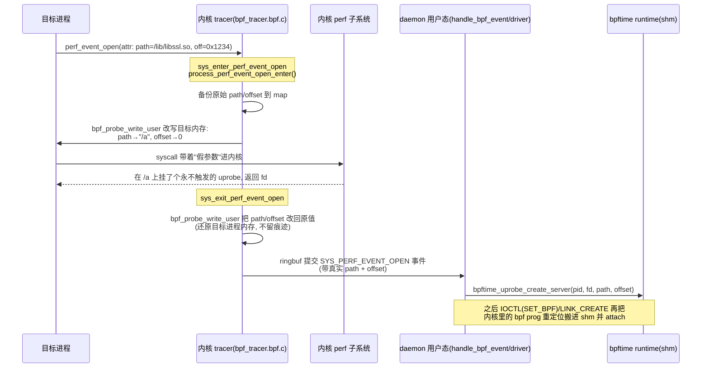
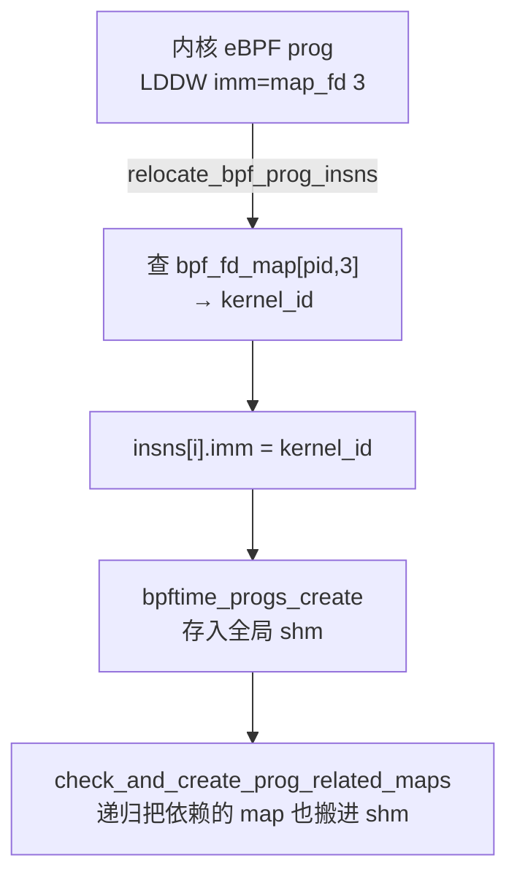

# 7. 外围：daemon / verifier / tools / 单测

> 本章是"地图"性质：不深挖每个部件的内部实现，只给你四张导航图 + 每个部件里**最容易踩坑或最反直觉**的那一处，让你日后需要时能一头扎对地方。行号以当前 worktree（HEAD=`ead56c9`）为准。

前五章都在讲 bpftime 的**主干**：syscall-server 拦截 `bpf()`、把程序和 map 放进共享内存、agent 注入目标进程、attach 层用 Frida 挂 uprobe、VM 跑字节码。本章讲的是围绕主干的四个"外围"部件——它们不在 ssl-nginx 热路径上，但决定了 bpftime 好不好用、能不能兼容内核 eBPF 生态、以及你怎么调试它。

| 部件 | 关键文件 | 一句话 |
|---|---|---|
| daemon | `daemon/kernel/bpf_tracer.bpf.c`(732L)、`daemon/user/{bpf_tracer,handle_bpf_event,bpftime_driver}.cpp` | 内核 eBPF tracer 监控目标进程的 `bpf()`/`perf_event_open()`，用 `bpf_probe_write_user` **改写 uprobe 路径**实现"透明劫持内核 eBPF 到用户态"；`relocate_bpf_prog_insns` 做 map fd→shm id 重定位 |
| verifier | `bpftime-verifier/src/{bpftime-verifier,platform-impl}.cpp` | PREVAIL 薄封装；**配置全是 `thread_local`**，跨线程校验前必须重新 `set_*`；只支持 uprobe/tracepoint + hash/array/ringbuf |
| tools | `tools/cli/main.cpp`(1275L) vs `tools/bpftimetool/main.cpp`(380L) | **cli 是注入器**（`fork`+`LD_PRELOAD` 或 Frida 注入），**bpftimetool 是 shm 直操作器**（不注入）——你天天用的 `remove` 就是它调 `bpftime_remove_global_shm` |
| 单测 | `runtime/unit-test/CMakeLists.txt`、`daemon/test/CMakeLists.txt` | Catch2 v3.4.0；`bpftime_runtime_tests` 可按 tag 过滤（如 `"[software_perf_event]"`）；attach 类测试要先 `make -C runtime/test/bpf` |

**两个一进门就要建立的心智**：

1. daemon 有**两层 eBPF**，千万别混：一层是 daemon 自己 attach 到内核 tracepoint 的**内核 tracer**（`bpf_tracer.bpf.c`，真跑在内核里）；另一层是**被劫持的目标程序**想加载的 eBPF（daemon 把它抢过来搬进用户态 shm）。本章说"劫持链"时，主角是前者在监视后者。
2. daemon 这条路和你在 ssl-nginx 里走的路**不是同一条**。你的 benchmark 用的是 `bpftime start`（agent 注入 + syscall-server 拦截，程序一开始就走用户态）。daemon 是给"**不改启动方式、已经在用内核 eBPF 的程序**"准备的透明劫持通道——理解它能让你看清 bpftime "两种接入模式"的全貌。

---

## 6.1 daemon：内核 eBPF 的"透明劫持"

### 它解决什么问题

`bpftime start` 需要你主动用它启动程序。但很多场景下，目标程序（比如某个 profiling agent）已经在用**内核** eBPF——它自己调 `bpf(BPF_PROG_LOAD)`、`perf_event_open()` 挂 uprobe。daemon 的野心是：**在不改目标程序一行代码的前提下**，把这些本该进内核的 eBPF 程序，偷偷搬到 bpftime 的用户态 runtime 里执行。

怎么做到"偷梁换柱"？答案是 daemon 在内核里挂一圈 tracepoint，盯着目标进程进出 `bpf()`/`perf_event_open()`/`ioctl()` 这些 syscall，然后在**目标进程还没真正进内核之前**，用 `bpf_probe_write_user` 篡改它传给内核的参数，让内核"什么都没干成"，同时把原始意图捞出来交给用户态 runtime 重演。

### 那条"魔法链"：uprobe 路径改写

最精彩的是 uprobe 劫持。目标程序调 `perf_event_open()` 想在 `/lib/libssl.so` 的某个 offset 挂 uprobe。daemon 的内核 tracer 在 `sys_enter_perf_event_open` 里拦下，做两件事：把 `probe_offset` 清零、把 `uprobe_path` 字符串从真实 so 路径改写成一个**空壳文件 `/a`**。于是内核在 `/a` 上挂了个 offset 0 的、永远不会触发的 uprobe——目标程序以为成功了，实际什么都没发生。真实的 `(路径, offset)` 则通过 ringbuf 事件送到 daemon 用户态，由它调 `bpftime_uprobe_create_server` 在 bpftime runtime 里挂**真的**用户态 uprobe。



关键点：**enter 时改成假参数骗内核，exit 时又原样改回**，所以目标进程从自己内存里读回来看，参数毫发无损——它完全不知道被劫持了。这正是"透明"二字的来源。

### 注释版代码选段（1）：uprobe 改写的核心

`daemon/kernel/bpf_tracer.bpf.c:404-434`

```c
if (new_attr_pointer->type == uprobe_perf_type) {   // 是 uprobe 类型的 perf event
    if (enable_replace_uprobe) {
        if (can_hook_uprobe_at(new_attr_pointer->probe_offset)) {
            u64 old_offset = new_attr_pointer->probe_offset;
            new_attr_pointer->probe_offset = 0;          // ① offset 清零
            long size = bpf_probe_read_user_str(         // 读出真实 so 路径
                old_uprobe_path, sizeof(old_uprobe_path),
                (void *)new_attr_pointer->uprobe_path);
            if (size <= 0) return 0;
            if (size > PATH_LENTH) size = PATH_LENTH;
            bpf_probe_write_user(                        // ② 路径改写成 "/a"
                (void *)new_attr_pointer->uprobe_path,
                &new_uprobe_path, (size_t)size);
            bpf_probe_write_user(attr, new_attr_pointer, // ③ 整个 attr 写回目标内存
                                 sizeof(*new_attr_pointer));
            return 1;   // 返回 1 = "这个请求归 bpftime 管，送 daemon"
        }
```

- **它在做什么**：把目标进程即将传给内核的 `perf_event_attr`，在原地（用户态内存）改成一个无害版本。
- **为什么这样写**：`bpf_probe_write_user` 是唯一能在内核 eBPF 里反向写目标进程用户态内存的 helper——这是整套劫持的物理基础。offset 清零 + 路径换成空壳 `/a`，保证内核那次挂载"合法但无效"。
- **坑在哪**：`new_uprobe_path` 被硬编码成 `/a`（见 `bpf_tracer.cpp:202`），代码注释直言原因——路径字符串太长会破坏目标进程用户态内存布局，只好用最短的 `/a`。这是个"能用但丑"的权衡，也解释了为什么 daemon 启动时要 `std::ofstream` 现场造一个 `/a` 空文件（`bpf_tracer.cpp:203-213`）。

### 注释版代码选段（2）：exit 时还原现场

`daemon/kernel/bpf_tracer.bpf.c:538-542`

```c
// Revert changes
bpf_probe_write_user(ap->path_buf_user, ap->name_or_path,   // 路径写回原值
                     sizeof(ap->name_or_path));
bpf_probe_write_user(&ap->attr_user->probe_offset,          // offset 写回原值
                     &ap->orig_offset, sizeof(ap->orig_offset));
```

- **它在做什么**：syscall 返回前，把 enter 时篡改过的两个字段改回去。
- **为什么这样写**：目标进程 syscall 返回后可能还会读自己的 `attr`（比如 libbpf 会核对）。如果留着 `/a` 和 offset 0，目标程序自检就会发现异常。所以必须"作案后打扫现场"。`orig_offset`/`name_or_path` 都是 enter 时存进 `perf_event_open_param_start` map 的备份（`:485-487`）。

📌 **案例连接（sigaction 修复）**：你修的第三个 bug 是 `probe_read`/`probe_write_user` 每次调用重装 SIGSEGV handler。注意 daemon 这里 `bpf_probe_write_user` 是**内核 helper**，跑在内核态，和你修的**用户态** runtime 里的 `bpf_probe_write_user`（`runtime/src/bpf_helper.cpp`，带 `ENABLE_PROBE_WRITE_CHECK` 的 SIGSEGV 保护）是**完全不同的两份实现**——同名不同物。内核版靠内核的 `copy_to_user` 做安全检查，压根不需要装信号 handler；用户态版才需要自己兜 SIGSEGV。这个"同名两实现"的对照，正好帮你把两层 eBPF 的边界钉死在脑子里。

### daemon 用户态：driver 的重定位

内核 tracer 只负责"抓意图 + 送事件"。真正把内核 eBPF 程序搬进 shm 的是用户态 `bpftime_driver`。最烧脑的一步是 **map fd → shm id 重定位**（`bpftime_driver.cpp:71-120`）：

内核 eBPF 程序里，`LDDW` 指令的 `imm` 存的是**内核 map fd**（进程私有的小整数）。搬到 bpftime runtime 后，这个 fd 毫无意义，必须换成 bpftime 全局 shm 里对应 map 的 id。`relocate_bpf_prog_insns` 遍历每条指令，遇到 `EBPF_OP_LDDW` 且 `src_reg` 是 1 或 2（map-by-fd / map-by-idx），就用 `(pid, fd)` 去查内核 id，再改写 `insns[i].imm`。



这解释了为什么 daemon 需要那么多张辅助 map（`bpf_fd_map`、`bpf_prog_insns_map`、`bpf_progs_new_fd_args_map`）：它要在内核里就把"哪个 fd 对应哪个 id、哪段指令属于哪个 prog"全记下来，用户态才有据可查。指令本身是靠 `kprobe/bpf_prog_kallsyms_add`（`bpf_obj_id_fd_map.h:50`）在内核加载程序时抓的快照。

---

## 6.2 verifier：一层 PREVAIL 薄封装，一个 thread_local 大坑

### 定位

`bpftime-verifier/` 把学术界的 PREVAIL 验证器（`ebpf-verifier/` 子目录，是上游 vbpf/ebpf-verifier）包了薄薄一层，供 syscall-server 在加载程序时做**用户态验证**。它只在编译时打开 `ENABLE_EBPF_VERIFIER` 才存在（`runtime/CMakeLists.txt:199` 定义 `ENABLE_BPFTIME_VERIFIER`）。

对外就三类接口（`bpftime-verifier.cpp`）：
- `verify_ebpf_program(raw_inst, num_inst, section_name)` → 返回 `optional<string>`，空 = 通过，有值 = 错误信息。
- `set_available_helpers` / `set_non_kernel_helpers` / `set_map_descriptors` → 验证**之前**必须先喂进去的上下文。

只支持三类程序（`platform-impl.cpp:21`：`uprobe`/`uretprobe`/`tracepoint`）和三类 map（`platform-impl.cpp:70`：`HASH`/`ARRAY`/`RINGBUF`），其它一律 `throw runtime_error`。

### 那个 thread_local 坑

`platform-impl.cpp:100-103`：

```cpp
// Thread independent
thread_local std::set<int32_t> usable_helpers;
thread_local std::map<int, EbpfMapDescriptor> map_descriptors;
thread_local std::map<int32_t, EbpfHelperPrototype> non_kernel_helpers;
```

这三个全局状态**都是 `thread_local`**。含义：你在**线程 A** 里调 `set_available_helpers(...)` 配好了可用 helper 集合，然后在**线程 B** 里调 `verify_ebpf_program(...)`——线程 B 看到的 `usable_helpers` 是**空的**，任何 helper 调用都会被判"Unusable helper"（`platform-impl.cpp:42` 抛异常），验证平白失败。

为什么这样设计？因为底层 PREVAIL 本身塞满了 `thread_local` 全局状态（`crab_verifier.cpp:29` 的 `global_program_info`、`thread_local_options`、各种 `lazy_allocator`……），它假设"配置和验证在同一线程内闭环"。bpftime 的封装层只能跟着用 `thread_local`，否则会和底层状态错位。

**实践上怎么不踩**：看 syscall-server 是怎么配的——`syscall_server_utils.cpp:93-95` 的 `set_available_helpers`/`set_non_kernel_helpers` 和 `bpftime_shm_internal.cpp:884` 的 `set_map_descriptors`，全都发生在**加载程序的那个线程**里，紧接着 `syscall_context.cpp:549` 就在**同一线程**调 `verify_ebpf_program`。只要"配置→验证"不跨线程，就没事。你若哪天想在后台线程池里做批量验证，这里就是第一个爆点。

### 注释版代码选段（3）：验证入口

`bpftime-verifier/src/bpftime-verifier.cpp:77-97`

```cpp
prog.info = {
    .platform = &bpftime_platform_spec,          // ① 挂上 bpftime 定制平台
    .map_descriptors = get_all_map_descriptors(),// ② 从 thread_local 取 map 上下文
    .type = bpftime_platform_spec.get_program_type(section_name, ""),
};
global_program_info = prog.info;                 // ③ 灌进 PREVAIL 的 thread_local
std::vector<std::vector<std::string>> notes;
auto unmarshal_result = unmarshal(prog, notes);  // ④ 字节码→内部 IR, 可能直接报错
if (std::holds_alternative<std::string>(unmarshal_result)) {
    return std::get<std::string>(unmarshal_result);
}
auto inst_seq = std::get<InstructionSeq>(unmarshal_result);
...
auto result = ebpf_verify_program(message_stream, inst_seq, prog.info,
                                  &verifier_options, &stats);
```

- **它在做什么**：把原始 8 字节一条的字节码组装成 `raw_program`，喂进 PREVAIL 两阶段——先 `unmarshal`（结构合法性），再 `ebpf_verify_program`（抽象解释做安全性证明）。
- **为什么这样写**：`get_all_map_descriptors()`（②）和 `global_program_info`（③）都读/写 `thread_local`，正是上面那个坑的现场——`prog.info` 里的 map 描述符来自当前线程的 `map_descriptors`，跨线程就是空的。
- **坑在哪**：`verifier_options`（`:19-30`）里 `no_simplify=true`、`check_termination=true` 是硬编码的。验证失败时错误信息通过一个自定义 `string_capture_streambuf`（`:37-61`）从 `ostream` 里捞出来——因为 PREVAIL 只会往流里打印、不返回结构化错误。

📌 **案例连接（对齐修复）**：verifier 关心的是"程序**逻辑**安全"（越界、未初始化寄存器、死循环），它管不到**运行时内存布局**。你修的 perf record 8 字节对齐 bug，是 record 落在环 buffer 边界的物理布局问题——PREVAIL 验证器对此**完全无感**，它验证时程序连跑都没跑。这提醒你：verifier 通过 ≠ 运行正确，一大类"对齐/并发/生命周期"bug 天然在验证器射程之外，只能靠你那种"读汇编 + 环边界回归测试"的路子抓。

### 验证模式（怎么关掉它）

验证不是死的：`BPFTIME_VERIFIER_LEVEL` 环境变量（`bpftime_config.cpp:133`）控制三档——`STRICT`（失败即 `-EINVAL` 拒绝加载）、`WARNING`（默认，打 warning 但仍加载，见 `syscall_context.cpp:561-579`）、`NO_VERIFY`（完全跳过）。调试自己写的程序被验证器挡住时，`BPFTIME_VERIFIER_LEVEL=NO_VERIFY` 是最快的绕行开关。

---

## 6.3 tools：注入器 vs shm 直操作器

两个都叫 `main.cpp`，职责却正交，别搞混。

| | `tools/cli` → `bpftime` 命令 | `tools/bpftimetool` → `bpftimetool` 命令 |
|---|---|---|
| 本质 | **注入器**：把 .so 塞进目标进程 | **shm 直操作器**：直接读写全局共享内存，不碰任何进程 |
| 子命令 | `load` / `start` / `attach` / `detach` / `trace` | `load` / `export` / `import` / `remove` / `run`(+`run-on-cuda`) |
| 怎么干活 | `load`：`fork`+`LD_PRELOAD` syscall-server（`run_command`, `main.cpp:987`）<br/>`start`：`LD_PRELOAD` agent（`:1010`）<br/>`attach`：Frida 注入到已运行 pid（`inject_by_frida`, `:1031`）<br/>`detach`：给 agent 发 `SIGUSR1`（`:1262`） | `remove`：`bpftime_remove_global_shm()`（`main.cpp:244`）<br/>`export`/`import`：shm ↔ JSON<br/>`run`：从 shm 取出 prog 直接 JIT/AOT/解释跑并测时 |
| 需不需要目标进程 | 需要（它就是启动/挂靠目标进程的） | 不需要（纯离线检修 shm） |

**记忆锚**：你天天清环境用的 `bpftime remove` 走的是 **bpftimetool**（`bpftime_remove_global_shm`），不是 cli。cli 的 `detach` 是"通知 agent 优雅退出"，bpftimetool 的 `remove` 是"直接把 `/dev/shm` 里那块内存删掉"——一个温柔一个粗暴，卡死时你要的往往是后者。

### cli 的两种注入机制

- **`load`/`start`（新进程）**：`run_command`（`main.cpp:106`）本质是 `fork` 出子进程，在 `execve` 前把 `LD_PRELOAD` 设成对应 .so，让动态链接器在程序 main 之前就加载 bpftime 库。`load` 预载 syscall-server（拦 `bpf()`），`start` 预载 agent（跑用户态 uprobe）。这就是你 ssl-nginx benchmark 走的路。
- **`attach`/`trace`（已运行进程）**：`inject_by_frida`（`main.cpp:275`）用 Frida 的 `frida_injector_inject_library_file_sync` 把 .so 注射进一个**已经在跑**的 pid——无需重启目标。`trace` 更复杂，还叠了 IPC refresh、CUDA late-PTX 提取、Ctrl+C 时先 detach agent 再停 loader 的优雅退出编排（`:1173-1240`）。

📌 **案例连接（绑核修复）**：你删掉的每事件 affinity 绑核，问题之一是"错误路径漏恢复 mask → 线程被永久钉死单核"。cli 的 `trace` 退出编排（`:1124-1240`）恰是相反的正面教材——它用 `sigaction` 存旧 handler、退出时 `sigaction(SIGINT, &old_int, ...)` 严格还原（`:1239-1240`），保证信号处理不残留副作用。同样是"改了全局/线程状态必须配对还原"，一个反例一个正例，可以对照记。

---

## 6.4 单测：组织与怎么跑单个

### 两套测试二进制

| 二进制 | 源码目录 | 跑法 | 覆盖 |
|---|---|---|---|
| `bpftime_runtime_tests` | `runtime/unit-test/` | `./build/runtime/unit-test/bpftime_runtime_tests` | maps、perf event、probe、attach+ebpf、tailcall |
| `bpftime_daemon_tests` | `daemon/test/` | `./build/daemon/test/bpftime_daemon_tests` | daemon driver |

用的都是 **Catch2 v3.4.0**（`runtime/unit-test/CMakeLists.txt:7` 里 FetchContent 拉取）。`make unit-test` = `unit-test-daemon` + `unit-test-runtime`（`Makefile:52`）。

### 怎么跑单个测试 / 按 tag 过滤

Catch2 支持位置参数选 `TEST_CASE`，也支持 `[tag]` 过滤。你修对齐 bug 时最常用的就是：

```bash
# 只跑软件 perf event 相关的三个 case（你的对齐回归测试就在这)
./build/runtime/unit-test/bpftime_runtime_tests "[software_perf_event]"

# 按名字精确跑一个
./build/runtime/unit-test/bpftime_runtime_tests \
  "Software perf event records remain aligned at the ring boundary"

# 列出所有 case / tag
./build/runtime/unit-test/bpftime_runtime_tests --list-tests
./build/runtime/unit-test/bpftime_runtime_tests --list-tags
```

那个环边界对齐回归测试就在 `runtime/unit-test/test_software_perf_event.cpp:199`，tag 是 `[perf_event][software_perf_event]`（`:200`）。

### 两个必知的坑

1. **attach 类测试要先编 eBPF 程序**。`test_attach_uprobe_with_ebpf.cpp:20` 通过编译期宏 `EBPF_PROGRAM_PATH_UPROBE` 拿到 .bpf.o 路径，这些 .o 由 CMake 的 `add_ebpf_program_target`（`CMakeLists.txt:88-94`）从 `assets/*.bpf.c` 现编。而 `unit-test-runtime` target 还额外 `make -C runtime/test/bpf`（`Makefile:47`）产另一批测试用 .o。忘了编 eBPF，attach 测试会因找不到 .o 而失败。

2. **`daemon/test/test_daemon.cpp` 是空壳**。`TEST_CASE("Test daemon")`（`:12`）函数体为空；`test_daemon_driver.cpp:17` 的 `TEST_CASE("Test daemon driver")` 里真正的断言也全被注释掉了（`:24-28`）。也就是说 daemon 目前**几乎没有有效单测**——别指望 `bpftime_daemon_tests` 绿灯能证明 daemon 逻辑正确。另外两个测试文件顶部都有 `#if !defined(__x86_64__)... #error Only supports x86_64`（`test_daemon.cpp:8`），在你的 **aarch64 Jetson 上 daemon 测试本就不为其设计**。

📌 **案例连接（对齐修复）**：你这次修对齐 bug 的做法——先加一个"record 落在环边界"的回归 `TEST_CASE`，再改代码让它变绿——正是这套 Catch2 框架的正确用法。用 `"[software_perf_event]"` tag 过滤只跑那三个 case，把单测反馈环从"全量几千断言"压到秒级，是你当时能快速迭代的关键。这也反衬出坑 2 的严重性：daemon 因为没测试，任何改动都得靠手工验证，风险高得多。

---

## 自测题

**Q1（原题保留）：daemon 里的"两层 eBPF"分别指什么？为什么容易混淆？**

<details><summary>答案</summary>

第一层是 daemon **自己**的内核 tracer（`bpf_tracer.bpf.c`），真跑在内核里，attach 到 `sys_enter/exit_bpf`、`perf_event_open`、`ioctl` 等 tracepoint，负责监视目标进程。第二层是**被劫持的目标程序**想加载的 eBPF——daemon 把它从内核抢过来搬进用户态 shm。混淆点：两者都是"eBPF 程序"，但一个是监视者（内核态、daemon 主动挂）、一个是被监视者（本想进内核、被搬到用户态）。`bpf_probe_write_user` 这类 helper 属于第一层。

</details>

**Q2（原题保留）：为什么 verifier 的配置跨线程会失效？**

<details><summary>答案</summary>

`usable_helpers` / `map_descriptors` / `non_kernel_helpers` 三个全局状态都是 `thread_local`（`platform-impl.cpp:100-103`），因为底层 PREVAIL 本身充满 thread_local 状态、假设配置与验证在同一线程闭环。在线程 A `set_available_helpers`、线程 B `verify_ebpf_program`，线程 B 看到的是空配置，helper 会被判 Unusable 而抛异常。syscall-server 的做法是保证"配置→验证"全在加载线程内完成（`syscall_server_utils.cpp` → `syscall_context.cpp:549` 同线程）。

</details>

**Q3（新）：uprobe 劫持时，为什么 enter 改参数、exit 又要把参数改回去？如果省掉 exit 的还原会怎样？**

<details><summary>答案</summary>

enter 时把 `probe_offset` 清零、`uprobe_path` 改成 `/a`，是为了骗内核挂一个无效 uprobe（`bpf_tracer.bpf.c:409-427`）。exit 时用备份还原（`:538-542`），因为 syscall 返回后目标进程/libbpf 可能会读回自己的 `attr` 做自检。若省掉还原，目标程序会看到路径变成 `/a`、offset 变 0，与它自己设的值不符，轻则报错重则行为异常——"透明"就破功了。备份存在 `perf_event_open_param_start` map 里（enter 的 `:485-487`）。

</details>

**Q4（新）：你想验证一个自己写的 uprobe eBPF 程序，但它一直被 verifier 拒绝加载，怎么快速定位/绕过？**

<details><summary>答案</summary>

三步：(1) 先设 `BPFTIME_VERIFIER_LEVEL=WARNING`（默认就是）或直接 `NO_VERIFY`（`bpftime_config.cpp:133`）确认是不是验证器的锅——`NO_VERIFY` 下能跑就说明程序逻辑没运行时问题，只是没过静态验证。(2) 看错误信息：验证失败的报告经 `string_capture_streambuf` 从 PREVAIL 的 ostream 捞出（`bpftime-verifier.cpp:94-101`），会指出哪条指令、什么问题。(3) 注意 bpftime 只支持 uprobe/uretprobe/tracepoint + hash/array/ringbuf（`platform-impl.cpp:21,70`），用了别的 section 或 map 类型会直接 `throw`，不是验证失败而是"不支持"，换类型即可。

</details>

**Q5（新）：`bpftime detach` 和 `bpftime remove` 有什么本质区别？卡死时该用哪个？**

<details><summary>答案</summary>

`detach` 属于 **cli**（`tools/cli/main.cpp:1245`），它遍历 alive agent 集合、给每个 agent 进程发 `SIGUSR1`（`:1262`）通知它优雅卸载——依赖 agent 还活着且能响应信号。`remove` 属于 **bpftimetool**（`tools/bpftimetool/main.cpp:244`），直接调 `bpftime_remove_global_shm()` 把 `/dev/shm` 里那块共享内存物理删除，不理会任何进程。目标进程已崩溃/卡死、agent 无法响应信号时，`detach` 无效，要用 `remove` 强制清干净 shm 再重来。

</details>

---
[← 返回目录](README.md)