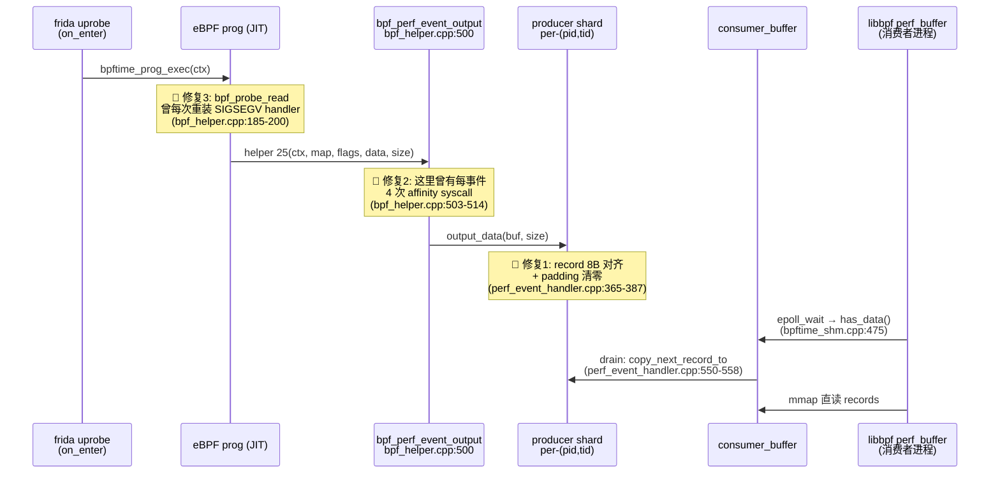
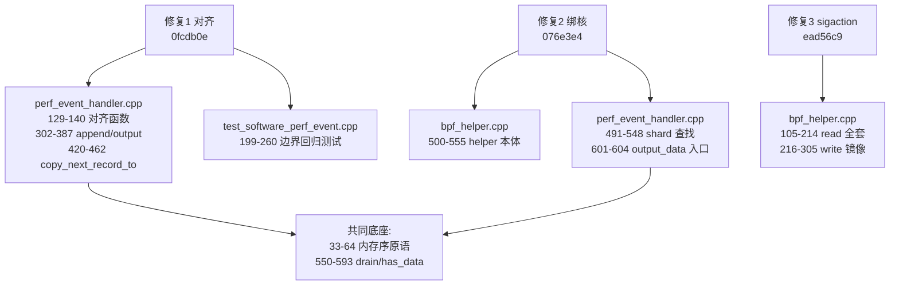

# 8. 实践：阅读节奏、验证实验与 PR 辩护清单

本章是全指南的"落地"部分：先给出阅读节奏，然后是本章核心——**PR 辩护精读清单**。
你将为三个修复（perf record 8 字节对齐 `0fcdb0e`、删除每事件绑核 `076e3e4`、
sigaction 重装 `ead56c9`）向上游提 PR/issue。审稿人不会读你的消融报告，他们读的是
diff、被改的函数、以及"你是否真的理解了周边代码"。这一节把辩护每个修复必须逐行
吃透的约 300 行代码列成清单，并预演审稿人最可能的追问。

行号基于当前 worktree（HEAD=`ead56c9`，含全部三个修复）。

---

## 1. 阅读节奏（按依赖序）

第 1 天主线 13 步 → 子系统 1（shm，半天）→ 子系统 2（入口层，半天）→
子系统 3（attach，1 天）→ 子系统 4（vm，1 天）→ 子系统 5（maps/helpers，半天，
大半你已熟）→ 子系统 6（按需）。

顺序的理由：shm 是所有跨进程状态的地基，不先懂 `handler_manager` 就看不懂
agent/syscall-server 在"注册什么"；attach 与 vm 相互独立，可换序；maps/helpers
放后是因为你在 benchmark 工作里已把 `bpf_helper.cpp` 的热路径段翻烂了，
剩下的是查漏。

---

## 2. 全景：三个修复在热路径上的位置

先把一张图刻进脑子——每个修复各钉在链路的哪一环。这也是 PR 辩护的开场白素材：
能一句话说清"我改的这行处于数据流的什么位置"，审稿人对你的信任度会完全不同。



三个修复分属两类：修复 1 是**生产者-消费者契约**问题（跨进程、跨代码库），
修复 2/3 是**热路径冗余 syscall** 问题（单进程、纯浪费）。辩护策略因此不同：
前者要论证"契约是什么、谁依赖它"，后者要论证"删掉的东西保护不了任何东西"。

---

## 3. PR 辩护精读清单 ⭐

总原则：每个修复的辩护 = **(a) 我改了什么**（diff 本身）+ **(b) 周边代码为什么
允许我这么改**（不变量论证）+ **(c) 诚实的边界**（行为差异主动声明，别等审稿人发现）。
(b) 是最费功夫的——下面每个修复列出必须逐行吃透的代码段和预演问答。

三段合计核心必读约 300 行（不含单测）。



### 3.1 修复 1：software perf record 8 字节对齐（`0fcdb0e`）

**必读清单**（约 170 行 + 62 行单测）：

| 代码段 | 位置 | 为什么必读 |
|---|---|---|
| `perf_event_record_alignment` 常量与 `align_perf_event_record_size` | `runtime/src/handler/perf_event_handler.cpp:129-140` | 修复的数学核心：溢出检查 + 向上取整 |
| `append_record_parts` | 同文件 `302-355` | 对齐后长度参与容量判断、padding 写入、head 推进 |
| `output_data` | 同文件 `365-387` | `header.size`（对齐值）与 `sample->size`（裸 payload）的分工 |
| `write_wrapped` / `read_wrapped` | 同文件 `389-418` | 环回绕拷贝——理解"header 跨界"故障的几何 |
| `copy_next_record_to` | 同文件 `420-462` | 消费侧防御：非对齐记录拒绝并弃 shard |
| 边界回归测试 | `runtime/unit-test/test_software_perf_event.cpp:199-260` | 审稿人会先看测试证明了什么 |

**注释版代码 ①**：`append_record_parts` 的核心（`perf_event_handler.cpp:310-347` 节选）：

```cpp
const size_t raw_record_size = first_size + second_size;
size_t record_size;
if (!align_perf_event_record_size(raw_record_size, record_size)) {
        return false;               // 溢出才失败，正常路径是向上取整到 8B
}
...
const size_t available_size = mmap_size() - used_size;
// Keep one byte empty so head == tail only represents an empty buffer.
if (available_size <= record_size) {  // 注意是 <=：留 1 字节空隙，
        return false;                 // head==tail 唯一表示"空"
}
write_wrapped(data_head, first, first_size);
if (second_size > 0) {
        write_wrapped(data_head + first_size, second, second_size);
}
if (record_size > raw_record_size) {  // 📌 修复新增：padding 显式清零
        const uint8_t padding[perf_event_record_alignment - 1] = {};
        write_wrapped(data_head + raw_record_size, padding,
                      record_size - raw_record_size);
}
uint64_t new_head = data_head + record_size;   // 用对齐值推进 head——
smp_store_release_u64(&header.data_head, new_head); // 对齐不变量由此归纳保持
```

要点：`data_head` 永远以 8 的倍数推进，且初值为 0（`:253`），归纳可得**每条 record
的起点恒 8B 对齐**——这是整个修复的不变量。padding 清零不是洁癖：不清零则消费者
读到的字节依赖环上残留数据，跨 run 不可复现。

**注释版代码 ②**：`copy_next_record_to` 的消费侧防御（`perf_event_handler.cpp:439-461` 节选）：

```cpp
perf_event_header record_header;
read_wrapped(data_tail, &record_header, sizeof(record_header));
if (record_header.size < sizeof(record_header) ||
    record_header.size > mmap_size() ||
    record_header.size % perf_event_record_alignment != 0) { // 📌 修复新增
        SPDLOG_ERROR("Invalid perf record size {}, dropping shard data",
                     record_header.size);
        smp_store_release_u64(&header.data_tail, data_head); // 弃掉整个 shard
        return false;                                        // 的未消费数据
}
if (record_header.size > data_head - data_tail) {
        return false;   // record 声称的长度超过实际已发布数据：等下一轮
}
```

要点：注意 drain 侧用 `read_wrapped` 拷出 header 再读字段——**它自己不怕跨界**。
怕跨界的是 libbpf：它在 wrap-copy 之前直接解引用环尾的 `ehdr->size`。所以生产侧
对齐是给 libbpf 的契约，消费侧检查是给"脏共享内存残留"的保险丝。

**审稿人可能问什么**：

- **Q：8 字节对齐是你们自造的约定吗？** 答：是 kernel perf ABI 的既有契约——内核
  perf 输出的每条 record 都 8B 对齐（`header.size` 由内核向上取整）；libbpf 的
  perf_buffer 消费路径据此假定 `perf_event_header` 在环内连续可读，在 wrap-copy
  前直接读 `ehdr->size`。bpftime 声称与 libbpf 消费者二进制兼容，生产侧就必须守约。
  违约的实测后果：header 落在环最后 1 字节 → 读到 `size=0` → tail 不推进 → 消费者
  空转（修复后消费者 task-clock −95.5%、指令 −96.1%）。
- **Q：`header.size` 写对齐值、`sample->size` 写裸 payload 长度（`:381/:383`），
  消费者会不会读到多余 padding？** 答：与 kernel 语义一致——`header.size` 用于
  推进 tail（必须覆盖 padding），`perf_sample_raw.size` 才是 payload 长度，
  perf_buffer 回调用后者切数据；padding 已清零。
- **Q：u16 上限拒绝是新增限制？** 答：`header.size` 本来就是 `uint16_t`（perf ABI
  字段宽度）。旧代码 `header.header.size = sizeof(header) + size` 直接隐式截断
  ——超 64KB 的事件会写出自相矛盾的 record。现在显式 `-E2BIG`（`:376-377`）。
- **Q：生产侧已保证对齐，消费侧为何还要拒绝（`:441-448`）？** 答：bpftime 的共享
  内存跨 run 持久（这正是你们双峰问题的另一半来源——残留 shm），旧版本 producer
  写入的非对齐记录可能仍在环里；拒绝并推 tail 到 head 是恢复不变量的最小代价。
- **Q：为何不改 libbpf 让它容忍跨界 header？** 答：libbpf 服务的是 kernel ABI，
  kernel 从不产生跨界 header；要求外部生态迁就 bpftime 的违约不现实。
- **Q：测试证明了什么？** 答：`test_software_perf_event.cpp:199-260` 用 64 字节
  迷你环 + 静态断言 record=24B（`:221`），8 轮绕环验证每条 record 起点对齐、
  padding 为零，且 `:251-254` 断言确实覆盖到"header 起点落在环倒数第 8 字节"
  的关键场景（`reached_last_header_slot`）。

### 3.2 修复 2：删除每事件 affinity 绑核（`076e3e4`）

**必读清单**（约 130 行）：

| 代码段 | 位置 | 为什么必读 |
|---|---|---|
| `bpf_perf_event_output` helper 本体 | `runtime/src/bpf_helper.cpp:500-555` | diff 就在这；`current_cpu` 的唯一用途在 `:529` |
| `my_sched_getcpu` | `runtime/src/platform_utils.cpp:7-9` | Linux 上就是 `sched_getcpu()`（vDSO/rseq，纳秒级） |
| shm 转发层 | `runtime/src/bpftime_shm.cpp:579-600` | fd → `software_perf_event_data::output_data` |
| `output_data` → `get_current_thread_shard` | `runtime/src/handler/perf_event_handler.cpp:601-604, 491-548` | 论证核心：写入按 (pid,tid) 分 shard，与 CPU 无关 |
| shard cache 与三级 generation | 同文件 `119-144, 495-511` | 无锁快路径为什么安全 |
| drain 与自旋锁 | 同文件 `550-558, 70-82` | 慢路径的互斥靠锁，不靠绑核 |
| 内存序原语 | 同文件 `33-64` | head/tail 的 acquire/release，绑核提供不了这个 |

**注释版代码 ③**：修复后的 `bpf_perf_event_output` 头部（`bpf_helper.cpp:500-529` 节选）：

```cpp
uint64_t bpf_perf_event_output(uint64_t ctx, uint64_t map, uint64_t flags,
                               uint64_t data, uint64_t size)
{
        int32_t current_cpu = my_sched_getcpu();  // 快照，Linux 上 ~ns 级
        ...
        // current_cpu is only a snapshot used as the per-CPU map lookup key,
        // and ring writes go to per-thread producer shards, so nothing below
        // depends on staying on this CPU. Do not pin the thread here: ...
        int fd = (int)map;
        bpftime::bpf_map_type map_ty;
        if (int err = bpftime_map_get_info(fd, nullptr, nullptr, &map_ty);
            err < 0) {  // 旧代码在这条错误路径 return 时不恢复 affinity
                ...     // → 被追踪线程被永久钉死单核（子 bug 1）
        }
        if (map_ty == ...BPF_MAP_TYPE_PERF_EVENT_ARRAY) {
                const int32_t *val_ptr = ...bpf_map_lookup_elem(
                        fd, &current_cpu, false);  // ← cpu 的唯一用途：map key
                ...
```

要点：`current_cpu` 在旧代码里也是**绑核之前**就快照好的；绑核既不影响它的取值，
也不被后续任何代码依赖。这一行注释（`:509-514`）就是 PR 论证的浓缩版，写它的目的
是防止下一个人把绑核加回来。

**审稿人可能问什么**：

- **Q：绑核难道不是为了保证"写到当前 CPU 的 buffer"？** 答：写入根本不进 per-CPU
  结构。`output_data`（`perf_event_handler.cpp:601-604`）转给
  `get_current_thread_shard()`，按 `(getpid(), gettid())` 选 shard（`:493-494,
  :519-521`）——**per-thread，不是 per-CPU**。`current_cpu` 的唯一用途是
  PERF_EVENT_ARRAY 的 lookup key（`bpf_helper.cpp:529`），而它在绑核前已快照，
  原实现从未消除"快照后迁移"窗口，只是略微缩短。
- **Q：那并发安全靠什么？** 答：shard 查找/创建/drain 全走 `shard_lock` 自旋锁
  （`:513, :552`），无锁快路径靠 thread_local cache + 三级 generation 校验
  （`:495-511`），环指针用 acquire/release 原语（`:33-64`）。绑核本来就不提供
  互斥——同核照样可被抢占。
- **Q：删除后事件的 cpu 归属会不会错？** 答（诚实边界，主动写进 PR）：存在
  快照-写入间迁移窗口，但与删除前**同类同源**；实测 16B 审计 10 秒约 20 万事件，
  nginx worker `nr_migrations = 0`；cpu 值只影响 perf_buffer 回调的 cpu 参数，
  无正确性影响。
- **Q：`BPF_MAP_TYPE_KERNEL_USER_PERF_EVENT_ARRAY` 共享路径（`:541-547`）呢？**
  答：用户态绑核影响不了内核侧的 per-CPU buffer 选择（内核用自己的
  `smp_processor_id()`），对该路径同样零保护。
- **Q：两个子 bug 是真的吗？** 答：看 `git show 076e3e4`——旧代码 map 类型查询失败
  （原 `:520`）与 lookup 失败（原 `:532`）路径直接 return，不恢复 mask，被追踪
  线程从此钉死单核；正常路径的恢复用的是进入时保存的 `orig`，与应用自身的
  `sched_setaffinity` 竞态（陈旧 mask 覆盖新设置）。
- **Q：性能数字可信吗？** 答：要先声明测量顺序——对齐 bug 不修，吞吐数据被隐藏
  丢事件污染（这是把修复 1 放在同一叙事里的原因）。修后：Jetson fair 口径 3 轮
  × 2 payload 六腿全同向（16B +7.58% / 256KB +9.81%），事件守恒 2.001/请求零丢失；
  x64 同 VM A/B +37～41%，kernel 腿 Δ≤0.7% 证明控制干净。

### 3.3 修复 3：SIGSEGV handler 每线程装一次（`ead56c9`）

**必读清单**（约 200 行，read/write 镜像各半）：

| 代码段 | 位置 | 为什么必读 |
|---|---|---|
| 状态机与 TLS 变量 | `runtime/src/bpf_helper.cpp:83-128` | `PROBE_STATUS` / `exist_read` / `segv_read_handler_installed` 各自的角色 |
| `segv_read_handler` | 同文件 `131-155` | 恢复机制：改写 PC 到 `jump_point_read` |
| `bpftime_probe_read` | 同文件 `157-214` | diff 所在；首调用探测 + 安装块 |
| `segv_write_handler` / `bpftime_probe_write_user` | 同文件 `217-305` | 镜像路径，diff 同样改了这里 |
| 编译开关 | `CMakeLists.txt:178-179`、`cmake/StandardSettings.cmake:102` | 默认 ON；不开则整段代码不存在 |

**注释版代码 ④**：修复后的安装逻辑（`bpf_helper.cpp:166-200` 节选）：

```cpp
status_probe_read = PROBE_STATUS::RUNNING_NO_ERROR;
struct sigaction sa, original_sa;   // ← original_sa 是栈上局部变量！
if (exist_read == ORIGIN_HANDLER_EXIST_FLAG::NOT_CHECKED) {
        int err = sigaction(SIGSEGV, nullptr, &original_sa);
        ...                          // 只有本线程首次调用才填充它。
        if (original_sa.sa_sigaction == nullptr) {
                exist_read = ORIGIN_HANDLER_EXIST_FLAG::NOT_EXIST;
        } else {
                exist_read = ORIGIN_HANDLER_EXIST_FLAG::EXIST;
                origin_segv_read_handler = original_sa.sa_sigaction;
        }
}
// 旧代码此处判断 original_sa.sa_sigaction != segv_read_handler——
// 第二次调用起 original_sa 未初始化（UB），实践上恒真 → 每次重装。
if (!segv_read_handler_installed) {   // 📌 修复：thread_local 标志
        sa.sa_flags = SA_SIGINFO;
        ...
        sa.sa_sigaction = segv_read_handler;
        err = sigaction(SIGSEGV, &sa, nullptr);
        ...
        segv_read_handler_installed = true;
}
```

要点：UB 的机制必须能脱稿讲清——`original_sa` 每次调用都是新的栈变量，但只在
`exist_read == NOT_CHECKED` 的首次调用里被 `sigaction` 查询填充；旧判断在后续
调用中读未初始化栈内存，结果恒不等于 handler 地址 → 每次调用 2 个
`rt_sigaction` syscall（查询 + 安装）。热路径每事件 payload 分块都要 probe_read，
账单随 payload 线性放大。

**审稿人可能问什么**：

- **Q：`sigaction` 是进程级的，为什么标志用 `thread_local` 而不是进程级 once？**
  答：功能上进程级也行，但整个状态机（`status_probe_read`、`exist_read`、
  `origin_segv_read_handler`）已全是 thread_local（`:107-115`），per-thread 标志
  是与既有结构一致的最小改动；代价仅是每线程首次调用多一次重装同一 handler（幂等）。
- **Q：行为变化——旧代码每次重装，"顺带修复"了应用中途替换 SIGSEGV handler 的
  情况；新代码不会。** 答：旧行为同时意味着**每次调用都覆盖应用的 handler**，而
  origin 只在首次调用捕获——所谓"顺带修复"是 bug 的副作用，且代价是应用 handler
  被永久顶掉。应用在 attach 后替换 SIGSEGV handler 本就与该恢复机制不兼容，
  属既有限制，不是本修复引入的。
- **Q（审稿人顺着代码可能挖出的既有问题，建议 PR 里主动声明 out of scope）**：
  1. read/write 两个 handler 互相覆盖同一个 SIGSEGV 槽位（`:194` vs `:283`），
     恢复依赖"origin 链意外接力"（后装者的 `origin_segv_*_handler` 恰好捕到
     先装者）；
  2. 第二个线程首次调用时，进程级 sigaction 查询返回的是**我们自己的 handler**，
     被存进该线程的 `origin_segv_read_handler`（`:181`）——真实应用 SEGV 走
     `NOT_RUNNING` 分支时会自我转发（`:134-135`），直接递归；
  3. `original_sa.sa_sigaction == nullptr` 判断无法区分 `SIG_DFL`/`SIG_IGN`
     （union 语义）。
  这三个都在修复前就存在，逐一指出并说明"本 PR 只修每次重装"，反而能展示你
  看得比 diff 远。
- **Q：为什么单测没抓住？** 答：`runtime/unit-test/test_probe.cpp` 的 24 个用例
  有 23 个因 mocked `get_global_attach_ctx` 异常本来就失败（与本修复无关，A/B
  验证过）；且重装 handler 是纯性能问题，功能语义不变，功能测试天然测不出。

---

## 4. 边读边做的验证实验（利用现有环境）

工作目录均为 `/home/jetson/src/bpftime-offical-no-btf`，构建目录
`build-alignment-test/`（`ENABLE_PROBE_READ_CHECK`/`WRITE_CHECK` 均为 ON，
已核实 CMakeCache）。

1. **读 shm 章时——dump handler 表认类型。** 跑一次 benchmark 后不执行
   `bpftimetool remove`，直接：
   ```bash
   sudo build-alignment-test/tools/bpftimetool/bpftimetool export /tmp/shm.json
   python3 -m json.tool /tmp/shm.json | less
   ```
   JSON 按 fd 槽位键入，每槽带 `"type"` 字符串（`bpf_prog_handler` /
   `bpf_map_handler` / `bpf_perf_event_handler` / `epoll_handler` / ...，见
   `runtime/src/bpftime_shm_json.cpp:253-312`），对照 `handler_variant` 的
   7 个成员（`runtime/src/handler/handler_manager.hpp:84-87`）逐槽认。

2. **读 JIT 章时——确认 helper 25 的绑定。** helper 编号在
   `runtime/src/bpf_helper.cpp:911`（`BPF_FUNC_perf_event_output = 25`），注册在
   `:1311-1314`；JIT 侧符号名由 `ext_func_sym` 生成
   （`vm/llvm-jit/src/compiler_utils.hpp:39-44`，格式 `_bpf_helper_ext_%04u` →
   `_bpf_helper_ext_0025`）。验证方式：
   ```bash
   SPDLOG_LEVEL=debug BPFTIME_LOG_OUTPUT=console \
     LD_PRELOAD=build-alignment-test/runtime/agent/libbpftime-agent.so <victim> \
     2>&1 | grep -i "ext_0025\|perf_event_output"
   ```
   （运行时日志级别经 `spdlog::cfg::load_env_levels()` 读取，
   `runtime/include/bpftime_logger.hpp:62`；注意 Release 构建可能把 DEBUG 宏
   编译掉，此时改用 AOT 产物 `llvm-objdump -t` 看符号表。）

3. **读 attach 章时——核对 enter 侧事件计数。** 在
   `attach/frida_uprobe_attach_impl/src/frida_internal_attach_entry.cpp:294`
   （`uprobe_listener_on_enter`）与 `:315`（`on_leave`）各加一个原子计数器，
   重编 agent，然后：
   ```bash
   sudo v4-ablation/short-test.sh original 16      # 单 payload 短测（~6.5 min）
   sudo v4-ablation/event-audit.sh original 16     # 事件守恒审计
   ```
   核对 2.001 事件/请求的另一半：enter 计数应 ≈ 消费者收到的 SSL_read+SSL_write
   事件数之和。

4. **读 probe_read 时——关掉检查做消融。** 本构建两个开关均 ON：
   ```bash
   grep PROBE build-alignment-test/CMakeCache.txt
   # ENABLE_PROBE_READ_CHECK:BOOL=ON / ENABLE_PROBE_WRITE_CHECK:BOOL=ON
   ```
   做一个 `-DENABLE_PROBE_READ_CHECK=OFF` 的变体构建跑短测，可直接回答消融报告
   ③段 +3.7pp 的来源（sigaction 修复后，剩余成本 = memcpy + 状态机本身）。

5. **（新增）读 perf buffer 时——跑边界回归测试。**
   ```bash
   ./build-alignment-test/runtime/unit-test/bpftime_runtime_tests \
     "[software_perf_event]"
   ```
   三个 TEST_CASE（`test_software_perf_event.cpp:43/142/199`）分别验证
   多线程 shard 隔离、mmap resize 后 shard 轮换、环边界对齐——正好是修复 1 + 修复 2
   赖以成立的三条不变量。改一行 `perf_event_record_alignment` 观察哪些断言炸，
   是理解不变量传播路径的最快方式。

---

## 5. 已知代码-注释不一致清单（已核实，附新发现）

阅读时以代码为准。以下每条都在当前 worktree 重新核实过：

- **`attach/frida_uprobe_attach_impl/include/frida_uprobe_attach_impl.hpp:20-25`：
  UPROBE/URETPROBE 注释写反**（已核实）。`ATTACH_UPROBE = 6` 顶着"invoked when
  the attached function **return**"的注释，`ATTACH_URETPROBE = 7` 顶着"invoked
  when the attached function was **invoked**"。实现侧
  （`frida_internal_attach_entry.cpp:294-339`）语义正常：`on_enter` 处理 uprobe、
  `on_leave` 处理 uretprobe。
- **"interpreter" 注释——底稿定位有误，已修正锚点**：自称 interpreter 的不是
  `llvmbpf_vm::exec`，而是 VM 抽象层的
  `vm/vm-core/include/ebpf-vm.h:151`（"Execute a BPF program in the VM using
  **the interpreter**"）。LLVM 后端下 `ebpf_exec` 一路转发到
  `llvmbpf_vm::exec`（`vm/llvm-jit/src/vm.cpp:57-84`），实为**惰性 JIT**：
  首调用 compile 后缓存函数指针再执行。`vm/llvm-jit/include/llvmbpf.hpp:48-50`
  的注释反而是对的。调用侧 `bpftime_prog_exec`
  （`runtime/src/bpftime_prog.cpp:245-255`）的 `jitted` 分支区分的是
  "预先显式 compile 过"与"没 compile 过"，后者对 LLVM 后端同样落到 JIT。
- **`runtime/src/bpf_map/userspace/per_cpu_hash_map.cpp:122-124`：一条注释两处
  失实**（已核实）。注释称"Allocate as a **local variable** to make it thread
  safe, since we use **sharable lock**"——实际 (a) 用的是共享成员
  `this->key_templates[0]`（`:124`），不是局部变量；(b)
  `per_cpu_hash_map.hpp:52` 明确 `should_lock = false`，全类无锁。
- **（新发现）`per_cpu_hash_map.cpp:96-106`：`elem_delete` 清零范围与意图相反**。
  `std::fill(begin, begin + cpu * value_size, 0)` 清的是 CPU `0..cpu-1` 的切片，
  不是当前 CPU 的 `[cpu*value_size, (cpu+1)*value_size)`；在 CPU 0 上调用则什么都
  不清。已在"已知未修"清单，此处补充：对照 `elem_update` 的正确写法
  （`:83-84`，`begin() + cpu * value_size` 作为**起点**）即可确认这是笔误。
- **（新发现）`perf_event_handler.cpp:385-386`：`output_data` 把丢弃当成功**。
  `append_sample` 的返回值被忽略，函数恒 `return 0`；全 runtime 无
  `PERF_RECORD_LOST` 生成。环满丢弃对 BPF 程序和消费者双向不可见——这是你们
  "隐藏丢事件"现象的代码根源，也在"已知未修"清单。
- **（新发现）`bpf_helper.cpp:500`：`flags` 参数整个被忽略**。
  `BPF_F_INDEX_MASK` 显式索引会被当 current-cpu 处理（对照 kernel 语义应取
  `flags & BPF_F_INDEX_MASK` 作 map index）。上游可单独立项。
- **（新发现，不确定是否有意）`runtime/syscall-server/syscall_context.cpp:890-892`：
  mocked mmap 兜底路径连调两次 `orig_mmap64_fn`**，第一次的匿名映射返回值直接
  丢弃（泄漏一块映射）。看不出第一次调用的意图，标记待查。

---

## 6. 自测题

读完本章（以及跑完实验）后自测。前三道对应 PR 辩护的核心论证，答不上来说明
还没到能上 PR 战场的程度。

**1. 修复 1 之后，一条 payload 为 5 字节的 record 在环上占几个字节？
`header.size` 和 `sample->size` 各是多少？**

<details><summary>答案</summary>

`perf_sample_raw` = `perf_event_header`(8) + `uint32_t size`(4) = 12 字节，
加 payload 5 = 17，向上对齐到 **24 字节**（`align_perf_event_record_size`，
`perf_event_handler.cpp:131-140`）。`header.size = 24`（对齐值，消费者用它推进
tail），`sample->size = 5`（裸 payload，回调用它切数据），第 17～23 字节为清零
padding（`:341-345`）。单测 `:219-221` 对 8 字节 payload 静态断言了同一算法
（12+8=20 → 24）。
</details>

**2. 为什么删除绑核后不需要任何替代同步措施？写入路径上每一层的安全靠什么？**

<details><summary>答案</summary>

因为绑核从未承担同步职责：(a) `current_cpu` 只是 map lookup key 的快照
（`bpf_helper.cpp:503, :529`）；(b) ring 写入按 `(pid, tid)` 选 producer shard
（`perf_event_handler.cpp:493-494`），单写者；(c) shard 表的增删查受
`shard_lock` 自旋锁（`:513, :552`）；(d) shard cache 快路径靠三级 generation
校验（`:495-511`）；(e) head/tail 跨进程可见性靠 acquire/release 原语
（`:33-64`）。每层各有其锁或其单写者性质，无一依赖"线程停在某个 CPU 上"。
</details>

**3. 修复 3 的 UB 判断为什么"首次调用后恒真"而不是随机真假？**

<details><summary>答案</summary>

旧判断是 `original_sa.sa_sigaction != segv_read_handler`。`original_sa` 是
栈上局部变量，仅在 `exist_read == NOT_CHECKED` 的首次调用里被填充
（`bpf_helper.cpp:171-183`）；后续调用里它是未初始化栈内存，恰好等于
`segv_read_handler` 地址的概率约为零，所以判断实践上恒真 → 每次重装。
说"恒真"是经验结论（UB 无保证），PR 里应表述为"未初始化读取，实测导致每次
调用重装"。
</details>

**4. `get_current_thread_shard` 的三个 generation 各防什么？**

<details><summary>答案</summary>

- `event_generation`（`perf_event_handler.cpp:97-103`，`pid<<32 ^ 计数器`）：
  防 shm 中同地址析构重建的另一个 event 被旧 cache 命中；
- `buffer_generation`：消费者 `ensure_mmap_buffer` 扩容后递增
  （`:619-622`），迫使所有 producer 换新 shard（新 shard 以新容量创建，
  `:535-538`），防止新旧容量混写；
- `shard.generation`：防 list 节点被 erase 后内存重用——cache 里存的裸指针
  必须与记录的 `shard_generation` 一致才可信（`:503-506`）。
</details>

**5. producer 环满时，BPF 程序和消费者分别观察到什么？这是 bug 吗？**

<details><summary>答案</summary>

BPF 程序看到 helper 返回 0（成功）——`output_data` 忽略 `append_sample` 的
false 返回值（`perf_event_handler.cpp:385-386`）；消费者什么也看不到——全
runtime 不产生 `PERF_RECORD_LOST`。是 bug（静默丢弃），在"已知未修"清单。
kernel 语义是 helper 返回 `-ENOSPC` 且可统计丢失。这也是对齐 bug 期间"高吞吐
假象"能长期隐身的原因：丢事件无任何可见信号。
</details>

**6. 若应用在 agent attach 之后自己调用 `sigaction(SIGSEGV, ...)`，修复 3 前后的
行为各是什么？**

<details><summary>答案</summary>

修复前：下一次 `probe_read` 会（因 UB 恒真）重装我们的 handler，把应用的
handler 顶掉——应用的 SEGV 处理从此失效（origin 只在首次调用捕获，链不到它）。
修复后：我们不再重装，应用 handler 生效，但代价是此后 `probe_read` 踩坏指针时
恢复机制失效，fault 落到应用 handler 上。两种行为都不理想；正解是进程级
handler 链或 kernel 式 pagefault 抑制，属后续工作——PR 里作为已声明的既有
限制处理。
</details>

---
[← 返回目录](README.md)
