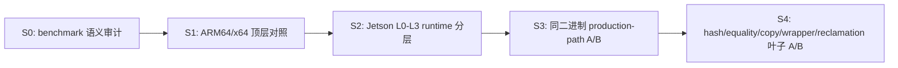

# BPFtime `benchmark/uprobe` 综合调查报告

- 日期：2026-08-13
- 平台：Jetson Orin Nano ARM64、Intel x64 物理机
- 范围：普通 map 与 per-CPU map 的 benchmark 语义、跨平台表现、BPFtime–kernel 差额及 BPFtime 源码路径归因

## 技术摘要

本轮调查已经完成从 benchmark 语义到源码叶子路径的主要证据链：

1. 修正了 hash delete 的测试语义。原测试只有第一组 delete 命中，之后 `99.999%` 的操作是 delete-miss；修正后，每个计时样本前都在计时区外恢复 1000 个 key，计时区内稳定测量 delete-hit。
2. 确认 ordinary array delete 和 per-CPU array delete 均不受 array map 支持，因此二者没有有效的删除性能含义。
3. 在 ARM64 与 x64 物理机上完成普通 map 顶层对照。普通 hash update 和修正后的 hash delete 在两个平台都由 BPFtime 获胜；ordinary array update 是唯一发生平台胜负翻转的项目。
4. 在 Jetson 上用 operation-specific matched control 测得 8 个有效 lookup/update 操作的严格 `BPFtime − kernel` 差额。除 ordinary hash update 外，另外 7 项均为 BPFtime 更重，其中 per-CPU hash lookup/update 的绝对差额最大。
5. 用同一诊断 runtime 二进制完成 L0–L3 分层和源码叶子 A/B。主要成本分别落在 generic userspace dispatch、`std::function`/CPU 选择、Boost.Interprocess hash 容器、shared-memory value-vector copy，以及同步节点析构和 shared-memory reclamation。
6. 当前工作已经定位到“哪一类 runtime 操作重、重多少、位于哪一层”。继续细拆 bucket/node/`offset_ptr` 或改写 wrapper，主要服务于优化，而不是完成当前的根因诊断。

最重要的结论不是“ARM 上 BPFtime 普遍执行更慢”。受控数据中，BPFtime 的普通 map 绝对成本在 ARM64 上均低于 x64；平台趋势差异主要来自 kernel 路径在 Jetson 上下降得更多。与此同时，在同一 Jetson 内部，BPFtime 的多条 userspace map 路径确实比 kernel BPF 重，且具体成本来源已经定位。

## 1. 调查范围

官方 victim 共包含 17 类测试：

- 3 类基本 probe：uprobe、uretprobe、uprobe + uretprobe；
- 2 类用户内存 helper：`bpf_probe_read_user`、`bpf_probe_write_user`；
- 6 类普通 map 名义操作：array/hash × lookup/update/delete；
- 6 类 per-CPU map 名义操作：per-CPU array/hash × lookup/update/delete。

本报告重点覆盖最后 12 个 map 名义操作。每个 map case 在一次 BPF invocation 内执行 1000 次 helper；正式顶层 victim 通常执行 100,000 次 invocation。

调查过程如下：



## 2. 指标与测量口径

### 2.1 官方顶层净 helper 成本

普通 map 的跨平台顶层结果采用同一 victim 进程内的空 uprobe 扣除：

```text
net ns/helper
  = (map case ns/invocation - __bench_uprobe ns/invocation) / 1000
```

该指标估计“触发相同 probe 后，1000 次 map helper 相对空 probe 增加的平均成本”。表格采用 5 个独立 victim 的同进程净值中位数。

### 2.2 Jetson matched BPFtime–kernel 差额

为避免空 uprobe 与真实 map 程序在循环、stack、key/value 准备方面不完全匹配，后续为每个操作构造了 operation-specific control：

```text
engine net ns/helper
  = (real case - matched control) / 1000

BPFtime-kernel gap
  = BPFtime engine net - kernel engine net
```

control 与 real 保留相同程序形状、循环次数和 key/value 准备，仅将真实 helper 替换为对应的控制操作。这是本报告判断“相对 kernel 多出来多少”的严格口径。

### 2.3 BPFtime 内部分层与叶子 A/B

BPFtime 侧分为：

| 层级 | 含义 |
|---|---|
| L0 | concrete map 实现，如 array body、Boost hash `find()` |
| L1 | generic `bpf_map_handler` 与 map type dispatch |
| L2 | shared-memory fd/variant 查找与分发 |
| L3 | production helper/JIT 调用边界 |

同一二进制内相邻模式的差值用于归因具体操作，例如开启/跳过 `find()`、value copy 或同步 reclamation。此类 A/B 能回答“BPFtime 内部哪段路径贡献多少”，但不能与另一套 harness 的绝对值随意相减。

### 2.4 证据使用原则

- 同 harness、同 binary、同输入的相邻 A/B 可以作因果归因；
- PMU 的 cycles/instructions 用于复核 wall-time 方向；
- perf flat profile 用于确认源码路径，不把嵌套 sample 百分比直接相加；
- 不把不同构建、不同 timing boundary 的数字拼成所谓独立“残差”；
- ARM64/x64 比较只能说明整个平台栈差异，不能完全分离 kernel、编译器、ISA 与微架构。

## 3. Benchmark 语义审计与修正

### 3.1 Hash 操作理论上有六种稳定语义

| 名义操作 | 稳定语义 1 | 稳定语义 2 |
|---|---|---|
| lookup | lookup-hit | lookup-miss |
| update | update-existing | update-insert |
| delete | delete-hit | delete-miss |

当前官方 benchmark 实际覆盖：

- lookup-hit：每次查找已经存在的 key；
- 近似 update-existing：最初 1000 次会插入 key，之后约 99,999,000 次均更新已有 key，insert 占比仅 `0.001%`；
- 修正后的 delete-hit：每个样本开始前恢复 key，计时区内删除 1000 个存在的 key。

lookup-miss、纯 update-insert 和 delete-miss 目前不是独立正式 case。如需覆盖完整语义，应新增 case，而不应改变现有 case 的含义。

### 3.2 原 hash delete 为什么有问题

原实现先准备 key `0..999`，随后 victim 连续执行 100,000 次 invocation：

- 第一次 invocation 的 1000 次 delete 成功；
- 之后 key 已不存在；
- 其余 99,999 次 invocation 全部测量 delete-miss。

因此原结果并不是“删除已有元素”的成本，而几乎完全是 missing-key lookup/error path。

修正提交在每个 delete 样本前调用 setup probe，在计时区外恢复 key `0..999`。普通 hash 与 per-CPU hash 使用相同协议，计时区中的 1000 次 helper 均为 delete-hit。

修正后的 delete 每个样本单独计时，timing boundary 与原非破坏性 case 不完全相同。因此 delete 适合做同平台 kernel/BPFtime 方向比较，不应把其绝对值直接与 lookup/update 横向相减。

### 3.3 Array delete 没有有效性能语义

普通 array map 和 per-CPU array map 都不支持删除元素。所谓 array delete case 只测量 unsupported/error-return path，不代表数据结构中的真实删除操作，因此从性能矩阵中排除。

## 4. 与 map 调查无关但已排除的路径

### 4.1 SIGSEGV handler 修复只影响 probe read/write

Jetson 上原镜像与修复镜像的早期对照为：

| 操作 | 原镜像 | 修复镜像 | 变化 |
|---|---:|---:|---:|
| `__bench_uprobe` | 367.17 ns | 366.56 ns | 基本不变 |
| `__bench_read` | 346,149.46 ns | 9,938.56 ns | 快 34.83× |
| `__bench_write` | 345,001.05 ns | 10,336.14 ns | 快 33.38× |
| per-CPU array lookup | 18,307.80 ns | 18,342.90 ns | +0.19% |
| per-CPU hash lookup | 136,637.86 ns | 136,262.07 ns | -0.28% |

结论是 SIGSEGV handler 修复解决了 `bpf_probe_read_user`/`bpf_probe_write_user` 的异常开销，但不能解释 map/per-CPU map 的性能差异。正式 map 调查关闭 probe read/write checks。

### 4.2 `bpf_perf_event_output` affinity 路径与 map benchmark 无关

此前 `ssl-nginx` 调查涉及 `bpf_perf_event_output` 的 CPU attribution/affinity 路径。`benchmark/uprobe` 的 map helper 不经过该 perf-event output 路径，因此删除临时 affinity 操作不会改善本报告中的普通或 per-CPU map 成本。

## 5. ARM64 与 x64 顶层结果

### 5.1 受控普通 map 对照

实验条件：Jetson 固定 CPU5 1.728 GHz、MAXN_SUPER；x64 固定 CPU5 2.2 GHz、关闭 turbo 并下线 SMT sibling；两端均启用 LLVM JIT 与 LTO，loader/victim 均固定 CPU 并以 root 运行。每个平台运行 5 个独立 victim。

| 操作 | ARM64 kernel | ARM64 BPFtime | ARM64 胜者 | x64 kernel | x64 BPFtime | x64 胜者 |
|---|---:|---:|---|---:|---:|---|
| array lookup-hit | 2.563 | 12.901 | kernel | 2.757 | 13.393 | kernel |
| array update-existing | 11.858 | 16.426 | kernel | 34.132 | 18.547 | **BPFtime** |
| hash lookup-hit | 27.808 | 54.608 | kernel | 49.948 | 77.501 | kernel |
| hash update-existing | 93.342 | 51.647 | **BPFtime** | 129.108 | 83.218 | **BPFtime** |

单位为 ns/helper，均为 5 轮中位数。

关键观察：

- lookup 在两个平台都由 kernel 获胜；
- hash update 在两个平台都由 BPFtime 获胜；
- array update 是唯一的胜负翻转：ARM64 kernel 获胜，x64 BPFtime 获胜；
- 四条 BPFtime 路径在 ARM64 上的绝对时间都低于 x64，因此不能概括成“BPFtime userspace map 在 ARM 上普遍更慢”。

### 5.2 Kernel matched runtime 解释平台趋势

相同 kernel BPF 程序的 control/real runtime A/B 为：

| kernel BPF 操作 | Jetson ARM64 | x64 2.2 GHz | x64/ARM64 |
|---|---:|---:|---:|
| array lookup-hit | 1.384 ns | 0.929 ns | 0.671× |
| array update-existing | 10.952 ns | 32.877 ns | **3.002×** |
| hash lookup-hit | 26.769 ns | 48.228 ns | **1.802×** |
| hash update-existing | 90.823 ns | 127.492 ns | **1.404×** |

array update、hash lookup 和 hash update 的 kernel 路径在 Jetson 上明显更轻。这说明早期观察到的 BPFtime/kernel 倍率扩大，不能只解释为 BPFtime 分子变重；kernel 分母的平台变化是重要来源。

### 5.3 Array update 为什么翻转

两端 kernel 使用同一份 `static inline bpf_obj_memcpy()` C 源码，差异在编译后的运行路径：

```text
Jetson ARM64:
  array_map_update_elem
    -> 内联 bpf_obj_memcpy 包装逻辑
    -> 直接进入短尺寸 memcpy 路径

x64:
  array_map_update_elem
    -> out-of-line bpf_obj_memcpy
         -> memcpy_orig
```

ARM64 array update 的净值为 10.952 ns、19.034 cycles 和 82.029 instructions/helper；x64 为 32.877 ns、69.220 cycles 和 110.157 instructions/helper。两端 L1D loads 接近且 LLC miss 近零，差距并非 cache miss 主导。

8B–256B value-size sweep 中，8B 时 x64 比 ARM 多 22.996 ns/helper，256B 时差距反而缩小到 18.494 ns/helper，进一步说明主要差异是固定 helper/map 路径，而不是复制字节越多导致的普通 memcpy 带宽差异。

## 6. Jetson 严格 matched BPFtime–kernel 差额

以下是当前最适合回答“BPFtime 相对 kernel 多出多少”的数据：

| 操作 | Kernel | BPFtime | BPFtime − Kernel | 额外 cycles | 额外 instructions |
|---|---:|---:|---:|---:|---:|
| ordinary array lookup | 1.396 | 12.847 | **+11.452 ns** | +19.76 | +98.04 |
| ordinary array update | 10.696 | 16.584 | **+5.888 ns** | +9.81 | +66.02 |
| ordinary hash lookup | 25.726 | 53.704 | **+27.978 ns** | +46.95 | +242.46 |
| ordinary hash update | 91.977 | 52.002 | **-39.975 ns** | -69.74 | -71.02 |
| per-CPU array lookup | 2.008 | 21.739 | **+19.732 ns** | +33.83 | +164.05 |
| per-CPU array update | 14.178 | 64.353 | **+50.175 ns** | +86.31 | +358.06 |
| per-CPU hash lookup | 26.956 | 153.994 | **+127.039 ns** | +218.07 | +800.83 |
| per-CPU hash update | 65.767 | 228.254 | **+162.487 ns** | +279.74 | +1,134.20 |

单位为 ns/helper；wall-time gap 的 5 轮标准差为 0.048–0.485 ns/helper。

这张表说明：

- ordinary hash update 是唯一在这 8 项 matched lookup/update 中由 BPFtime 获胜的操作；
- ordinary array lookup/update 的绝对差额较小，但 BPFtime 的固定 dispatch 对极短 kernel 路径很显眼；
- per-CPU array 在普通 array 基础上增加 CPU selection 和 runtime wrapper；
- per-CPU hash lookup/update 是绝对差额最大的两项，也是 Boost shared-memory 表示和 value-vector 路径的重点。

## 7. 普通 array 路径

### 7.1 Ordinary array lookup-hit

Concrete array address access 本身很轻。生产路径 A/B 测得：

| BPFtime 特有层 | wall-time | cycles | instructions |
|---|---:|---:|---:|
| SHM fd/variant dispatch | 1.84 ns | 4.20 | 26.40 |
| generic handler/type dispatch | 4.73 ns | 10.04 | 51.59 |

因此该项目的主要问题不是 array 索引算法，而是 userspace runtime 在进入 concrete array 前的固定分发。对于 kernel 约 1–2 ns 的极短 lookup，这类固定成本足以主导 BPFtime 的顶层差额。

### 7.2 Ordinary array update-existing

叶子 A/B 将 concrete body 闭合为：

| Concrete body 组成 | ns/helper | 占 concrete body |
|---|---:|---:|
| 8-byte value copy | 1.824 | 58.0% |
| shared-memory vector 目标地址计算 | 1.328 | 42.2% |
| checks | wall-time 接近噪声 | — |
| 完整 concrete body | 3.146 | 100% |

Concrete body 之外还有 generic handler 4.922 ns/44.990 instructions，以及 SHM fd/variant lookup 1.378 ns/22.016 instructions。

这里需要区分两种结论：8-byte copy 占 concrete body 的 58%，但 concrete body 并不是全部 BPFtime–kernel 差额；从完整 runtime 看，generic handler 和 SHM dispatch 是更显著的 BPFtime 特有固定路径。

## 8. 普通 hash 路径

### 8.1 Ordinary hash lookup-hit

顶层 matched gap 为约 27.978 ns/helper。BPFtime hash table 在该 benchmark 中有 1000 个 active key 和 1031 个 prime bucket，load 约 97%；平均每次 hit 检查 2.972 个候选，655/1000 个 key 位于第一个候选位置，最坏需要 18 次 probing。

L0–L3 分层结果：

| 路径 | 约 ns/helper | 说明 |
|---|---:|---|
| L0 hash/probing/通用比较 | 37.655 | concrete hash lookup 主体 |
| L1−L0 generic handler | 9.294 | userspace handler/type dispatch |
| L2−L1 SHM dispatch | 4.919 | fd/variant 查找 |
| L3−L2 helper/JIT 边界 | 接近 0 | 仅约 3 instructions |

叶子 A/B 进一步发现：

| 叶子修改 | 节省量 |
|---|---:|
| 预计算 hash/首 bucket | 6.822 ns |
| 4-byte整数比较替代通用 `memcmp` | 11.700 ns |
| 条件回绕替代 `% num_buckets` | 2.678 ns |
| 跳过 empty check | 0.233 ns |
| 缓存 bucket | 0.009 ns |

组合后 direct full 从 29.067 ns 降至 12.538 ns，节省 16.530 ns（56.9%）。反汇编确认通用 key compare 进入 `memcmp@plt`，probing 的 `% num_buckets` 在 ARM64 上包含 `udiv`。

生产顶层同二进制 A/B 中：

- 去掉 userspace spin lock 和 trace logging 的 outer-path effect 为 13.549 ns；
- 4B compare + conditional wrap 的 lookup fast-path effect 为 12.060 ns；
- 两组按量级合计 25.609 ns，约为 27.918 ns 顶层 gap 的 91.7%。

这两组 A/B 彼此可能有交互，因此“91.7%”是量级覆盖，不是严格可加的代数闭合。可以可靠得出的源码结论是：主要成本来自 userspace outer dispatch/lock/logging，以及通用 key comparison 和除法 probing，而不是单一 JIT 边界。

### 8.2 Ordinary hash update-existing 与 delete-hit

这两个操作在 ARM64 和 x64 都由 BPFtime 获胜，因此不属于“BPFtime 为什么更慢”的重点路径。

修正后的 ordinary hash delete 顶层方向为：

| 平台 | Kernel | BPFtime | 方向 |
|---|---:|---:|---|
| ARM64 | 108.539 ns/helper | 29.125 ns/helper | BPFtime 约快 3.73× |
| x64 | 112.116 ns/helper | 40.970 ns/helper | BPFtime 约快 2.74× |

由于 delete 使用单独的状态恢复和计时边界，仅引用其同平台方向，不与 lookup/update 的 matched 表做绝对值拼接。

## 9. Per-CPU array 路径

Per-CPU array 不是在 ordinary array helper 后简单增加一句 `sched_getcpu()`；它进入不同的 concrete 实现，并包含 CPU slot 选择、wrapper/间接调用和 per-CPU 地址计算。

### 9.1 Per-CPU array lookup-hit

| Concrete body 组成 | ns/helper | 占比 | instructions/helper |
|---|---:|---:|---:|
| `ensure_on_current_cpu(std::function)` wrapper | 4.669 | 48.2% | 30.950 |
| userspace CPU selection | 2.682 | 27.7% | 25.996 |
| key/null/bounds checks | 1.277 | 13.2% | 14.010 |
| per-CPU 目标地址计算 | 1.063 | 11.0% | 12.020 |
| 完整 concrete body | 9.691 | 100% | 82.977 |

lookup 不包含 value copy，因此四段可以闭合 concrete body。最大单项是 runtime 引入的 `std::function` wrapper，CPU selection 位居第二。

### 9.2 Per-CPU array update-existing

| Concrete body 组成 | ns/helper | 占比 | instructions/helper |
|---|---:|---:|---:|
| `ensure_on_current_cpu(std::function)` wrapper | 45.559 | 84.4% | 247.055 |
| userspace CPU selection | 3.472 | 6.4% | 23.030 |
| per-CPU 目标地址计算 | 1.788 | 3.3% | 17.991 |
| 8-byte value copy | 1.568 | 2.9% | 25.000 |
| flags/key/bounds checks | 1.584 | 2.9% | 21.958 |
| 完整 concrete body | 53.970 | 100% | 335.035 |

这里的大头既不是 `sched_getcpu()`，也不是裸 8-byte copy，而是 `ensure_on_current_cpu(std::function)` 带来的类型擦除、lambda/间接调用及其周边 runtime 路径。该 wrapper 是 BPFtime userspace 实现特有的组织成本；kernel BPF 也必须选择当前 CPU 的 per-CPU slot，但不走同一套 C++ wrapper。

## 10. Per-CPU hash lookup/update 路径

Per-CPU hash 使用 Boost.Interprocess shared-memory 容器和 `vector` 形式的 key/value 表示。它不是 ordinary hash 后增加 CPU index 的薄封装，因此普通 hash 的成本结论不能直接替代 per-CPU hash。

### 10.1 Per-CPU hash lookup-hit

| `impl.find()` 内部组成 | ns/helper | 占完整 find |
|---|---:|---:|
| 逐字节 Boost hash | 15.186 | 12.1% |
| 通用 shared-memory vector equality | 27.280 | 21.8% |
| hash/equality 交互 | 0.332 | 0.3% |
| Boost container 组合剩余路径 | 82.476 | 65.8% |
| 完整 `impl.find()` | 125.275 | 100% |

完整 find 为 216.313 cycles 和 661.305 instructions/helper；容器组合剩余约为 142.104 cycles 和 434.523 instructions。该“剩余”包括 bucket/node traversal、`offset_ptr`、容器状态访问和 value extraction 等组合路径，并非一个已经完全独立的单函数。

`key_vec.assign()` 位于 find 边界之外，相对固定长度 copy 另多 7.147 ns、12.182 cycles 和 46.812 instructions/helper。

所有 A/B 模式保持 10,000 次 lookup、10,000 hit、0 miss、10,000 次 hasher 和 13,360 次 equality，排除了因 bucket/collision 语义变化造成的伪差异。

### 10.2 Per-CPU hash update-existing

| `impl.find()` 内部组成 | ns/helper | 占完整 find |
|---|---:|---:|
| 逐字节 Boost hash | 13.399 | 10.7% |
| 通用 shared-memory vector equality | 25.730 | 20.5% |
| hash/equality 交互 | 0.115 | 0.1% |
| Boost container 组合剩余路径 | 86.340 | 68.8% |
| 完整 `impl.find()` | 125.585 | 100% |

完整 find 为 215.134 cycles 和 604.980 instructions/helper。find 之外：

- key vector assign 相对 fixed copy 多 7.396 ns；
- value template assign 多 7.441 ns；
- 命中后把 8-byte value 写入当前 CPU slot 的 shared-memory value-vector copy 为 57.011 ns、98.649 cycles 和 371.908 instructions/helper。

这里的“8-byte value copy”不是裸 `memcpy(8)`，而是通过 Boost shared-memory vector iterator 定位目标 slot 并复制，因此明显重于 ordinary array 中的 8-byte copy。

## 11. Per-CPU hash delete-hit 路径

修正语义后，per-CPU hash delete 在两个平台均由 kernel 获胜。Jetson 直接分层结果为：

| 模式 | ns/helper |
|---|---:|
| control | 2.976 |
| CPU + key 准备 | 14.112 |
| find only | 109.760 |
| find + extract + hold | 147.963 |
| find + extract + drop | 981.335 |
| find + erase | 998.532 |
| production L0 | 966.596 |

关键差值为：

```text
(find + erase) - (find + extract + hold)
  = 850.569 ns/helper
```

相对于 direct synthetic delete 的净成本 995.556 ns/helper，同步 vector/node 析构与 shared-memory reclamation 占约 85.4%。

生产路径同二进制 A/B 也给出一致证据：

| 模式 | ns/helper |
|---|---:|
| 原同步回收 | 998.563 |
| 延迟 reclaim | 211.975 |
| 节省 | **786.588** |

perf 符号集中在 table node 删除、`vector` 析构、`rbtree_best_fit::deallocate` 和 interprocess mutex。Kernel hash map 的预分配/freelist 删除路径避免了同样的同步 Boost.Interprocess 节点回收，因此这是明确的 BPFtime 特有高成本路径。

## 12. 12 项操作状态总表

| 操作 | 有效语义 | ARM64/x64 方向 | 当前深度 | 主要结论 |
|---|---|---|---|---|
| ordinary array lookup | lookup-hit | Kernel / Kernel | S3 | concrete access 很轻；generic handler 与 SHM dispatch 主导固定成本 |
| ordinary array update | update-existing | ARM Kernel；x64 BPFtime | S4 | concrete body 很轻；BPFtime 外层 dispatch 明确，翻转主要来自 ARM kernel 路径更轻 |
| ordinary array delete | 不支持 | 无意义 | S0 | 排除 |
| ordinary hash lookup | lookup-hit | Kernel / Kernel | S4 / Closed | outer lock/logging、通用 compare 和 modulo probing 覆盖主要 gap 量级 |
| ordinary hash update | 近似 update-existing | BPFtime / BPFtime | S1 | BPFtime 已更快，不做慢路径归因 |
| ordinary hash delete | delete-hit | BPFtime / BPFtime | S1 | 语义已修正，BPFtime 已更快 |
| per-CPU array lookup | lookup-hit | Kernel / Kernel | S4 | wrapper 48.2%，CPU selection 27.7% |
| per-CPU array update | update-existing | Kernel / Kernel | S4 | `std::function` wrapper 占 concrete body 84.4% |
| per-CPU array delete | 不支持 | 无意义 | S0 | 排除 |
| per-CPU hash lookup | lookup-hit | Kernel / Kernel | S4 | Boost container remainder 占 find 65.8%，hash/equality 占约 34% |
| per-CPU hash update | update-existing | Kernel / Kernel | S4 | find remainder 68.8%，命中后的 value-vector copy 另为 57.011 ns |
| per-CPU hash delete | delete-hit | Kernel / Kernel | S4 / Closed | 同步 vector/node 析构与 SHM reclamation 占约 85.4% |

数量汇总：

```text
12 个名义操作
├── 2 个无有效性能语义：ordinary/per-CPU array delete
├── 2 个 BPFtime 已更快：ordinary hash update/delete-hit
└── 8 个进入成本调查
    ├── 2 个基本闭环：ordinary hash lookup、per-CPU hash delete-hit
    ├── 5 个完成源码叶子 A/B：ordinary array update、per-CPU array lookup/update、per-CPU hash lookup/update
    └── 1 个生产操作级解释已足够：ordinary array lookup
```

## 13. 统一结论

### 13.1 哪些是 BPFtime runtime 特有成本

| 成本类别 | 代表操作 | 与 kernel 的关系 |
|---|---|---|
| SHM fd/variant 与 generic handler dispatch | ordinary/per-CPU array、ordinary hash | BPFtime userspace runtime 特有组织路径 |
| `std::function`/lambda 间接 wrapper | per-CPU array | BPFtime 当前 C++ 实现特有；kernel 不走该 wrapper |
| Boost.Interprocess vector/hash/node/`offset_ptr` | per-CPU hash | BPFtime shared-memory 容器实现特有 |
| shared-memory value-vector slot copy | per-CPU hash update | 语义上 kernel 也写 per-CPU value，但 BPFtime 的 Boost vector 表示和访问路径特有 |
| 同步 vector/node 析构与 allocator reclamation | per-CPU hash delete | BPFtime Boost shared-memory 生命周期路径特有；kernel 使用不同的预分配/freelist 机制 |
| userspace lock/logging、通用 `memcmp`、除法 probing | ordinary hash lookup | map lookup 语义双方都有，但这些具体实现选择和成本形态属于 BPFtime 当前 runtime |

### 13.2 为什么 per-CPU 普遍比 ordinary 更困难

Per-CPU array 在普通 array 数据访问之外引入 CPU slot 选择与 wrapper；per-CPU hash 则使用不同的 Boost shared-memory key/value/container 表示。因此 per-CPU 的额外成本不是单一 `sched_getcpu()`，而是整套 runtime 表示和调用组织。特别是 update/delete 会进一步触发 value-vector copy 或同步 allocator reclamation。

### 13.3 当前诊断完成到什么程度

当前已经能回答：

- benchmark 实际测量的语义是什么；
- 哪些项目无效、哪些项目 BPFtime 已经更快；
- ARM64/x64 的胜负和绝对值趋势如何；
- Jetson 上 BPFtime 相对 kernel 多出多少 wall-time/cycles/instructions；
- 主要差额落在 BPFtime 的哪一层；
- 对五项操作，具体到 hash、equality、wrapper、CPU selection、copy 或容器剩余路径；
- per-CPU hash delete 的同步回收根因及占比。

因此，以“查明主要高成本路径”为目标，本轮调查已经完成。进一步拆 Boost container remainder 内部的 bucket/node/`offset_ptr`，或改写 `std::function`、key/value representation，主要是为了选择和验证优化方案。

## 14. 局限性与稳健性

1. ARM64 与 x64 使用不同 kernel 构建、编译器产物、ISA 和微架构；跨平台结果不能归因给单一因素。
2. ordinary hash lookup 使用 1000 key/1031 bucket，load 约 97%；结论适用于当前 benchmark 的高负载查找分布，不代表所有 hash workload。
3. 当前 update 是稳定 existing-hit，不覆盖纯 insert；lookup 只覆盖 hit，不覆盖 miss。
4. 修正后的 delete 采用单独状态恢复和计时边界，不能与非破坏性 case 作无条件绝对值横向比较。
5. 内部 A/B 贡献可能重叠。例如 outer-path 与 lookup fast-path 的节省量不能被解释成严格可加的独立阶段。
6. 叶子开关是诊断工具，不是已经验证可合入的生产优化。
7. 极短的 1–3 ns 路径容易受 harness 边界影响，因此同时使用 wall-time、cycles 和 instructions 判断方向。

## 15. 后续工作

若继续以“语义和诊断完整性”为目标：

1. 新增并明确标记 lookup-miss、update-insert、delete-miss 三类 case；
2. 保持状态准备在计时区外，并为每个 case 构造 operation-specific control；
3. 在新增语义上复用当前 L0–L3 与 same-binary A/B 方法。

若转向优化：

1. 优先评估 per-CPU hash delete 的延迟/批量 reclamation；
2. 评估 per-CPU array 是否能消除 `std::function`/类型擦除 wrapper；
3. 评估 per-CPU hash 的 key/value representation 与 Boost container traversal；
4. 评估 ordinary hash 的固定长度 compare 和无除法 probing；
5. 每个候选优化必须回到未修改 benchmark 做端到端验证，并检查语义、并发和 shared-memory 兼容性。

## 16. 结果与文档索引

### 主要报告

- [普通 map 系统报告](https://github.com/plsy1/bpftime-benchmark/blob/summry/jetson/uprobe/ordinary/bpftime-uprobe-ordinary-map-systematic-report-20260804.md)
- [Per-CPU 跨架构分析](https://github.com/plsy1/bpftime-benchmark/blob/summry/jetson/uprobe/percpu/bpftime-uprobe-percpu-cross-architecture-analysis-20260728.md)
- [Per-CPU 路径诊断](https://github.com/plsy1/bpftime-benchmark/blob/summry/jetson/uprobe/percpu/bpftime-uprobe-percpu-path-diagnosis-20260805.md)
- [ARM64 matched BPFtime–kernel 差额](https://github.com/plsy1/bpftime-benchmark/blob/summry/jetson/uprobe/attribution/bpftime-uprobe-matched-kernel-gap-arm64-20260812.md)
- [ARM64 production-path 归因](https://github.com/plsy1/bpftime-benchmark/blob/summry/jetson/uprobe/attribution/bpftime-uprobe-production-path-attribution-arm64-20260813.md)
- [五项 map 叶子级归因](https://github.com/plsy1/bpftime-benchmark/blob/summry/jetson/uprobe/attribution/bpftime-uprobe-five-map-leaf-attribution-arm64-20260813.md)
- [12 项操作调查矩阵](https://github.com/plsy1/bpftime-benchmark/blob/summry/jetson/uprobe/map-operation-investigation-matrix.md)

### 主要原始结果

- [ARM64 顶层结果](https://github.com/plsy1/bpftime-benchmark/tree/benchmark-results/jetson/uprobe/uprobe-top-arm64-20260803)
- [x64 顶层结果](https://github.com/plsy1/bpftime-benchmark/tree/benchmark-results/jetson/uprobe/uprobe-top-x64-20260802)
- [跨架构汇总](https://github.com/plsy1/bpftime-benchmark/tree/benchmark-results/jetson/uprobe/uprobe-top-cross-arch-20260803)
- [ARM64 matched BPFtime–kernel 差额](https://github.com/plsy1/bpftime-benchmark/tree/benchmark-results/jetson/uprobe/relative-kernel-attribution-arm64-20260812)
- [Production-path A/B](https://github.com/plsy1/bpftime-benchmark/tree/benchmark-results/jetson/uprobe/map-production-leaf-ab-arm64-20260813)
- [Per-CPU hash lookup 叶子 A/B](https://github.com/plsy1/bpftime-benchmark/tree/benchmark-results/jetson/uprobe/percpu-hash-lookup-leaf-ab-arm64-20260813)
- [其余四项叶子 A/B](https://github.com/plsy1/bpftime-benchmark/tree/benchmark-results/jetson/uprobe/remaining-map-leaf-ab-arm64-20260813)
- [Per-CPU hash delete 分层](https://github.com/plsy1/bpftime-benchmark/tree/benchmark-results/jetson/uprobe/percpu-hash-delete-layers-arm64-20260805)

## 17. 仍可回答的后续问题

- Boost container remainder 的 65%–69% 中，bucket traversal、node/`offset_ptr` 和 allocator metadata 各占多少？
- `std::function` wrapper 的高成本主要来自类型擦除、不可内联间接调用，还是 lambda 捕获/返回对象？
- 在低 load-factor、不同 key/value 大小和 lookup-miss 下，ordinary/per-CPU hash 的成本结构是否保持？
- 将诊断 A/B 转化为语义等价优化后，顶层官方 victim 和真实 workload 能保留多少收益？
